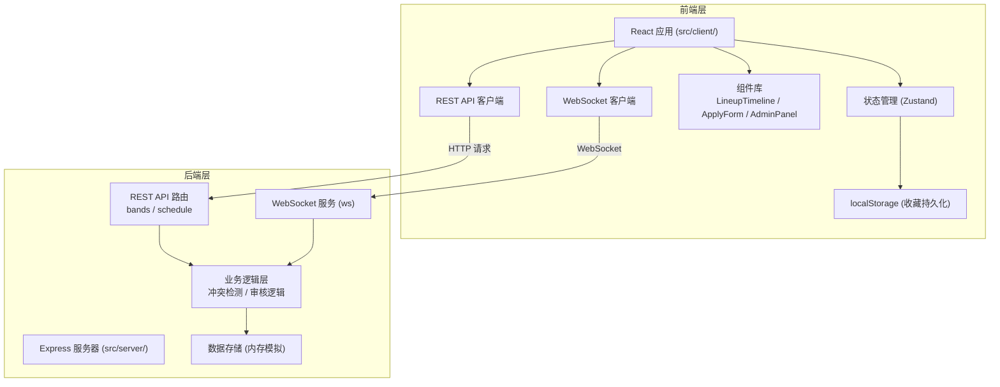
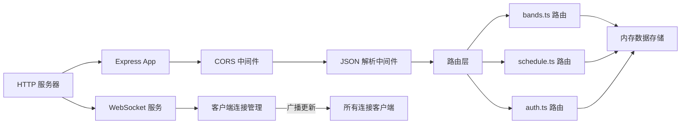

## 1. 架构设计



## 2. 技术描述

- **前端框架**：React 18 + TypeScript
- **构建工具**：Vite
- **状态管理**：Zustand
- **路由**：React Router DOM
- **样式方案**：CSS Modules / 原生CSS（深色星空主题）
- **图标库**：Lucide React
- **后端框架**：Express 4 + TypeScript
- **WebSocket**：ws 库
- **数据存储**：内存模拟（uuid 生成ID）
- **认证**：bcryptjs + jsonwebtoken
- **跨域**：cors 中间件

## 3. 路由定义

### 前端路由

| 路由路径 | 页面组件 | 用途 |
|----------|----------|------|
| / | LineupPage | 日程时间轴首页 |
| /apply | ApplyForm | 乐队申请报名页 |
| /admin | AdminPanel | 管理员审核面板 |
| /schedule | ScheduleManager | 舞台排期管理页 |
| /login | AdminLogin | 管理员登录页 |

### 后端 API 路由

| 方法 | 路径 | 用途 |
|------|------|------|
| POST | /api/bands | 提交乐队申请 |
| GET | /api/bands | 获取乐队列表（可按状态筛选） |
| PUT | /api/bands/:id | 更新乐队信息 |
| POST | /api/bands/:id/review | 审核乐队（通过/拒绝） |
| POST | /api/schedule | 创建排期分配 |
| GET | /api/schedule | 获取所有排期 |
| PUT | /api/schedule/:id | 更新排期 |
| DELETE | /api/schedule/:id | 删除排期 |
| POST | /api/auth/login | 管理员登录 |

## 4. API 定义

### 4.1 数据类型定义

```typescript
// 乐队
interface Band {
  id: string;
  name: string;
  description: string;
  genres: string[];
  memberCount: number;
  contact: string;
  status: 'pending' | 'approved' | 'rejected';
  submittedAt: string;
}

// 排期
interface Schedule {
  id: string;
  bandId: string;
  bandName: string;
  stage: string;
  startTime: string; // ISO 8601
  endTime: string;   // ISO 8601
  genres: string[];
}

// 冲突错误
interface ConflictError {
  message: string;
  conflict: {
    stage: string;
    startTime: string;
    endTime: string;
    bandName: string;
  };
}

// WebSocket 消息
interface WSMessage {
  type: 'schedule_update' | 'schedule_create' | 'schedule_delete';
  data: Schedule | { id: string };
}
```

### 4.2 请求/响应示例

**提交乐队申请**
- 请求：`POST /api/bands`
- Body：`{ name, description, genres, memberCount, contact }`
- 响应：`{ id, status: 'pending', message: '申请已提交，等待审核' }`

**审核乐队**
- 请求：`POST /api/bands/:id/review`
- Body：`{ status: 'approved' | 'rejected' }`
- 响应：`{ id, status, message: '审核完成' }`

**创建排期**
- 请求：`POST /api/schedule`
- Body：`{ bandId, stage, startTime, endTime }`
- 成功响应：`{ id, ...schedule }`
- 冲突响应（400）：`{ message: '主舞台 18:00-18:30 已被乐队XX占用', conflict: {...} }`

## 5. 服务器架构图



## 6. 数据模型

### 6.1 数据模型定义

```mermaid
erDiagram
    BAND {
        string id PK
        string name
        string description
        string[] genres
        int memberCount
        string contact
        string status
        datetime submittedAt
    }
    
    SCHEDULE {
        string id PK
        string bandId FK
        string bandName
        string stage
        datetime startTime
        datetime endTime
        string[] genres
    }
    
    ADMIN {
        string id PK
        string username
        string passwordHash
    }
    
    BAND ||--o{ SCHEDULE : "有排期"
```



### 6.2 内存数据结构

```typescript
// 内存存储（模拟数据库）
interface DataStore {
  bands: Band[];
  schedules: Schedule[];
  admins: Admin[];
}

// 初始数据
const initialData: DataStore = {
  bands: [
    {
      id: '1',
      name: '星光乐队',
      description: '一支来自上海的独立摇滚乐队',
      genres: ['摇滚', '独立'],
      memberCount: 4,
      contact: 'starlight@example.com',
      status: 'approved',
      submittedAt: '2026-06-01T10:00:00Z'
    }
  ],
  schedules: [
    {
      id: 's1',
      bandId: '1',
      bandName: '星光乐队',
      stage: '主舞台',
      startTime: '2026-07-01T18:00:00Z',
      endTime: '2026-07-01T19:00:00Z',
      genres: ['摇滚', '独立']
    }
  ],
  admins: [
    {
      id: 'admin1',
      username: 'admin',
      passwordHash: '$2a$10$...' // bcrypt hash of 'admin123'
    }
  ]
};
```

## 7. 项目文件结构

```
auto32/
├── package.json
├── vite.config.js
├── tsconfig.json
├── index.html
├── src/
│   ├── client/              # 前端代码
│   │   ├── App.tsx          # 根组件，路由分发
│   │   ├── main.tsx         # 入口文件
│   │   ├── components/      # 组件
│   │   │   ├── LineupTimeline.tsx   # 日程时间轴
│   │   │   ├── Navbar.tsx          # 导航栏
│   │   │   ├── BandCard.tsx        # 乐队卡片
│   │   │   └── Notification.tsx    # 通知浮窗
│   │   ├── pages/           # 页面
│   │   │   ├── LineupPage.tsx      # 日程页
│   │   │   ├── ApplyForm.tsx       # 申请表单页
│   │   │   ├── AdminPanel.tsx      # 审核面板页
│   │   │   └── ScheduleManager.tsx # 排期管理页
│   │   ├── store/           # 状态管理
│   │   │   └── useStore.ts
│   │   ├── services/        # API 服务
│   │   │   ├── api.ts
│   │   │   └── websocket.ts
│   │   ├── types/           # 类型定义
│   │   │   └── index.ts
│   │   └── utils/           # 工具函数
│   │       └── time.ts
│   └── server/              # 后端代码
│       ├── index.ts         # 入口文件
│       ├── routes/          # 路由
│       │   ├── bands.ts
│       │   ├── schedule.ts
│       │   └── auth.ts
│       ├── data/            # 数据存储
│       │   └── store.ts
│       ├── utils/           # 工具函数
│       │   └── conflict.ts
│       └── types/           # 类型定义
│           └── index.ts
```

## 8. 文件调用关系和数据流向

### 8.1 前端数据流
1. `App.tsx` → 路由分发 → 页面组件
2. 页面组件 → `services/api.ts` → REST API 请求 → 后端
3. 页面组件 → `services/websocket.ts` → WebSocket 连接 → 实时更新
4. 页面组件 → `store/useStore.ts` → 全局状态管理
5. `LineupTimeline.tsx` → 接收排期数据 → 渲染甘特图

### 8.2 后端数据流
1. `index.ts` → 初始化 Express + WebSocket → 挂载路由
2. 路由层（`routes/`）→ 接收请求 → 调用业务逻辑
3. `utils/conflict.ts` → 时间冲突检测算法
4. `data/store.ts` → 内存数据读写操作
5. WebSocket → 排期变更时 → 广播到所有连接客户端
