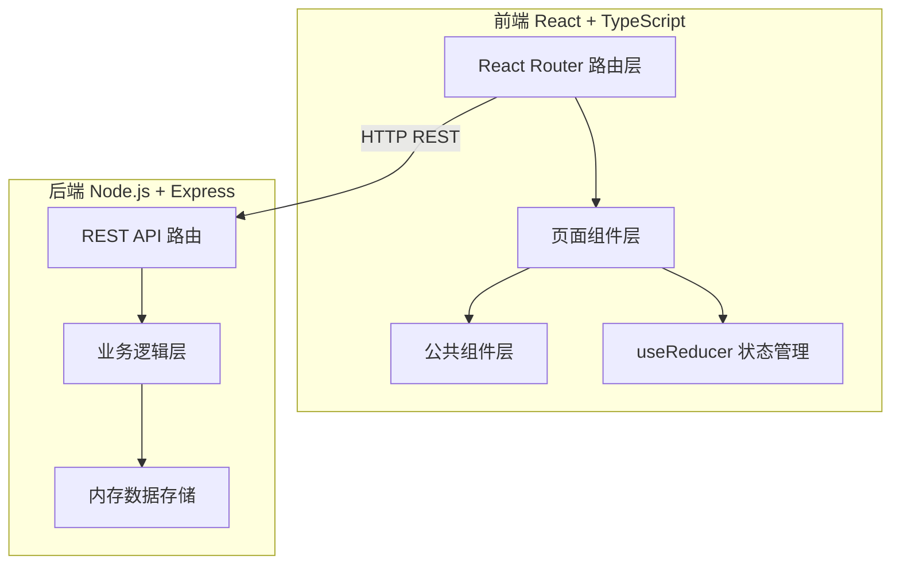
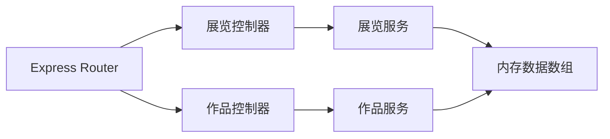
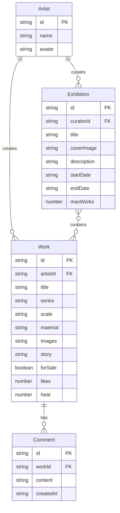

## 1. 架构设计



## 2. 技术说明
- 前端：React@18 + TypeScript + framer-motion + react-lazyload + Tailwind CSS + Vite
- 初始化工具：vite-init（react-express-ts 模板）
- 后端：Express@4 + TypeScript + cors + uuid
- 数据库：内存数组存储（无持久化）
- 通信协议：REST API（JSON）

## 3. 路由定义
| 路由 | 用途 |
|------|------|
| /home | 展览首页，策展人列表+展览瀑布流 |
| /exhibition/:id | 展览详情，时间轴布局+拖拽排序+热度 |
| /artist/:id | 个人工作室，作品瀑布流+申请参展 |
| /create | 作品发布页，创建作品表单 |

## 4. API 定义

### 4.1 数据类型
```typescript
interface Work {
  id: string;
  artistId: string;
  title: string;
  series: string;
  scale: string;
  material: string;
  images: string[];
  story: string;
  forSale: boolean;
  likes: number;
  comments: Comment[];
  heat: number;
}

interface Exhibition {
  id: string;
  curatorId: string;
  title: string;
  coverImage: string;
  description: string;
  startDate: string;
  endDate: string;
  maxWorks: number;
  workIds: string[];
}

interface Comment {
  id: string;
  userId: string;
  content: string;
  createdAt: string;
}

interface Artist {
  id: string;
  name: string;
  avatar: string;
}
```

### 4.2 接口定义
| 方法 | 路径 | 请求体 | 响应 | 说明 |
|------|------|--------|------|------|
| GET | /api/exhibitions | - | Exhibition[] | 获取展览列表 |
| POST | /api/exhibitions | Exhibition(无id) | Exhibition | 创建展览 |
| GET | /api/exhibitions/:id | - | Exhibition(含作品列表) | 获取展览详情 |
| PUT | /api/exhibitions/:id/order | { workIds: string[] } | Exhibition | 更新作品顺序 |
| POST | /api/works | Work(无id) | Work | 申请参展/创建作品 |
| GET | /api/works/:id | - | Work(含评论) | 获取作品详情 |
| POST | /api/works/:id/like | - | { likes: number } | 点赞 |
| POST | /api/works/:id/comment | { content: string } | Comment | 评论 |

## 5. 服务端架构图



## 6. 数据模型

### 6.1 数据模型定义



### 6.2 初始数据
内存数组预置3个模型师、6件作品、2场展览和若干评论，确保首页加载即可展示完整数据。
