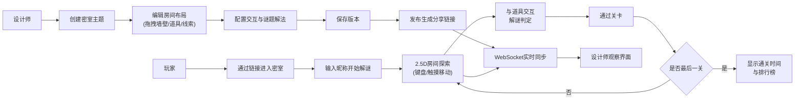

## 1. 产品概述
在线密室逃脱谜题编辑器，面向密室设计师提供谜题创作、测试与发布平台，面向玩家提供沉浸式解谜体验与竞技排行。
- 目标用户：密室逃脱设计师、解谜游戏爱好者
- 产品价值：降低密室谜题创作门槛，提供可分享的在线解谜体验

## 2. 核心功能

### 2.1 用户角色
| 角色 | 注册方式 | 核心权限 |
|------|----------|----------|
| 设计师 | 本地访问 | 创建密室主题、编辑房间布局、配置谜题解法、观察玩家实时操作、发布密室生成分享链接 |
| 玩家 | 输入昵称 | 浏览已发布密室、进入解谜、提交成绩、查看排行榜 |

### 2.2 功能模块
1. **设计师编辑器页面**：房间画布、元素工具栏、属性面板、版本管理、发布分享
2. **玩家解谜页面**：2.5D房间渲染、角色移动控制、道具交互、解谜判定、通关结算
3. **实时观察后台**：设计师视角的玩家操作同步展示
4. **排行榜系统**：通关时间统计、Top10展示、个人排名高亮

### 2.3 页面详情
| 页面名称 | 模块名称 | 功能描述 |
|----------|----------|----------|
| 首页 | 密室列表 | 展示已发布密室，选择进入设计师或玩家模式 |
| 设计师编辑器 | 画布区域 | 800x600网格画布，Rough.js手绘风格，鼠标悬停显示坐标，可拖拽放置元素 |
| 设计师编辑器 | 元素工具栏 | 墙壁、道具、线索、出口四类元素，拖拽到画布 |
| 设计师编辑器 | 属性面板 | 选中元素的交互配置（点击弹窗、位置触发、密码输入等） |
| 设计师编辑器 | 版本管理 | 保存/加载房间布局版本 |
| 设计师编辑器 | 发布面板 | 生成唯一分享链接，切换观察模式查看实时玩家 |
| 玩家解谜页面 | 2.5D房间 | CSS 3D变换实现俯视透视效果，沉浸式全屏界面 |
| 玩家解谜页面 | 角色控制 | 键盘方向键移动，移动端手势滑动移动 |
| 玩家解谜页面 | 交互系统 | 靠近道具显示交互提示，点击/触发解谜逻辑 |
| 玩家解谜页面 | 反馈特效 | 解法错误时红色裂纹闪现，正确时粒子扩散动画 |
| 玩家解谜页面 | 结算面板 | 通关用时、排行榜展示、个人排名金色高亮 |

## 3. 核心流程

### 设计师创作流程
设计师进入编辑器 → 拖拽元素构建房间布局 → 配置元素交互行为与谜题解法 → 保存版本 → 发布生成分享链接 → 进入观察模式查看玩家实时操作

### 玩家解谜流程
玩家通过分享链接或列表进入密室 → 输入昵称开始 → 控制角色在2.5D房间探索 → 与道具/线索交互 → 解开谜题进入下一关 → 完成所有关卡 → 查看通关时间与排行榜

## 4. 用户界面设计

### 4.1 设计风格
- **主色调**：深灰(#1a1a2e)、暗紫(#16213e)作为背景基调
- **强调色**：金属铜色渐变(#b8860b → #cd853f → #daa520)用于按钮、边框和交互元素
- **辅助色**：血红色(#8b0000)用于错误反馈，金色(#ffd700)用于排行榜高亮
- **按钮风格**：金属铜色渐变，毛玻璃背景(backdrop-filter: blur)，悬浮时发光效果
- **字体**：衬线字体用于标题营造哥特氛围，无衬线字体用于正文保证可读性
- **布局风格**：卡片式布局，所有面板带毛玻璃背景和细边框
- **动效**：粒子扩散(Canvas)、裂纹闪现(0.5s)、元素选中发光、页面淡入

### 4.2 页面设计概览
| 页面名称 | 模块名称 | UI元素 |
|----------|----------|--------|
| 设计师编辑器 | 画布区域 | 800x600网格，Rough.js手绘边框，坐标悬停提示，拖拽放置高亮 |
| 设计师编辑器 | 工具栏 | 左侧垂直排列元素图标，铜色渐变边框，毛玻璃背景 |
| 设计师编辑器 | 属性面板 | 右侧配置表单，输入框铜色聚焦边框 |
| 玩家解谜页面 | 2.5D房间 | CSS transform: perspective + rotateX实现俯视透视，墙面渐变阴影 |
| 玩家解谜页面 | 角色 | 圆形发光图标，移动时平滑transition(60fps) |
| 玩家解谜页面 | 交互提示 | 铜色气泡提示，靠近时淡入 |
| 排行榜 | 排名列表 | 毛玻璃卡片，前3名带奖牌图标，个人排名金色背景高亮 |

### 4.3 响应式
- Desktop优先设计，Canvas画布固定800x600
- 移动端解谜页面：角色移动改为触摸滑动手势，虚拟方向键可选
- 面板在移动端自动折叠为底部抽屉

### 4.4 视觉特效
- **粒子扩散**：道具选中时Canvas绘制径向扩散粒子，铜金色调
- **错误裂纹**：解法错误时屏幕边缘叠加SVG裂纹图案，0.5s后淡出
- **毛玻璃**：所有面板使用backdrop-filter: blur(12px)，半透明暗紫背景
- **发光效果**：选中元素、可交互道具带box-shadow铜色光晕
