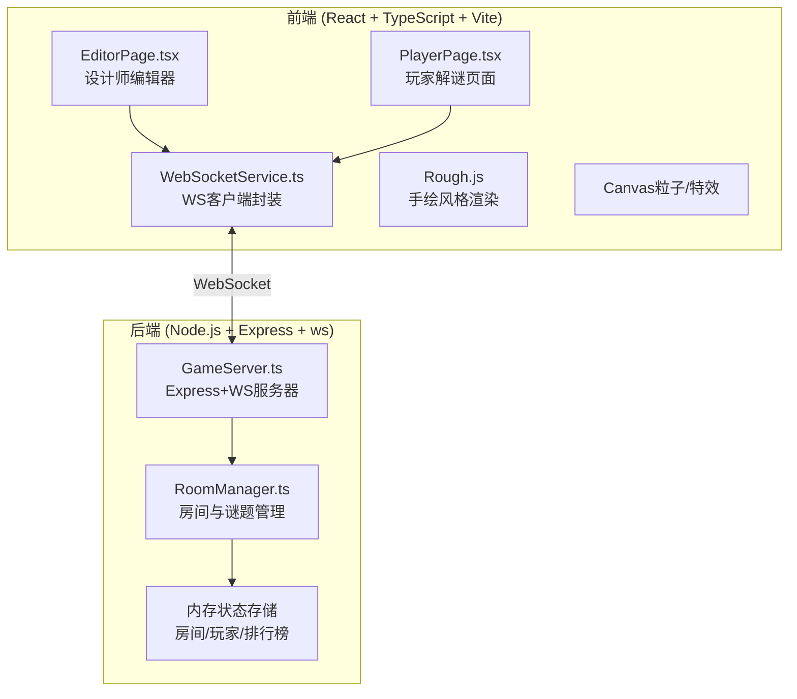
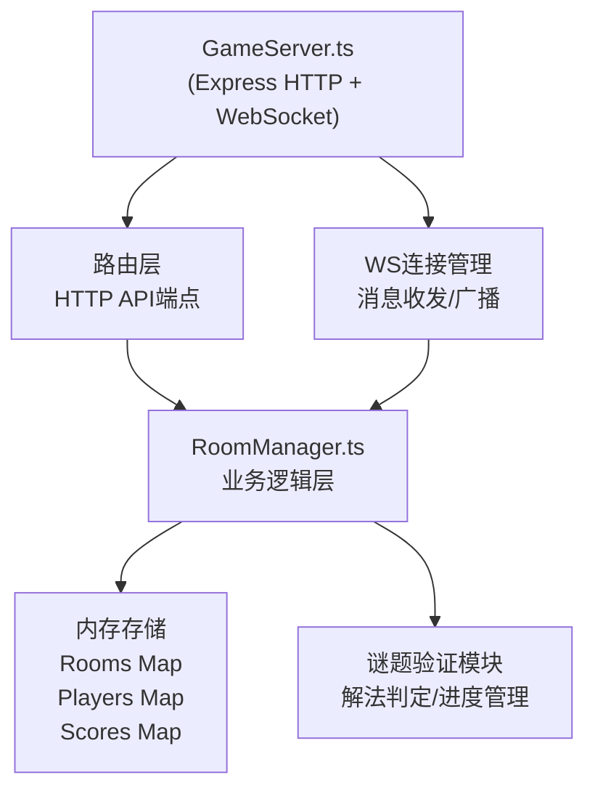
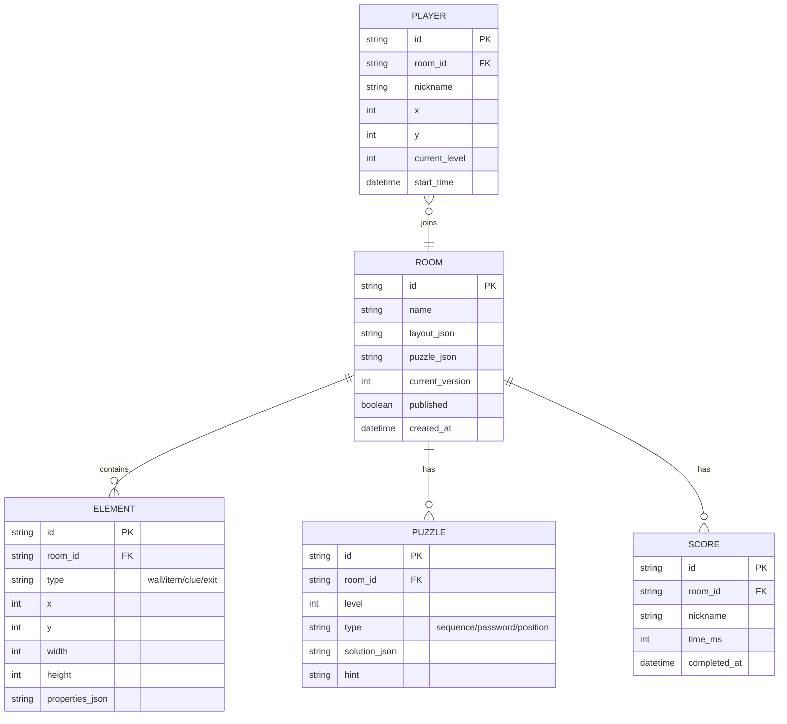

## 1. 架构设计



## 2. 技术描述
- **前端框架**：React@18 + TypeScript@5 + Vite@5
- **后端框架**：Express@4 + ws@8 (WebSocket)
- **状态管理**：React useState/useRef (局部状态)，无需全局状态库
- **样式方案**：原生CSS + CSS Modules，CSS变量主题系统
- **渲染引擎**：Rough.js (手绘风格画布) + CSS 3D Transform (2.5D房间透视)
- **特效**：Canvas API (粒子扩散) + CSS Animation (裂纹闪现)
- **通信**：WebSocket (ws库) 双向实时同步
- **工具库**：uuid (唯一ID生成)、cors (跨域支持)

## 3. 路由定义
| 路由 | 用途 |
|------|------|
| / | 首页，选择设计师/玩家模式，展示密室列表 |
| /editor | 设计师编辑器页面 |
| /room/:roomId | 玩家解谜页面，roomId为分享链接中的密室ID |
| /observe/:roomId | 设计师观察页面，实时查看玩家操作 |

## 4. API 与 WebSocket 消息定义

### HTTP API
| 方法 | 路径 | 描述 | 请求 | 响应 |
|------|------|------|------|------|
| GET | /api/rooms | 获取已发布密室列表 | - | { rooms: Room[] } |
| POST | /api/rooms | 创建/保存密室 | { layout, puzzles, name } | { roomId, shareUrl } |
| GET | /api/rooms/:roomId | 获取密室配置 | - | { layout, puzzles, name } |
| GET | /api/rooms/:roomId/leaderboard | 获取排行榜 | - | { rankings: Score[], myRank?: number } |
| POST | /api/rooms/:roomId/score | 提交通关成绩 | { nickname, time } | { rank, rankings } |

### WebSocket 消息协议
```typescript
// 客户端 → 服务端
type ClientMessage =
  | { type: 'join_room'; roomId: string; nickname?: string; role: 'player' | 'observer' }
  | { type: 'player_move'; x: number; y: number }
  | { type: 'player_interact'; elementId: string; action: string; payload?: any }
  | { type: 'leave_room' }

// 服务端 → 客户端
type ServerMessage =
  | { type: 'room_state'; state: RoomState }
  | { type: 'player_joined'; playerId: string; nickname: string; x: number; y: number }
  | { type: 'player_left'; playerId: string }
  | { type: 'player_moved'; playerId: string; x: number; y: number }
  | { type: 'player_interacted'; playerId: string; elementId: string; action: string }
  | { type: 'puzzle_solved'; puzzleId: string; nextLevel?: number }
  | { type: 'puzzle_failed'; reason: string }
  | { type: 'level_complete'; level: number }
  | { type: 'game_complete'; time: number }
```

## 5. 服务端架构



- **GameServer.ts**：Express服务器启动，WebSocket连接建立与维护，HTTP路由注册
- **RoomManager.ts**：密室状态管理（单例），维护所有活跃房间、玩家、排行榜，处理谜题验证逻辑

## 6. 数据模型

### 6.1 数据模型定义


### 6.2 核心 TypeScript 类型定义
```typescript
interface RoomElement {
  id: string;
  type: 'wall' | 'item' | 'clue' | 'exit';
  x: number;
  y: number;
  width: number;
  height: number;
  label?: string;
  interaction?: {
    type: 'click_text' | 'drag_target' | 'password' | 'sequence_trigger';
    content?: string;
    targetId?: string;
    password?: string;
    triggerId?: string;
  };
}

interface Puzzle {
  id: string;
  level: number;
  type: 'sequence' | 'password' | 'position_combo';
  solution: string[] | string | { elementId: string; x: number; y: number }[];
  hint: string;
  unlocksExit?: boolean;
}

interface RoomLayout {
  width: number;
  height: number;
  elements: RoomElement[];
  puzzles: Puzzle[];
  startPosition: { x: number; y: number };
}

interface PlayerState {
  id: string;
  nickname: string;
  x: number;
  y: number;
  currentLevel: number;
  startTime: number;
  inventory: string[];
  solvedPuzzles: string[];
}

interface LeaderboardEntry {
  nickname: string;
  timeMs: number;
  rank: number;
}
```
