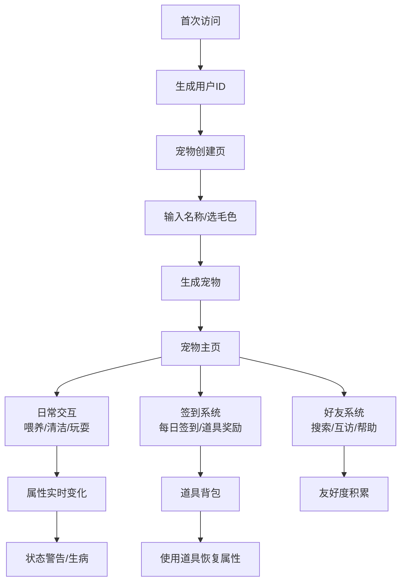

## 1. 产品概述

虚拟宠物养成与社交小站是一款在线宠物养成社交应用，用户可以领养虚拟宠物、进行日常喂养清洁玩耍互动，并通过好友互访功能与其他用户互动。

- 核心价值：提供轻松有趣的虚拟宠物养成体验，结合社交元素增加用户粘性
- 目标用户：喜欢休闲养成类游戏、追求轻度社交体验的用户群体

## 2. 核心功能

### 2.1 用户角色
| 角色 | 注册方式 | 核心权限 |
|------|----------|----------|
| 普通用户 | 首次访问自动生成ID | 领养宠物、日常互动、好友互访、签到领道具 |

### 2.2 功能模块
1. **宠物养成**：宠物领养、属性管理、状态动画、日常交互
2. **好友系统**：搜索用户、好友申请、好友列表、互访帮助
3. **签到奖励**：每日签到、连续签到、道具奖励、背包管理
4. **状态系统**：属性衰减、警告提醒、生病状态、道具恢复

### 2.3 页面详情
| 页面名称 | 模块名称 | 功能描述 |
|----------|----------|----------|
| 宠物主页 | 宠物展示区 | 中央展示宠物动画，背景圆形渐变 |
| 宠物主页 | 属性面板 | 左上角显示四项属性进度条（饥饿度、快乐度、清洁度、精力） |
| 宠物主页 | 交互面板 | 底部弧形排列三个交互按钮（喂养、清洁、玩耍） |
| 宠物主页 | 状态警告 | 右上角红色提醒横幅，属性低于20时显示 |
| 宠物主页 | 友好度 | 右上角星星图标显示友好度数值 |
| 好友列表页 | 搜索栏 | 6位ID搜索用户，发送好友申请 |
| 好友列表页 | 好友网格 | 卡片式展示好友宠物，含名称、缩略动画、属性图标 |
| 好友详情页 | 宠物详情 | 展示好友宠物完整信息和动画 |
| 好友详情页 | 帮助操作 | 三个帮助按钮（喂食、清洁、玩耍），30秒冷却 |
| 签到页面 | 日历控件 | 展示当月签到情况，连续签到天数高亮 |
| 签到页面 | 今日奖励 | 显示今日签到可获得的随机道具 |
| 背包页面 | 道具网格 | 图标展示所有道具，可点击使用 |
| 宠物创建页 | 名称输入 | 用户自定义宠物名称 |
| 宠物创建页 | 毛色选择 | 提供多种毛色供选择 |

## 3. 核心流程

### 3.1 首次使用流程
用户首次访问 → 生成唯一6位ID → 进入宠物创建页 → 输入名称选择毛色 → 生成宠物 → 进入宠物主页

### 3.2 日常交互流程
用户点击交互按钮 → 本地乐观更新属性 → 调用API更新后端状态 → 宠物播放反馈动画 → 按钮进入5秒冷却

### 3.3 属性衰减流程
后端定时任务（每10分钟）→ 计算所有在线宠物属性衰减 → 通过WebSocket推送状态更新 → 前端更新显示 → 属性低于20触发警告

### 3.4 好友互访流程
输入好友ID搜索 → 发送好友申请 → 对方通过 → 好友列表显示 → 点击好友卡片 → 进入好友详情页 → 执行帮助操作 → 双方属性/友好度更新

### 3.5 签到奖励流程
用户进入签到页 → 检查今日是否已签到 → 未签到则显示签到按钮 → 点击签到 → 随机获得道具 → 加入背包 → 更新连续签到天数

## 4. 用户界面设计

### 4.1 设计风格
- **主色调**：浅米色 #FFF5E4（背景）、珊瑚橙 #FF6B6B（强调色）
- **辅助色**：淡黄 #FFEAA7、浅粉 #FFC3A0
- **按钮风格**：圆角 + 毛玻璃效果（backdrop-filter: blur(4px)），悬停放大1.1倍带阴影
- **字体**：圆润可爱的字体风格，与宠物主题匹配
- **布局风格**：卡片式布局，柔和阴影，圆角设计
- **图标风格**：卡通风格图标，使用emoji或SVG图标（食物🍖、水滴💧、球⚽）

### 4.2 页面设计概述
| 页面名称 | 模块名称 | UI元素 |
|----------|----------|--------|
| 宠物主页 | 宠物展示区 | 圆形渐变背景（淡黄→浅粉），中央宠物动画 |
| 宠物主页 | 属性进度条 | 高度12px，圆角6px，红到绿渐变，低于30红色闪烁 |
| 宠物主页 | 交互按钮 | 底部弧形排列，圆形按钮，带图标，冷却半透明 |
| 宠物主页 | 警告横幅 | 右上角，红色背景，闪烁动画 |
| 好友列表页 | 搜索框 | 圆角20px，聚焦底部展开动效 |
| 好友列表页 | 好友卡片 | 1:1宽高比，圆角8px，浅影，缩略动画 |
| 签到页面 | 日历网格 | 当月日期，已签到高亮，连续标记 |
| 背包页面 | 道具图标 | 网格布局，悬停放大，使用粒子特效 |

### 4.3 响应式设计
- **桌面端（>=1024px）**：宠物显示区占宽60%，交互面板在底部
- **平板端（768-1023px）**：显示区占宽80%
- **手机端（<768px）**：宠物居中全宽，按钮直径50px，属性条移至顶部横向排列
- **触摸优化**：按钮最小点击区域44px，增加触摸反馈

### 4.4 动画效果
- **宠物状态动画**：
  - 饥饿时：耳朵耷拉（translateY抖动）
  - 快乐时：转圈（rotate）
  - 清洁时：闪光（opacity脉冲）
  - 精力低时：瞌睡（scale缩小+呼吸）
  - 生病时：躺倒、颜色变灰
- **交互反馈动画**：
  - 喂养：嘴巴开合
  - 清洁：水花效果
  - 玩耍：蹦跳
- **页面过渡**：fade淡入淡出（0.3秒）
- **道具使用**：白色星星从图标向上飘散粒子特效
