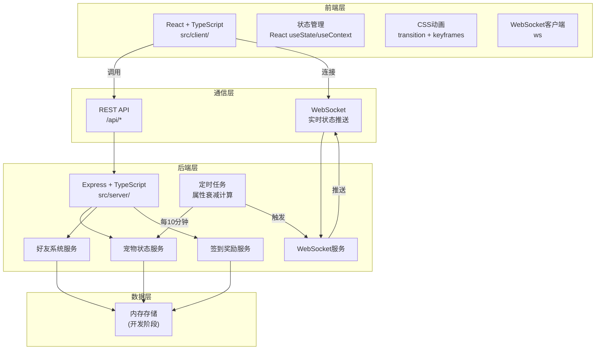
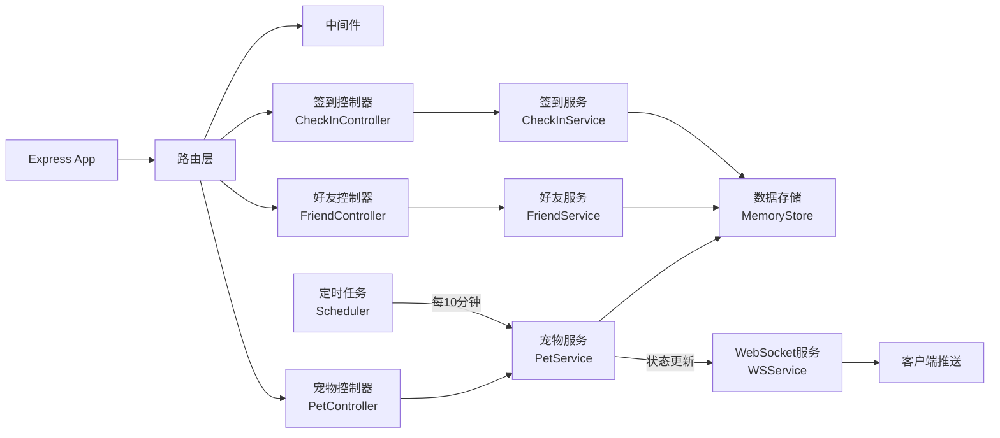
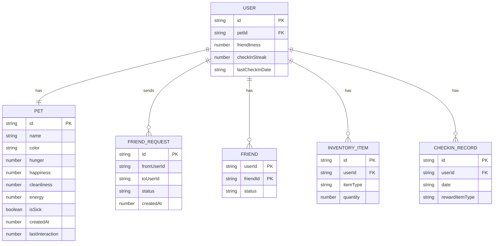

## 1. 架构设计



## 2. 技术描述

- **前端**：React@18 + TypeScript + Vite
- **后端**：Express@4 + TypeScript + WebSocket (ws)
- **状态管理**：React useState + useContext（轻量级，无需额外状态库）
- **样式方案**：原生 CSS + CSS Modules（避免使用 tailwindcss，按需求使用纯 CSS 动画）
- **构建工具**：Vite
- **数据存储**：内存存储（开发演示用）
- **通信协议**：REST API + WebSocket

### 依赖包
- `react` - UI框架
- `react-dom` - React DOM渲染
- `express` - 后端Web框架
- `ws` - WebSocket库
- `uuid` - 唯一ID生成
- `cors` - 跨域资源共享
- `typescript` - 类型检查
- `vite` - 构建工具

## 3. 路由定义

### 前端路由
| 路由 | 页面 | 说明 |
|------|------|------|
| / | 宠物主页 | 展示宠物和交互面板 |
| /create | 宠物创建页 | 首次访问时创建宠物 |
| /friends | 好友列表页 | 搜索和管理好友 |
| /friends/:id | 好友详情页 | 查看好友宠物并执行帮助操作 |
| /checkin | 签到页面 | 每日签到和奖励展示 |
| /backpack | 背包页面 | 查看和使用道具 |

### 后端API路由
| 方法 | 路径 | 说明 |
|------|------|------|
| GET | /api/pet/state | 获取宠物状态 |
| POST | /api/pet/interact | 执行交互操作（喂养/清洁/玩耍） |
| POST | /api/pet/create | 创建新宠物 |
| GET | /api/friends | 获取好友列表 |
| POST | /api/friends/search | 搜索用户（按6位ID） |
| POST | /api/friends/request | 发送好友申请 |
| POST | /api/friends/accept | 接受好友申请 |
| GET | /api/friends/:id | 获取好友宠物详情 |
| POST | /api/friends/:id/help | 帮助好友宠物 |
| GET | /api/checkin/status | 获取签到状态 |
| POST | /api/checkin | 执行签到 |
| GET | /api/backpack | 获取背包道具 |
| POST | /api/items/:id/use | 使用道具 |

## 4. API 定义

### 4.1 数据类型定义

```typescript
// 宠物属性
interface PetStats {
  hunger: number;      // 饥饿度 0-100
  happiness: number;   // 快乐度 0-100
  cleanliness: number; // 清洁度 0-100
  energy: number;      // 精力 0-100
}

// 宠物信息
interface Pet {
  id: string;
  name: string;
  color: string;
  stats: PetStats;
  isSick: boolean;
  createdAt: number;
  lastInteraction: number;
}

// 用户信息
interface User {
  id: string;          // 6位ID
  pet: Pet;
  friends: string[];
  friendRequests: string[];
  friendliness: number; // 友好度
  checkInStreak: number; // 连续签到天数
  lastCheckInDate: string | null;
  backpack: InventoryItem[];
}

// 背包道具
interface InventoryItem {
  id: string;
  type: ItemType;
  quantity: number;
}

// 道具类型
type ItemType = 'energyJuice' | 'magicShampoo' | 'luxuryFood' | 'playToy';

// 交互类型
type InteractionType = 'feed' | 'clean' | 'play';
```

### 4.2 请求/响应示例

**获取宠物状态**
```
GET /api/pet/state
Response:
{
  success: true,
  data: Pet
}
```

**执行交互操作**
```
POST /api/pet/interact
Request:
{
  type: 'feed' | 'clean' | 'play'
}
Response:
{
  success: true,
  data: {
    stats: PetStats,
    isSick: boolean
  }
}
```

**帮助好友宠物**
```
POST /api/friends/:id/help
Request:
{
  type: 'feed' | 'clean' | 'play'
}
Response:
{
  success: true,
  data: {
    friendPetStats: PetStats,
    friendliness: number
  }
}
```

## 5. 服务器架构



## 6. 数据模型

### 6.1 实体关系图



### 6.2 核心数据结构说明

**用户数据 (User)**
- `id`: 6位唯一标识符，首次访问时生成
- `pet`: 用户的宠物对象
- `friends`: 好友ID列表
- `friendRequests`: 收到的好友申请列表
- `friendliness`: 友好度积分，帮助好友时增加
- `checkInStreak`: 连续签到天数
- `lastCheckInDate`: 最后签到日期（YYYY-MM-DD格式）
- `backpack`: 背包道具列表

**宠物数据 (Pet)**
- `id`: 宠物唯一ID
- `name`: 宠物名称
- `color`: 宠物毛色
- `stats.hunger`: 饥饿度（0-100，越高越饱）
- `stats.happiness`: 快乐度（0-100，越高越开心）
- `stats.cleanliness`: 清洁度（0-100，越高越干净）
- `stats.energy`: 精力（0-100，越高越有活力）
- `isSick`: 是否生病（任意属性降为0时触发）
- `createdAt`: 创建时间戳
- `lastInteraction`: 最后交互时间戳

**道具类型 (ItemType)**
- `energyJuice`: 活力果汁（+20精力）
- `magicShampoo`: 魔法沐浴露（+20清洁度）
- `luxuryFood`: 豪华猫罐头（+20饥饿度）
- `playToy`: 逗猫棒（+20快乐度）

## 7. 性能优化策略

### 7.1 前端优化
- 使用 `React.memo` 优化组件重渲染
- 使用 `useMemo` 缓存计算结果
- WebSocket 消息节流（每秒不超过1次）
- CSS 动画仅使用 `transform` 和 `opacity` 避免重排
- 动态 `import` 延迟加载非首屏组件
- 首屏加载时间控制在2秒内

### 7.2 后端优化
- 定时任务批量计算属性衰减
- WebSocket 广播合并发送
- 内存数据索引优化

## 8. 项目文件结构

```
.
├── package.json
├── vite.config.js
├── tsconfig.json
├── index.html
└── src/
    ├── client/                 # 前端代码
    │   ├── App.tsx            # 主应用组件
    │   ├── main.tsx           # 入口文件
    │   ├── pet.ts             # 宠物数据模型和状态逻辑
    │   ├── PetAnimation.tsx   # 宠物动画组件
    │   ├── InteractionPanel.tsx # 交互面板组件
    │   ├── StatBar.tsx        # 属性进度条组件
    │   ├── WarningBanner.tsx  # 警告横幅组件
    │   ├── pages/             # 页面组件
    │   │   ├── HomePage.tsx
    │   │   ├── CreatePetPage.tsx
    │   │   ├── FriendsPage.tsx
    │   │   ├── FriendDetailPage.tsx
    │   │   ├── CheckInPage.tsx
    │   │   └── BackpackPage.tsx
    │   ├── components/        # 公共组件
    │   │   ├── NavBar.tsx
    │   │   ├── FriendCard.tsx
    │   │   ├── ItemIcon.tsx
    │   │   └── Calendar.tsx
    │   ├── hooks/             # 自定义hooks
    │   │   ├── useWebSocket.ts
    │   │   └── useCooldown.ts
    │   ├── api/               # API调用
    │   │   └── index.ts
    │   ├── styles/            # 样式文件
    │   │   ├── global.css
    │   │   └── animations.css
    │   └── types/             # 类型定义
    │       └── index.ts
    └── server/                # 后端代码
        ├── server.ts          # 服务器入口
        ├── services/          # 业务服务
        │   ├── PetService.ts
        │   ├── FriendService.ts
        │   └── CheckInService.ts
        ├── store/             # 数据存储
        │   └── MemoryStore.ts
        ├── websocket/         # WebSocket
        │   └── WSService.ts
        └── types/             # 类型定义
            └── index.ts
```
