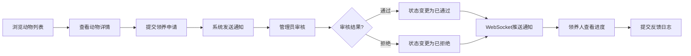
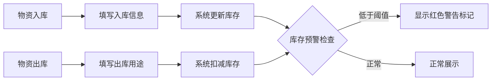

## 1. 产品概述

本系统为流浪动物救助组织提供线上宠物领养与物资管理一体化解决方案，简化救助站工作流程，提升领养效率和物资管理透明度。

- **核心价值**：通过数字化管理，帮助救助站高效管理待领养动物档案、处理领养申请、追踪物资库存
- **目标用户**：救助站管理员、授权志愿者、潜在领养人
- **市场价值**：降低救助站运营成本，提高领养成功率，增强社会公信力

## 2. 核心功能

### 2.1 用户角色

| 角色 | 注册方式 | 核心权限 |
|------|----------|----------|
| 管理员 | 预设账号 | 动物档案CRUD、领养申请审核、物资管理、查看通知 |
| 领养人 | 自主注册 | 浏览动物、提交领养申请、查看申请进度、提交反馈 |
| 志愿者 | 管理员授权 | 物资入库出库登记、查看库存 |

### 2.2 功能模块

1. **首页**：动物瀑布流展示、导航侧边栏、用户登录入口
2. **动物详情页**：照片轮播、完整档案信息、领养条件列表、申请按钮
3. **领养申请表单页**：个人信息填写、居住情况、养宠经验
4. **个人中心页**：申请历史时间线、消息通知、反馈提交
5. **管理员面板**：动物管理、申请审核、物资管理、通知列表
6. **库存管理页**：物资表格展示、入库出库操作、库存预警

### 2.3 页面详情

| 页面名称 | 模块名称 | 功能描述 |
|----------|----------|----------|
| 首页 | 瀑布流卡片 | 动物照片缩略图、名称、年龄、品种标签、申请领养按钮、悬停放大效果 |
| 动物详情页 | 照片轮播 | 多张照片轮播展示、完整档案、领养条件列表 |
| 领养申请页 | 表单填写 | 个人简介、居住情况、养宠经验、提交申请 |
| 个人中心 | 时间线 | 申请历史按时间展示、状态标签、操作按钮 |
| 管理员面板 | 动物管理 | 创建、编辑、删除动物档案 |
| 管理员面板 | 申请审核 | 批准/拒绝申请、查看申请详情 |
| 库存管理 | 物资表格 | 类别筛选、名称搜索、入库出库登记、库存预警 |

## 3. 核心流程

### 3.1 领养申请流程

领养人浏览动物列表 → 点击查看详情 → 提交领养申请 → 系统发送通知给管理员 → 管理员审核申请 → 状态变更实时推送给领养人 → 领养人查看进度并提交反馈

### 3.2 物资管理流程

管理员/志愿者登录 → 物资入库登记 → 系统更新库存 → 物资出库登记 → 系统扣减库存 → 库存低于阈值时显示警告

## 4. 用户界面设计

### 4.1 设计风格

- **主色调**：温暖柔和的橙黄色 `#FFA726`，传递关爱与温暖的品牌调性
- **强调色**：深蓝色 `#1565C0`，用于按钮和链接，提供清晰的视觉引导
- **背景色**：纯白色 `#FFFFFF`，保持界面干净清爽
- **圆角设计**：卡片和表格统一采用 `8px` 圆角，营造柔和友好的视觉感受
- **按钮交互**：悬停时颜色加深 `10%` 并轻微上移 `3px`，提供清晰的反馈
- **字体选择**：采用 `Noto Sans SC` 作为中文显示字体，搭配 `Poppins` 作为英文数字字体
- **图标风格**：使用线性图标，保持简洁统一

### 4.2 页面设计概览

| 页面名称 | 模块名称 | UI元素 |
|----------|----------|--------|
| 首页 | 瀑布流卡片 | 橙黄色卡片背景、深蓝色标签、悬停放大1.05倍、阴影效果、淡入动画 |
| 动物详情页 | 照片轮播 | 平滑过渡动画、指示器、放大预览、渐显加载 |
| 领养申请页 | 表单 | 分步骤引导、输入框焦点动画、表单验证反馈 |
| 个人中心 | 时间线 | 垂直时间线、状态色标、卡片式记录、滑动动画 |
| 管理员面板 | 数据表格 | 斑马纹、悬停高亮、操作按钮组、分页控件 |
| 库存管理 | 预警标记 | 红色感叹号、闪烁动画、阈值提示气泡 |

### 4.3 响应式设计

- **桌面端（≥1024px）**：左侧窄侧边栏（240px）+ 右侧主内容区
- **平板端（768px-1023px）**：侧边栏可折叠，主内容区自适应
- **移动端（<768px）**：侧边栏收起到顶部汉堡菜单，内容单列布局，最小宽度320px
- **触摸优化**：按钮最小尺寸44×44px，触摸反馈动画

### 4.4 动效设计

- **页面加载**：瀑布流卡片采用交错淡入动画，延迟间隔100ms
- **卡片悬停**：`transform: scale(1.05)` + `box-shadow` 增强，过渡时间300ms
- **按钮交互**：`translateY(-3px)` + 颜色加深，过渡时间200ms
- **消息通知**：从右侧滑入，带有弹跳效果
- **WebSocket推送**：顶部通知横幅滑入，脉冲动画提示

## 5. 性能指标

- **动物列表首屏加载**：≤1.5秒（50条数据以内）
- **物资搜索响应**：≤200ms
- **图片懒加载**：瀑布流图片采用Intersection Observer实现懒加载
- **WebSocket连接**：3秒内建立连接，重连机制指数退避
