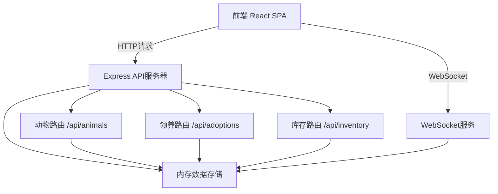
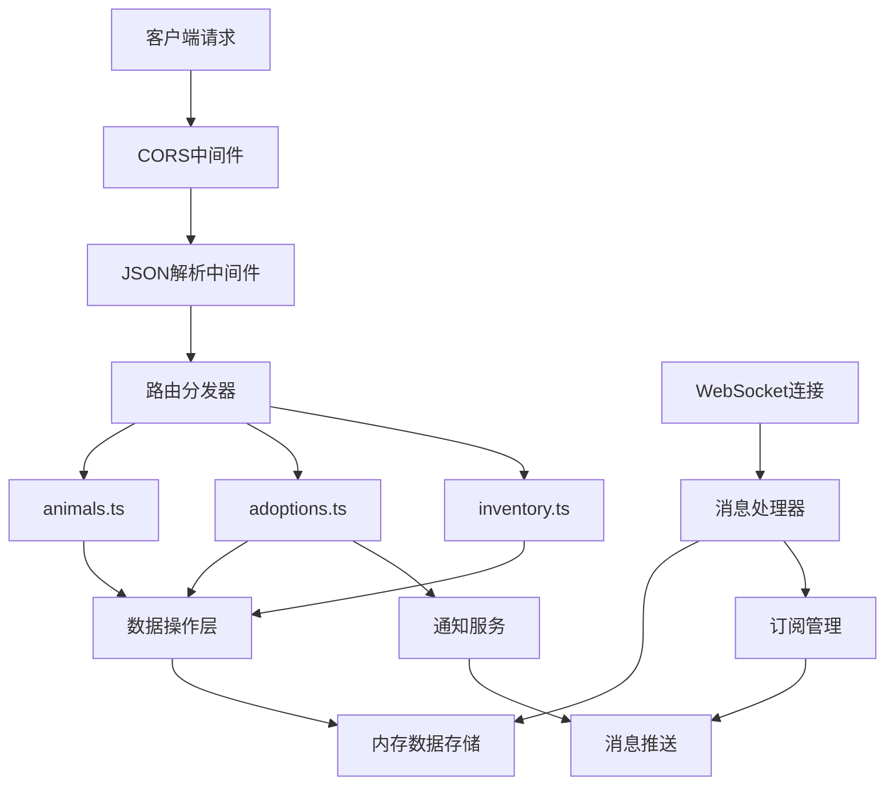
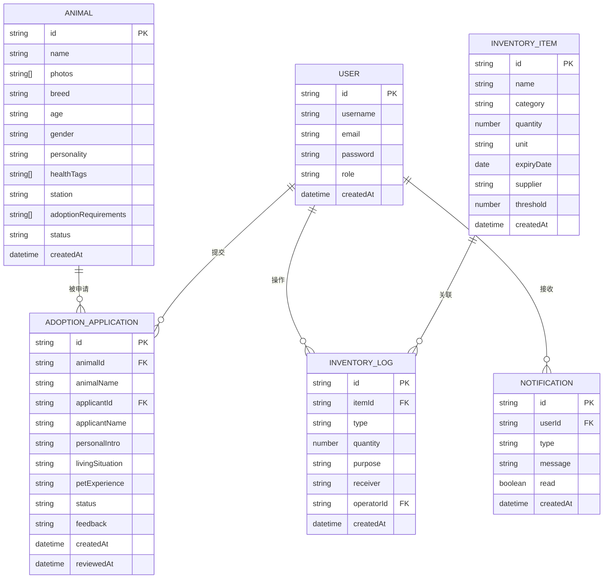
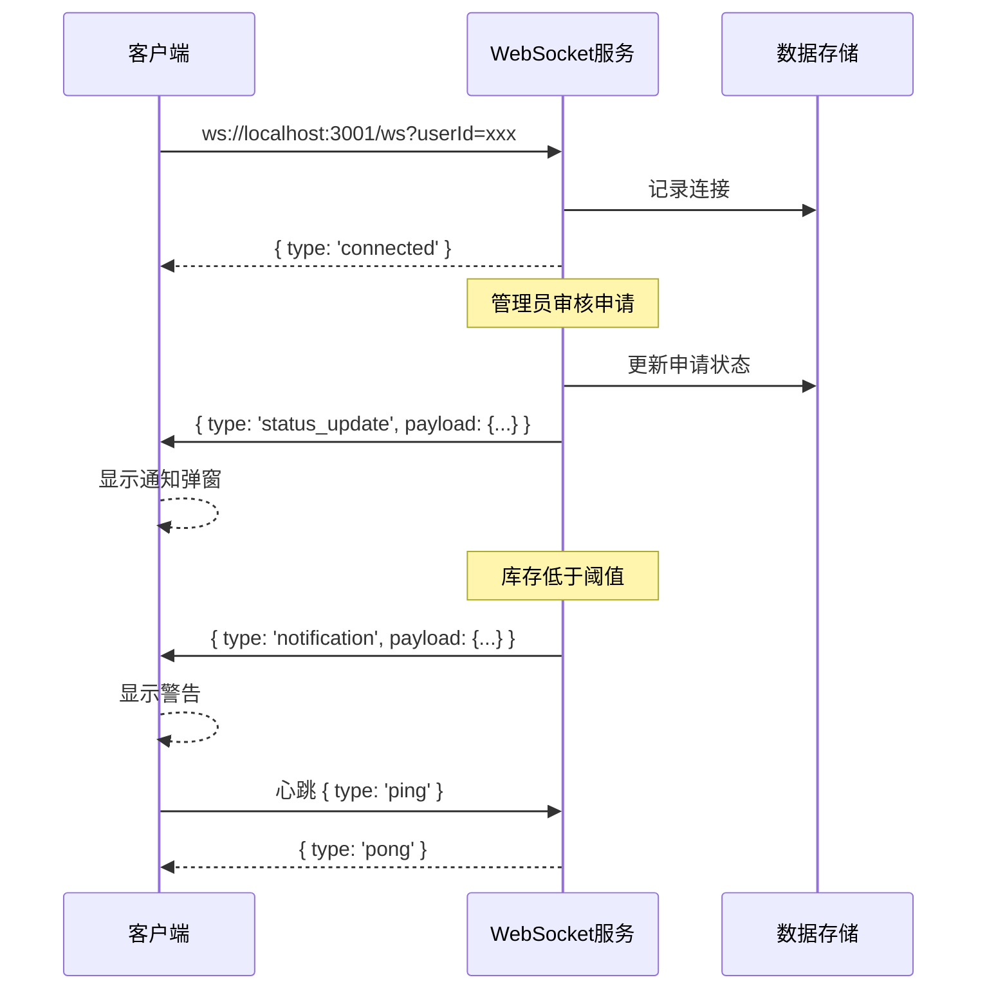

## 1. 架构设计



## 2. 技术描述

### 2.1 技术栈选择

| 层级 | 技术选型 | 版本 | 用途 |
|------|----------|------|------|
| 前端 | React | ^18.2.0 | UI框架 |
| 前端 | React Router | ^6.20.0 | 客户端路由 |
| 前端 | TypeScript | ^5.3.0 | 类型安全 |
| 前端 | Vite | ^5.0.0 | 构建工具 |
| 前端 | react-masonry-css | ^1.0.16 | 瀑布流布局 |
| 后端 | Express | ^4.18.2 | API服务器 |
| 后端 | ws | ^8.14.0 | WebSocket服务 |
| 后端 | cors | ^2.8.5 | 跨域支持 |
| 后端 | uuid | ^9.0.1 | ID生成 |
| 开发工具 | concurrently | ^8.2.0 | 同时启动前后端 |

### 2.2 项目结构

```
auto42/
├── package.json              # 项目依赖和脚本
├── vite.config.js            # Vite构建配置
├── tsconfig.json             # TypeScript配置
├── index.html                # HTML入口
└── src/
    ├── client/               # 前端代码
    │   ├── App.tsx           # 主应用组件
    │   ├── api.ts            # API调用封装
    │   ├── components/
    │   │   ├── AnimalCard.tsx        # 动物卡片组件
    │   │   ├── AdminPanel.tsx        # 管理员面板
    │   │   ├── AnimalDetail.tsx      # 动物详情页
    │   │   ├── AdoptionForm.tsx      # 领养申请表单
    │   │   ├── UserProfile.tsx       # 用户个人中心
    │   │   ├── InventoryPanel.tsx    # 库存管理面板
    │   │   ├── Sidebar.tsx           # 侧边导航
    │   │   └── NotificationToast.tsx # 通知提示
    │   ├── types/
    │   │   └── index.ts      # 类型定义
    │   └── styles/
    │       └── global.css    # 全局样式
    └── server/               # 后端代码
        ├── index.ts          # 服务器入口
        ├── routes/
        │   ├── animals.ts    # 动物API路由
        │   ├── adoptions.ts  # 领养API路由
        │   └── inventory.ts  # 库存API路由
        └── data/
            └── mockData.ts   # 模拟数据
```

## 3. 路由定义

### 3.1 前端路由

| 路由路径 | 页面组件 | 权限要求 | 说明 |
|----------|----------|----------|------|
| `/` | AnimalList | 公开 | 首页瀑布流展示 |
| `/animal/:id` | AnimalDetail | 公开 | 动物详情页 |
| `/adopt/:id` | AdoptionForm | 已登录 | 领养申请表单 |
| `/profile` | UserProfile | 已登录 | 个人中心 |
| `/admin` | AdminPanel | 管理员 | 管理员面板 |
| `/inventory` | InventoryPanel | 管理员/志愿者 | 库存管理 |
| `/login` | LoginPage | 公开 | 登录页 |
| `/register` | RegisterPage | 公开 | 注册页 |

### 3.2 API路由

| 方法 | 路径 | 描述 |
|------|------|------|
| GET | `/api/animals` | 获取所有动物列表 |
| GET | `/api/animals/:id` | 获取单个动物详情 |
| POST | `/api/animals` | 创建动物档案（管理员） |
| PUT | `/api/animals/:id` | 更新动物档案（管理员） |
| DELETE | `/api/animals/:id` | 删除动物档案（管理员） |
| POST | `/api/adoptions` | 提交领养申请 |
| GET | `/api/adoptions` | 获取领养申请列表 |
| PUT | `/api/adoptions/:id/status` | 审核申请（管理员） |
| POST | `/api/adoptions/:id/feedback` | 提交反馈日志 |
| GET | `/api/inventory` | 获取物资库存列表 |
| POST | `/api/inventory` | 物资入库 |
| PUT | `/api/inventory/:id/outbound` | 物资出库 |
| PUT | `/api/inventory/:id/threshold` | 设置库存阈值 |

## 4. API定义

### 4.1 类型定义

```typescript
// 动物档案
interface Animal {
  id: string;
  name: string;
  photos: string[];
  breed: string;
  age: string;
  gender: 'male' | 'female';
  personality: string;
  healthTags: string[];
  station: string;
  adoptionRequirements: string[];
  status: 'available' | 'pending' | 'adopted';
  createdAt: string;
}

// 领养申请
interface AdoptionApplication {
  id: string;
  animalId: string;
  animalName: string;
  applicantId: string;
  applicantName: string;
  personalIntro: string;
  livingSituation: string;
  petExperience: string;
  status: 'pending' | 'approved' | 'rejected';
  feedback?: string;
  createdAt: string;
  reviewedAt?: string;
}

// 物资库存
interface InventoryItem {
  id: string;
  name: string;
  category: 'food' | 'medicine' | 'supplies' | 'equipment';
  quantity: number;
  unit: string;
  expiryDate?: string;
  supplier?: string;
  threshold: number;
  createdAt: string;
}

// 库存记录
interface InventoryLog {
  id: string;
  itemId: string;
  type: 'inbound' | 'outbound';
  quantity: number;
  purpose?: string;
  receiver?: string;
  operatorId: string;
  createdAt: string;
}

// 用户
interface User {
  id: string;
  username: string;
  email: string;
  role: 'adopter' | 'admin' | 'volunteer';
  createdAt: string;
}

// 通知
interface Notification {
  id: string;
  userId: string;
  type: 'new_application' | 'status_update' | 'low_stock';
  message: string;
  read: boolean;
  createdAt: string;
}
```

### 4.2 请求响应格式

```typescript
// 统一响应格式
interface ApiResponse<T> {
  success: boolean;
  data?: T;
  error?: string;
  message?: string;
}

// 分页响应
interface PaginatedResponse<T> {
  items: T[];
  total: number;
  page: number;
  pageSize: number;
}

// WebSocket消息
interface WSMessage {
  type: 'notification' | 'status_update';
  payload: Notification | AdoptionApplication;
}
```

## 5. 服务器架构图



## 6. 数据模型

### 6.1 ER图



### 6.2 模拟数据初始化

```typescript
// 预置管理员账号
// username: admin, password: admin123

// 预置测试动物数据（50条以内）
// 包含不同品种、年龄、性别的动物档案

// 预置物资数据
// 猫粮、狗粮、药品、笼子等分类

// 预置领养申请记录
// 包含不同状态的申请示例
```

## 7. 性能优化策略

### 7.1 前端优化

- **图片懒加载**：使用 `IntersectionObserver` API实现瀑布流图片懒加载
- **虚拟滚动**：动物列表超过50条时启用虚拟滚动
- **请求防抖**：物资搜索输入采用300ms防抖
- **缓存策略**：动物列表数据缓存5分钟，避免重复请求
- **代码分割**：按路由进行代码分割，减少首屏加载体积

### 7.2 后端优化

- **内存索引**：为动物名称、物资名称建立内存索引
- **分页查询**：列表接口默认分页，每页20条
- **批量操作**：支持批量入库出库，减少IO操作
- **连接池**：WebSocket连接池管理，支持心跳检测

## 8. WebSocket实时通信设计


