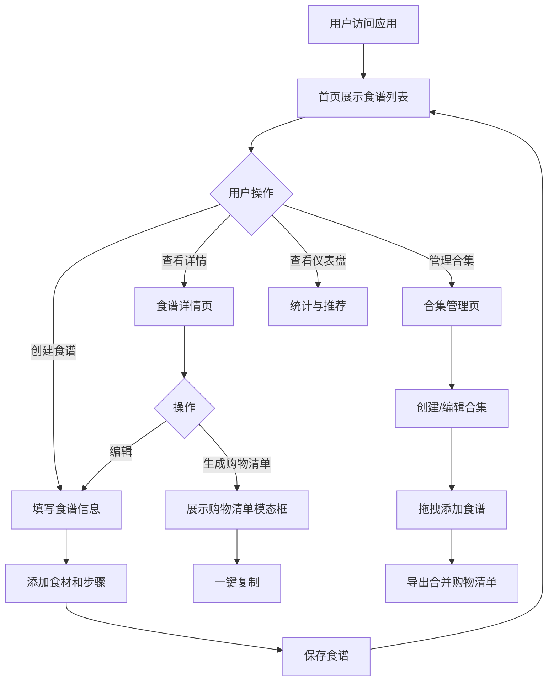

## 1. 产品概述

在线食谱创作与家庭菜谱管理应用，帮助用户上传和管理家庭菜谱、创建自定义食谱合集、获得智能每日菜单推荐，并自动生成购物清单。

- **主要用途**：个人和家庭用户的食谱管理、菜单规划、购物清单生成
- **解决的问题**：菜谱散乱、菜单规划困难、购物清单手动整理繁琐
- **目标用户**：家庭主妇/主夫、烹饪爱好者、需要规划每日饮食的用户
- **产品价值**：通过数字化管理提升烹饪效率，减少食材浪费，让家庭饮食更健康有计划

## 2. 核心功能

### 2.1 用户角色

| 角色 | 注册方式 | 核心权限 |
|------|----------|----------|
| 普通用户 | 无需注册（本地存储） | 创建、编辑、删除食谱；创建合集；查看推荐；生成购物清单 |

### 2.2 功能模块

1. **首页（食谱列表）**：瀑布流卡片展示、搜索过滤、标签筛选、难度筛选
2. **食谱详情页**：大图轮播、食材表格、步骤列表、进度指示器、编辑按钮、生成购物清单
3. **食谱编辑页**：表单编辑、食材列表管理、步骤拖拽排序、标签选择
4. **合集管理页**：合集列表、拖拽添加食谱、合集内排序、合并购物清单生成
5. **仪表盘页**：统计卡片、分类饼图、今日推荐、倒计时刷新

### 2.3 页面详情

| 页面名称 | 模块名称 | 功能描述 |
|----------|----------|----------|
| 首页 | 搜索栏 | 顶部固定，实时搜索食谱名称和描述 |
| 首页 | 侧边栏 | 标签多选过滤、难度星级滑块过滤、导航菜单 |
| 首页 | 瀑布流卡片 | 食谱卡片展示、悬停效果、拖拽排序、点击进入详情 |
| 食谱详情页 | 大图轮播 | 展示食谱多张图片，支持切换 |
| 食谱详情页 | 食材表格 | 展示所有食材的名称、数量、单位 |
| 食谱详情页 | 步骤列表 | 带进度指示器，当前步骤高亮 |
| 食谱详情页 | 操作按钮 | 编辑食谱、生成购物清单 |
| 食谱编辑页 | 基本信息 | 名称、描述、图片URL输入 |
| 食谱编辑页 | 食材列表 | 动态增删食材条目，填写名称、数量、单位 |
| 食谱编辑页 | 步骤表格 | 有序步骤列表，支持拖拽调整顺序 |
| 食谱编辑页 | 标签选择器 | 难度星级选择、标签多选 |
| 合集管理页 | 合集列表 | 展示所有合集，可创建新合集 |
| 合集管理页 | 拖拽区域 | 从食谱列表拖拽菜谱到合集中 |
| 合集管理页 | 购物清单 | 汇总食材、导出模态框、一键复制 |
| 仪表盘页 | 统计卡片 | 总食谱数、合集数、最近30天新增数，淡入动画 |
| 仪表盘页 | 分类饼图 | 根据标签统计，点击扇形筛选食谱 |
| 仪表盘页 | 今日推荐 | 随机3条食谱，倒计时刷新，入场动画 |

## 3. 核心流程

### 3.1 食谱创建流程
用户进入首页 → 点击"新增食谱" → 填写食谱基本信息 → 添加食材列表 → 添加烹饪步骤（可拖拽排序） → 选择标签和难度 → 保存 → 自动返回首页展示新食谱

### 3.2 购物清单生成流程
用户浏览食谱 → 进入食谱详情页 → 点击"生成购物清单" → 系统提取所有食材 → 展示购物清单模态框 → 一键复制到剪贴板

### 3.3 合集创建流程
用户进入合集管理页 → 点击"创建合集" → 输入合集名称 → 从左侧食谱列表拖拽食谱到合集中 → 调整合集内顺序 → 点击"导出购物清单" → 系统合并计算所有食材总量 → 展示合并购物清单 → 一键复制

### 3.4 流程图

## 4. 用户界面设计

### 4.1 设计风格

- **主色调**：#E8744A（暖橙色）
- **辅助色**：#F5CBA7（浅桃色）
- **背景色**：#FFF8F0（米白色）
- **按钮风格**：圆角8px，主色填充，悬停时加深10%，点击时有微缩放效果
- **字体选择**：
  - 标题：Noto Serif SC（有衬线，温暖感）
  - 正文：Noto Sans SC（无衬线，易读性）
- **布局风格**：卡片式设计，左窄侧边栏+右主区域
- **图标风格**：线性图标配合暖色调，使用emoji增强亲和力
- **卡片样式**：圆角12px，柔和阴影（box-shadow: 0 4px 12px rgba(232, 116, 74, 0.1)）

### 4.2 页面设计概述

| 页面名称 | 模块名称 | UI元素 |
|----------|----------|--------|
| 首页 | 搜索栏 | 固定顶部，圆角8px，左侧搜索图标，右侧清除按钮 |
| 首页 | 侧边栏 | 宽度240px，标签色块（圆角6px），难度滑块 |
| 首页 | 瀑布流卡片 | 3列布局，卡片悬停放大1.05倍，半透明遮罩"查看详情"按钮 |
| 食谱详情页 | 大图轮播 | 800x400px，指示器圆点，左右切换按钮 |
| 食谱详情页 | 步骤列表 | 左侧进度条，当前步骤高亮（背景色#F5CBA7） |
| 食谱编辑页 | 表单 | 分组卡片，输入框圆角8px，动态增删按钮 |
| 合集管理页 | 拖拽区域 | react-beautiful-dnd实现，拖拽时阴影加深 |
| 仪表盘页 | 统计卡片 | 3列等宽，数字淡入动画（0.6s ease-in） |
| 仪表盘页 | 饼图 | recharts实现，扇形悬停放大，点击交互 |
| 仪表盘页 | 今日推荐 | 从左滑入动画（transform: translateX(-20px) → 0） |

### 4.3 响应式设计

- **桌面端（≥1024px）**：侧边栏240px+主区域自适应，瀑布流3列
- **平板端（768px-1023px）**：侧边栏可折叠，瀑布流2列
- **移动端（<768px）**：单列布局，导航变为底部标签栏（首页、合集、仪表盘、新增），瀑布流1列
- **触摸优化**：按钮最小尺寸44x44px，卡片点击区域扩大，禁用悬停效果改用点击反馈

### 4.4 动画与过渡

- **页面切换**：淡入淡出（opacity 0→1，0.3s ease）
- **卡片悬停**：scale 1→1.05，box-shadow加深，0.3s ease
- **按钮点击**：scale 1→0.95，0.1s ease
- **数字动画**：统计数字从0滚动到目标值，0.8s ease-out
- **入场动画**：推荐卡片从左滑入，stagger延迟0.1s
- **拖拽动画**：拖拽项透明度0.8，阴影加深，0.2s ease
