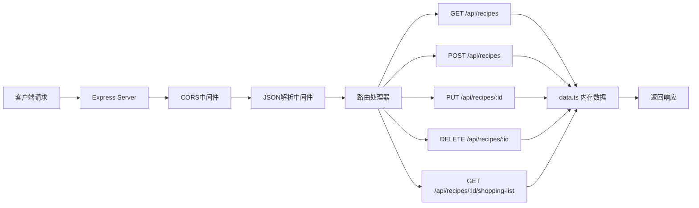
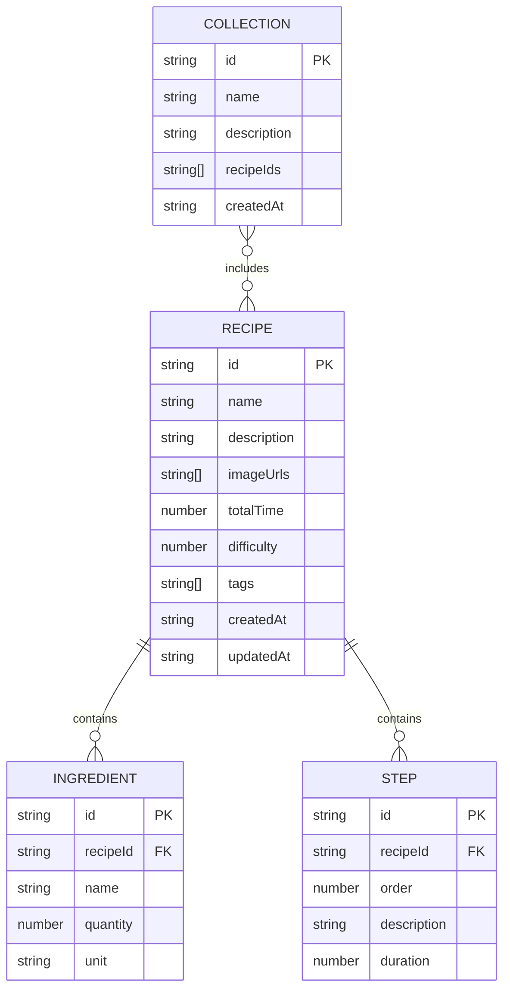

## 1. 架构设计


## 2. 技术描述

- **前端**：React 18 + TypeScript + Vite
- **状态管理**：React Hooks (useState, useEffect, useContext)
- **路由**：React Router v6
- **样式方案**：CSS Modules + CSS Variables
- **拖拽库**：react-beautiful-dnd
- **图表库**：recharts
- **构建工具**：Vite
- **后端**：Node.js + Express 4 + TypeScript
- **HTTP客户端**：Fetch API
- **数据存储**：内存数据（模拟数据库）
- **唯一ID**：uuid

## 3. 目录结构

```
auto44/
├── package.json
├── vite.config.js
├── tsconfig.json
├── index.html
└── src/
    ├── client/
    │   ├── App.tsx              # 主应用组件
    │   ├── main.tsx             # 入口文件
    │   ├── types.ts             # 类型定义
    │   ├── api/
    │   │   └── recipes.ts       # API客户端
    │   ├── components/
    │   │   ├── RecipeCard.tsx   # 食谱卡片
    │   │   ├── Sidebar.tsx      # 侧边栏
    │   │   ├── SearchBar.tsx    # 搜索栏
    │   │   ├── StarRating.tsx   # 星级评分
    │   │   ├── Modal.tsx        # 模态框
    │   │   └── BottomNav.tsx    # 底部导航（移动端）
    │   ├── pages/
    │   │   ├── Dashboard.tsx    # 仪表盘
    │   │   ├── RecipeForm.tsx   # 食谱编辑
    │   │   ├── RecipeDetail.tsx # 食谱详情
    │   │   ├── RecipeList.tsx   # 首页列表
    │   │   └── Collection.tsx   # 合集管理
    │   ├── context/
    │   │   └── RecipeContext.tsx # 全局状态
    │   └── styles/
    │       └── variables.css    # CSS变量
    └── server/
        ├── index.ts             # Express服务器
        ├── data.ts              # 内存数据源
        └── types.ts             # 服务端类型
```

## 4. 路由定义

| 前端路由 | 页面 | 说明 |
|----------|------|------|
| / | 首页（食谱列表） | 瀑布流展示所有食谱，支持搜索过滤 |
| /recipe/:id | 食谱详情页 | 展示食谱完整信息 |
| /recipe/new | 新增食谱 | 创建新食谱 |
| /recipe/:id/edit | 编辑食谱 | 编辑现有食谱 |
| /collections | 合集管理 | 管理食谱合集 |
| /dashboard | 仪表盘 | 统计与推荐 |

| 后端API路由 | 方法 | 说明 |
|------------|------|------|
| /api/recipes | GET | 获取所有食谱 |
| /api/recipes | POST | 创建新食谱 |
| /api/recipes/:id | GET | 获取单条食谱 |
| /api/recipes/:id | PUT | 更新食谱 |
| /api/recipes/:id | DELETE | 删除食谱 |
| /api/recipes/:id/shopping-list | GET | 生成购物清单 |
| /api/collections | GET | 获取所有合集 |
| /api/collections | POST | 创建合集 |
| /api/collections/:id | PUT | 更新合集 |
| /api/collections/:id | DELETE | 删除合集 |
| /api/collections/:id/shopping-list | GET | 生成合集购物清单 |

## 5. API类型定义

```typescript
// 食材
interface Ingredient {
  name: string;
  quantity: number;
  unit: string;
}

// 步骤
interface Step {
  id: string;
  order: number;
  description: string;
  duration?: number;
}

// 食谱
interface Recipe {
  id: string;
  name: string;
  description: string;
  imageUrls: string[];
  ingredients: Ingredient[];
  steps: Step[];
  totalTime: number;
  difficulty: 1 | 2 | 3 | 4 | 5;
  tags: string[];
  createdAt: string;
  updatedAt: string;
}

// 合集
interface Collection {
  id: string;
  name: string;
  description: string;
  recipeIds: string[];
  createdAt: string;
}

// 购物清单项
interface ShoppingListItem {
  name: string;
  totalQuantity: number;
  unit: string;
  recipes: string[];
}

// 统计数据
interface Stats {
  totalRecipes: number;
  totalCollections: number;
  recentAdded: number;
  tagDistribution: { tag: string; count: number }[];
}
```

## 6. 服务端架构



## 7. 数据模型

### 7.1 ER图



### 7.2 初始化数据

```typescript
// 预设标签
const PRESET_TAGS = [
  '川菜', '粤菜', '湘菜', '鲁菜', '苏菜', '浙菜', '闽菜', '徽菜',
  '烘焙', '甜点', '素食', '减脂', '快手菜', '家常菜', '汤品',
  '早餐', '午餐', '晚餐', '夜宵', '儿童餐', '老人餐'
];

// 示例食谱数据
const INITIAL_RECIPES: Recipe[] = [
  {
    id: '1',
    name: '红烧肉',
    description: '经典家常菜，肥而不腻，入口即化',
    imageUrls: ['https://images.unsplash.com/photo-1623595119708-26b1f7500ddd?w=800'],
    ingredients: [
      { name: '五花肉', quantity: 500, unit: 'g' },
      { name: '冰糖', quantity: 30, unit: 'g' },
      { name: '生抽', quantity: 2, unit: '勺' },
      { name: '老抽', quantity: 1, unit: '勺' }
    ],
    steps: [
      { id: 's1', order: 1, description: '五花肉切块，冷水下锅焯水', duration: 10 },
      { id: 's2', order: 2, description: '炒糖色，小火融化冰糖', duration: 5 },
      { id: 's3', order: 3, description: '放入肉块翻炒上色', duration: 5 }
    ],
    totalTime: 90,
    difficulty: 3,
    tags: ['家常菜', '红烧肉', '午餐'],
    createdAt: new Date().toISOString(),
    updatedAt: new Date().toISOString()
  }
];
```

## 8. 性能优化方案

1. **搜索过滤优化**：使用useMemo缓存过滤结果，搜索防抖（200ms）
2. **瀑布流性能**：使用CSS columns实现，避免复杂JS计算
3. **图片优化**：使用loading="lazy"懒加载，设置合适尺寸
4. **渲染优化**：使用React.memo包裹RecipeCard，避免不必要重渲染
5. **状态管理**：使用Context + useReducer管理全局状态，避免props drilling
6. **动画优化**：使用transform和opacity属性，开启GPU加速
7. **打包优化**：Vite自动代码分割，按需加载路由组件

## 9. 开发与运行

- **安装依赖**：`npm install`
- **启动开发服务器**：`npm run dev`
- **访问地址**：http://localhost:5173（前端），http://localhost:3001（后端API）
- **构建生产版本**：`npm run build`
