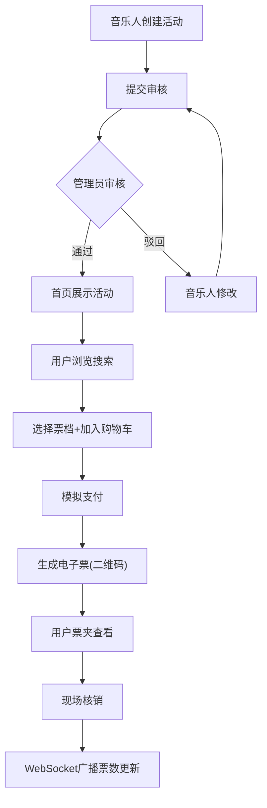

## 1. 产品概述

独立音乐人演出推广与票务管理平台，解决小型演出信息零散、宣传渠道单一、售票流程繁琐的痛点。面向独立音乐人（发布活动、管理票务）、普通用户（浏览购票）和管理员（审核活动）三类角色，提供一站式活动发布、审核、购票、电子票核销和数据分析服务。

## 2. 核心功能

### 2.1 用户角色

| 角色 | 注册方式 | 核心权限 |
|------|----------|----------|
| 音乐人 | 邮箱注册 | 创建/管理演出活动、查看售票统计、核销电子票 |
| 购票用户 | 邮箱注册 | 浏览搜索活动、购票、查看电子票夹 |
| 管理员 | 系统指定 | 审核活动（通过/驳回）、实时查看票数更新 |

### 2.2 功能模块

1. **首页**：活动网格卡片展示、关键词搜索、日期范围筛选
2. **活动详情页**：完整活动信息、弧形时间线、票档选择、购物车、支付模拟
3. **我的票夹页**：已购电子票列表、二维码展示、过期票灰色标识
4. **音乐人后台**：创建活动、售票统计看板（环形图+折线图）、检票核销
5. **管理员后台**：活动审核列表、通过/驳回操作

### 2.3 页面详情

| 页面名称 | 模块名称 | 功能描述 |
|----------|----------|----------|
| 首页 | 搜索栏 | 支持按名称关键词模糊搜索和日期范围筛选，响应时间≤200ms |
| 首页 | 活动卡片网格 | 毛玻璃效果卡片，显示海报缩略图、活动名称、日期、票价范围、剩余票数；悬停时海报放大1.05倍并显示购买按钮 |
| 活动详情页 | 活动信息展示 | 海报、名称、日期、场地、艺人简介、曲目列表 |
| 活动详情页 | 弧形时间线 | Canvas绘制180度弧形时间轴，每个曲目为轴上节点 |
| 活动详情页 | 票档选择 | 早鸟/普通/VIP三档阶梯定价，选中按钮放大动画+勾选标记 |
| 活动详情页 | 购物车 | 显示单价和合计金额，支持修改数量或删除，操作延迟≤100ms |
| 活动详情页 | 支付模拟 | 模拟支付成功，全屏彩屑飘落庆祝动画（CSS keyframes） |
| 我的票夹 | 电子票列表 | 卡片列表展示，每张含海报缩略图、活动名、日期、票档、二维码；过期票灰色标注 |
| 音乐人后台-创建活动 | 活动表单 | 活动名称、海报URL、日期时间、场地地址、阶梯票价、曲目列表、艺人简介；提交后进入审核状态 |
| 音乐人后台-售票统计 | 数据看板 | 总售票数/总收入（动画刷新）、票价档销量占比环形图、7日售票趋势折线图（Recharts） |
| 音乐人后台-检票 | 核销功能 | 输入/扫描票据号核销，防重复使用，WebSocket实时通知票数刷新 |
| 管理员后台 | 活动审核列表 | 列表展示待审核活动，支持通过或驳回（附驳回原因） |

## 3. 核心流程

### 3.1 活动发布流程
音乐人登录 → 创建活动（填写表单） → 提交审核 → 管理员审核 → 通过后首页展示 / 驳回通知修改

### 3.2 购票流程
用户浏览/搜索活动 → 选择活动 → 选择票档和数量 → 加入购物车 → 确认支付（模拟） → 生成电子票（含二维码） → 票夹查看

### 3.3 检票核销流程
音乐人进入检票页 → 输入/扫描票据号 → 核销成功（防重复） → WebSocket广播 → 管理员页面实时刷新剩余票数

## 4. 用户界面设计

### 4.1 设计风格

- **主色调**：深紫(#6B21A8)到暖橙(#F97316)渐变，背景深色(#1A1A2E)
- **字体**：Inter无衬线字体
- **按钮风格**：圆角渐变按钮，悬停时发光
- **卡片风格**：毛玻璃效果(backdrop-filter: blur(12px))，半透明边框，悬停上浮+椭圆阴影
- **布局风格**：桌面端网格布局，移动端单列flex布局，底部悬浮导航栏

### 4.2 页面设计概述

| 页面名称 | 模块名称 | UI元素 |
|----------|----------|--------|
| 首页 | 搜索栏 | 深色背景输入框，聚焦时紫色边框发光动画 |
| 首页 | 活动卡片网格 | 3列网格，毛玻璃卡片，悬停上浮+海报放大1.05倍+购买按钮浮现 |
| 活动详情页 | 左栏-海报与信息 | 大幅海报+活动详情信息 |
| 活动详情页 | 右栏-票档与购物车 | 票档选择按钮（选中放大+勾选）、购物车列表、确认支付按钮 |
| 活动详情页 | 支付成功弹窗 | 全屏彩屑飘落CSS动画，成功提示 |
| 活动详情页 | 弧形时间线 | Canvas绘制的180度弧形时间轴，曲目节点高亮 |
| 我的票夹 | 电子票卡片 | 卡片含海报缩略图+活动信息+二维码，过期票灰色+已过期标签 |
| 音乐人后台 | 统计看板 | 数字动画刷新、Recharts环形图和折线图 |
| 音乐人后台 | 检票输入框 | 扫描/输入票据号，核销状态反馈 |
| 管理员后台 | 审核列表 | 表格展示，通过/驳回按钮，驳回输入原因弹窗 |

### 4.3 响应式设计

- 桌面优先设计，移动端自适应
- 移动端：卡片变为单列，底部悬浮导航栏，触控优化
- 购票页面移动端：单栏堆叠布局（海报→票档→购物车）
- 动画使用requestAnimationFrame确保60fps
- 表单输入错误提示红色抖动文字弹出

### 4.4 动效设计

- 卡片悬停：transform: scale(1.05) + translateY(-8px) + 椭圆阴影
- 票档选中：按钮放大动画 + 勾选图标弹出
- 支付成功：全屏彩屑飘落（CSS keyframes confetti）
- 数字刷新：计数动画（从0滚动到目标值）
- 输入框聚焦：紫色边框glow动画
- 错误提示：红色文字抖动动画
- 页面加载：staggered reveal动画
