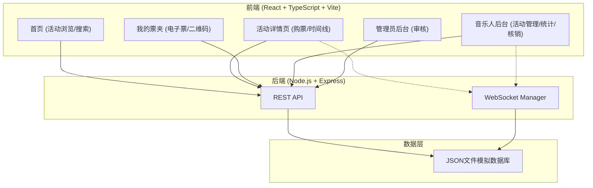
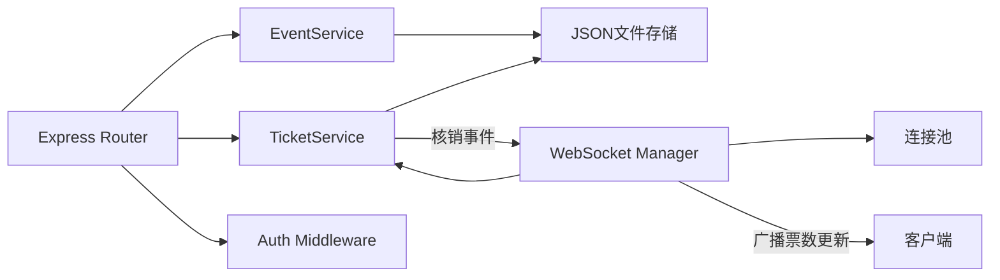
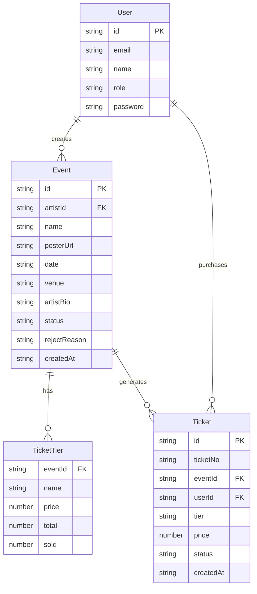

## 1. 架构设计



## 2. 技术说明

- **前端**：React@18 + TypeScript + Vite + TailwindCSS@3 + Zustand
- **初始化工具**：vite-init (react-express-ts 模板)
- **后端**：Express@4 + TypeScript + ws (WebSocket)
- **数据库**：JSON文件模拟数据库
- **图表库**：Recharts
- **二维码**：qrcode
- **其他依赖**：uuid, cors, react-router-dom

## 3. 路由定义

| 路由 | 用途 |
|------|------|
| `/` | 首页 - 活动网格展示、搜索和筛选 |
| `/event/:id` | 活动详情页 - 完整信息、时间线、购票流程 |
| `/tickets` | 我的票夹 - 电子票列表和二维码 |
| `/artist/events` | 音乐人后台 - 活动管理 |
| `/artist/events/create` | 音乐人 - 创建活动 |
| `/artist/analytics/:id` | 音乐人 - 售票统计看板 |
| `/artist/checkin/:id` | 音乐人 - 检票核销 |
| `/admin/events` | 管理员后台 - 活动审核 |

## 4. API定义

### 4.1 认证API

```typescript
POST /api/auth/register
Body: { email: string; password: string; role: "artist" | "user" | "admin"; name: string }
Response: { user: User; token: string }

POST /api/auth/login
Body: { email: string; password: string }
Response: { user: User; token: string }
```

### 4.2 活动API

```typescript
GET /api/events?keyword=string&dateFrom=string&dateTo=string
Response: Event[]

GET /api/events/:id
Response: Event

POST /api/events
Body: { name: string; posterUrl: string; date: string; venue: string; tiers: TicketTier[]; tracks: string[]; artistBio: string }
Response: Event

GET /api/admin/events?status=pending
Response: Event[]

PUT /api/admin/events/:id/verify
Body: { action: "approve" | "reject"; reason?: string }
Response: Event
```

### 4.3 票务API

```typescript
POST /api/tickets
Body: { eventId: string; tier: string; quantity: number; userId: string }
Response: Ticket[]

GET /api/tickets?userId=string
Response: Ticket[]

PUT /api/tickets/:id/checkin
Body: { ticketNo: string }
Response: Ticket
```

### 4.4 统计API

```typescript
GET /api/analytics/events/:id
Response: {
  totalSold: number;
  totalRevenue: number;
  tierBreakdown: { tier: string; count: number; revenue: number }[];
  dailyTrend: { date: string; count: number; revenue: number }[];
}
```

### 4.5 数据类型定义

```typescript
interface User {
  id: string;
  email: string;
  name: string;
  role: "artist" | "user" | "admin";
}

interface TicketTier {
  name: string;
  price: number;
  total: number;
  sold: number;
}

interface Event {
  id: string;
  artistId: string;
  name: string;
  posterUrl: string;
  date: string;
  venue: string;
  tiers: TicketTier[];
  tracks: string[];
  artistBio: string;
  status: "pending" | "approved" | "rejected";
  rejectReason?: string;
  createdAt: string;
}

interface Ticket {
  id: string;
  ticketNo: string;
  eventId: string;
  userId: string;
  tier: string;
  price: number;
  status: "valid" | "used" | "expired";
  createdAt: string;
}
```

## 5. 服务器架构图



## 6. 数据模型

### 6.1 数据模型定义



### 6.2 JSON数据存储

- `data/users.json` - 用户数据
- `data/events.json` - 活动数据（含票档信息）
- `data/tickets.json` - 票据数据

### 6.3 文件组织结构

```
├── package.json
├── vite.config.ts
├── tsconfig.json
├── index.html
├── data/
│   ├── users.json
│   ├── events.json
│   └── tickets.json
├── src/
│   ├── client/
│   │   ├── App.tsx
│   │   ├── components/
│   │   │   └── EventCard.tsx
│   │   ├── pages/
│   │   │   ├── HomePage.tsx
│   │   │   ├── EventDetail.tsx
│   │   │   └── TicketPage.tsx
│   │   ├── stores/
│   │   ├── hooks/
│   │   └── utils/
│   └── server/
│       ├── index.ts
│       ├── services/
│       │   ├── eventService.ts
│       │   └── ticketService.ts
│       └── websocketManager.ts
```
