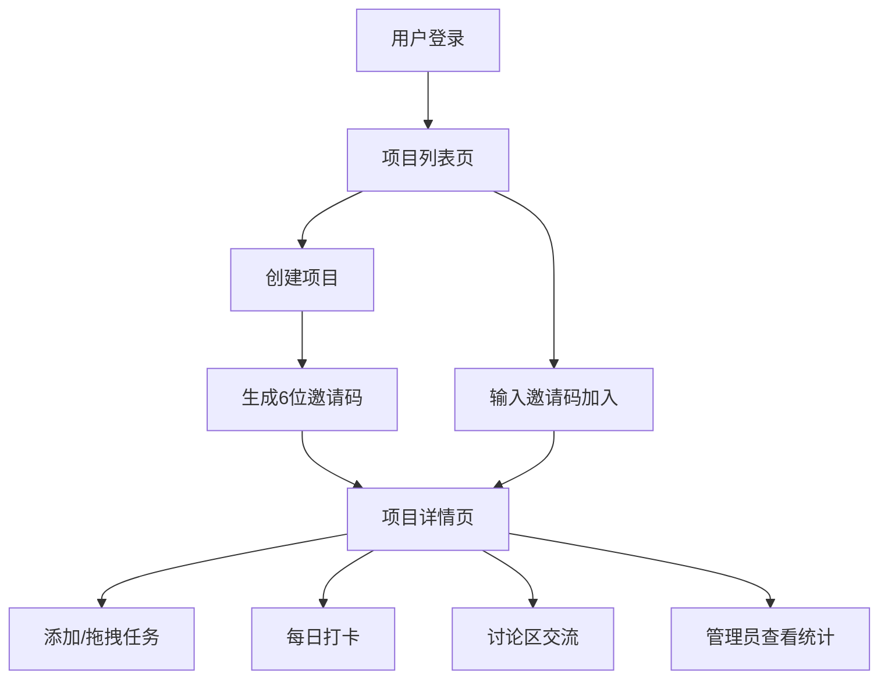

## 1. 产品概述

团队项目协作管理应用，面向中小学生小组作业场景，解决成员责任不明、进度不透明、沟通效率低的问题。通过邀请码快速组队、泳道图任务管理、每日打卡追踪、实时讨论区四大核心功能，提升团队协作效率。

## 2. 核心功能

### 2.1 用户角色

| 角色 | 注册方式 | 核心权限 |
|------|----------|----------|
| 普通成员 | 输入昵称登录 | 查看项目、领取任务、每日打卡、发送消息 |
| 项目管理员 | 创建项目者自动成为 | 全部普通成员权限 + 置顶消息、查看打卡统计、管理任务 |

### 2.2 功能模块

1. **项目列表页**：项目卡片展示、搜索过滤、创建新项目、加入项目
2. **项目详情页**：泳道图任务管理、任务拖拽排序、每日打卡、打卡统计图表、讨论区

### 2.3 页面详情

| 页面名称 | 模块名称 | 功能描述 |
|----------|----------|----------|
| 项目列表页 | 项目卡片列表 | 展示项目名、成员数、剩余天数、进度条（红到绿渐变），卡片式布局 |
| 项目列表页 | 创建项目弹窗 | 输入项目名称、截止日期、项目简介，生成6位邀请码 |
| 项目列表页 | 加入项目弹窗 | 输入6位邀请码加入已有项目 |
| 项目列表页 | 搜索过滤 | 按项目名称搜索过滤 |
| 项目详情页 | 泳道图任务面板 | 按负责人分列展示任务，支持拖拽排序，半透明拖影动画 |
| 项目详情页 | 添加任务表单 | 指定负责人、任务描述、优先级（高/中/低）、预计完成小时数 |
| 项目详情页 | 任务卡片 | 优先级标签（红/橙/绿圆点）、打卡按钮、最后打卡时间戳 |
| 项目详情页 | 打卡弹窗 | 输入当日完成进度描述和困难点，提交后触发弹跳动画 |
| 项目详情页 | 打卡统计 | 柱状图展示每人累计打卡天数和总时长 |
| 项目详情页 | 讨论区 | 消息列表（带发送时间和头像）、新消息淡入动画、置顶消息（淡黄色背景+小红旗） |

## 3. 核心流程

用户输入昵称登录 → 进入项目列表页 → 创建项目（生成邀请码）或输入邀请码加入项目 → 进入项目详情页 → 添加任务并分配负责人 → 每日打卡更新进度 → 讨论区沟通协作 → 管理员查看统计数据

## 4. 用户界面设计

### 4.1 设计风格

- **主背景色**：浅灰蓝 #F0F4FF
- **卡片背景**：白色圆角矩形，细微阴影
- **标题栏**：深蓝 #1E3A5F
- **功能按钮**：渐变蓝紫 #4A90D9 → #7B68EE，hover时颜色加深，0.2秒过渡
- **优先级标签**：高（红 #FF4757）、中（橙 #FFA502）、低（绿 #2ED573），小圆点+文字
- **进度条**：从红色渐变到绿色，直观展示完成度
- **字体**：使用思源黑体或系统无衬线字体，层级清晰
- **动画**：拖拽0.3秒平滑过渡，打卡成功弹跳动画，新消息淡入动画

### 4.2 页面设计概述

| 页面名称 | 模块名称 | UI元素 |
|----------|----------|--------|
| 项目列表页 | 项目卡片 | 白色圆角卡片、渐变进度条、成员头像组、剩余天数标签、悬停阴影加深 |
| 项目详情页 | 泳道图 | 按负责人分列、每列顶部显示成员头像和名称、任务卡片可拖拽 |
| 项目详情页 | 任务卡片 | 优先级圆点标签、预计时长、打卡按钮、最后打卡时间、拖拽时半透明 |
| 项目详情页 | 打卡统计 | 柱状图（recharts）、成员头像、累计天数和总时长数字 |
| 项目详情页 | 讨论区 | 聊天气泡布局、置顶消息淡黄色背景+小红旗图标、输入框固定底部 |

### 4.3 响应式

- **桌面端**：泳道图横向分列展示，讨论区右侧面板
- **移动端（<768px）**：泳道图切换为垂直列表，卡片自适应宽度，16px圆角，讨论区改为底部标签切换

### 4.4 性能要求

- 主要交互（拖拽排序、打卡提交、消息发送）响应时间 ≤ 300ms
- 页面首次加载时间 ≤ 2秒
- 使用 framer-motion 实现高性能动画
