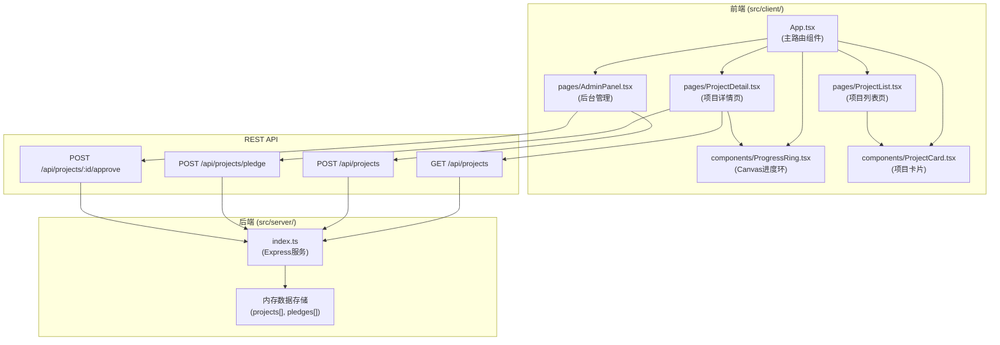
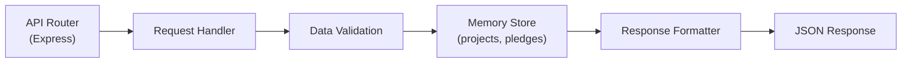
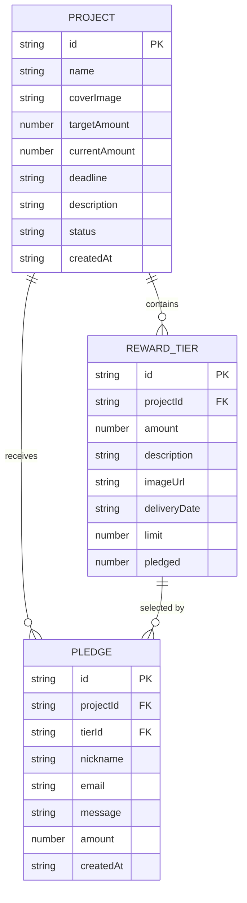

## 1. 架构设计



## 2. 技术描述

- **前端**：React 18 + TypeScript + Vite
- **构建工具**：Vite 5
- **样式**：原生CSS + CSS Modules
- **后端**：Node.js + Express 4
- **数据存储**：内存数组（无数据库）
- **依赖库**：react, react-dom, express, uuid, cors, marked, body-parser

## 3. 路由定义

| 路由 | 页面 | 用途 |
|------|------|------|
| `/` | 项目列表页 | 展示所有已发布项目，按筹款进度排序 |
| `/project/:id` | 项目详情页 | 查看项目详情、选择档位、提交认筹 |
| `/admin` | 后台管理页 | 创建新项目、审核发布项目 |

## 4. API 定义

### 4.1 类型定义

```typescript
// 回报档位
interface RewardTier {
  id: string;
  amount: number;
  description: string;
  imageUrl: string;
  deliveryDate: string;
  limit: number;
  pledged: number;
}

// 众筹项目
interface Project {
  id: string;
  name: string;
  coverImage: string;
  targetAmount: number;
  currentAmount: number;
  deadline: string;
  description: string;
  rewardTiers: RewardTier[];
  status: 'pending' | 'approved' | 'rejected';
  createdAt: string;
}

// 认筹记录
interface Pledge {
  id: string;
  projectId: string;
  tierId: string;
  nickname: string;
  email: string;
  message: string;
  amount: number;
  createdAt: string;
}

// 认筹请求
interface PledgeRequest {
  projectId: string;
  tierId: string;
  nickname: string;
  email: string;
  message?: string;
}

// 认筹响应
interface PledgeResponse {
  pledgeId: string;
  project: Project;
}
```

### 4.2 接口列表

| 方法 | 路径 | 描述 | 请求体 | 响应 |
|------|------|------|--------|------|
| GET | `/api/projects` | 获取项目列表（可带status过滤） | - | `Project[]` |
| GET | `/api/projects/:id` | 获取单个项目详情 | - | `Project` |
| POST | `/api/projects` | 创建新项目 | `Omit<Project, 'id' \| 'currentAmount' \| 'status' \| 'createdAt'>` | `Project` |
| POST | `/api/projects/:id/approve` | 审核通过项目 | - | `Project` |
| POST | `/api/projects/pledge` | 提交认筹 | `PledgeRequest` | `PledgeResponse` |
| GET | `/api/projects/:id/pledges` | 获取项目认筹记录 | - | `Pledge[]` |

## 5. 服务端架构



## 6. 数据模型

### 6.1 ER 图



### 6.2 初始数据

后端启动时预置3个演示项目数据，包含不同状态（审核中、已发布），每个项目至少3个回报档位。

## 7. 文件结构

```
├── package.json
├── vite.config.js
├── tsconfig.json
├── index.html
└── src/
    ├── client/
    │   ├── App.tsx
    │   ├── types.ts
    │   ├── components/
    │   │   ├── ProgressRing.tsx
    │   │   ├── ProjectCard.tsx
    │   │   ├── Countdown.tsx
    │   │   └── PledgeModal.tsx
    │   └── pages/
    │       ├── ProjectList.tsx
    │       ├── ProjectDetail.tsx
    │       └── AdminPanel.tsx
    └── server/
        ├── index.ts
        ├── data.ts
        └── types.ts
```
