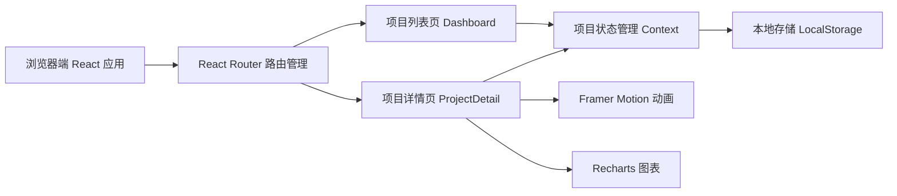
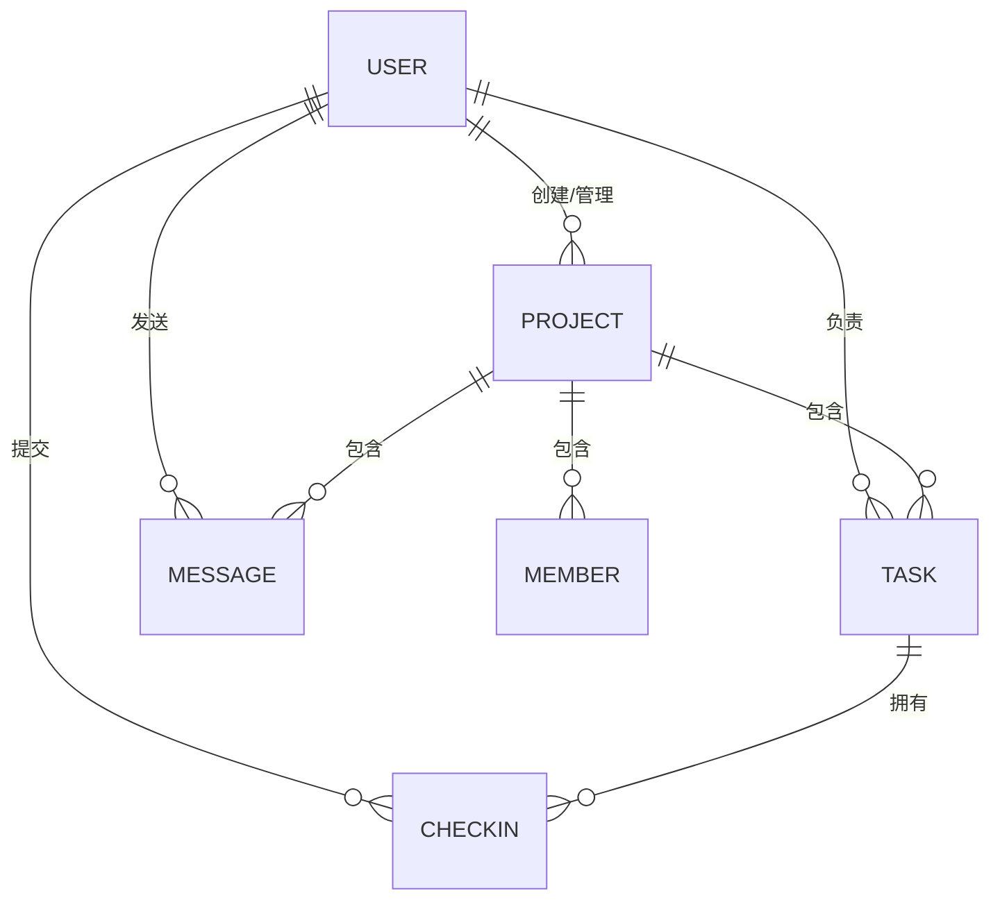

## 1. 架构设计



## 2. 技术描述

- **前端框架**：React@18 + TypeScript@5
- **构建工具**：Vite@5
- **路由管理**：react-router-dom@6
- **状态管理**：React Context + useReducer
- **动画库**：framer-motion@11
- **图表库**：recharts@2
- **唯一ID生成**：uuid@9
- **数据持久化**：LocalStorage（模拟后端）
- **CSS方案**：CSS Modules + CSS Variables

## 3. 路由定义

| 路由 | 页面组件 | 用途 |
|------|----------|------|
| `/` | Dashboard | 项目列表页，展示所有项目卡片 |
| `/project/:id` | ProjectDetail | 项目详情页，包含任务管理、打卡、讨论区 |
| `/login` | Login | 登录页，输入昵称 |

## 4. 数据模型

### 4.1 实体关系图



### 4.2 TypeScript 类型定义

```typescript
interface User {
  id: string;
  name: string;
  avatar: string;
}

interface Project {
  id: string;
  name: string;
  description: string;
  deadline: string;
  inviteCode: string;
  creatorId: string;
  createdAt: string;
  memberIds: string[];
  pinnedMessageId?: string;
}

interface Task {
  id: string;
  projectId: string;
  title: string;
  description: string;
  priority: 'high' | 'medium' | 'low';
  assigneeId: string;
  estimatedHours: number;
  order: number;
  createdAt: string;
  lastCheckinAt?: string;
}

interface Checkin {
  id: string;
  taskId: string;
  userId: string;
  progress: string;
  difficulties: string;
  createdAt: string;
  durationHours: number;
}

interface Message {
  id: string;
  projectId: string;
  userId: string;
  content: string;
  createdAt: string;
  isPinned: boolean;
}
```

## 5. 文件结构

```
src/
├── App.tsx              # 根组件，路由配置
├── main.tsx             # 应用入口
├── index.css            # 全局样式，CSS变量
├── pages/
│   ├── Login.tsx        # 登录页
│   ├── Dashboard.tsx    # 项目列表页
│   └── ProjectDetail.tsx # 项目详情页
├── components/
│   ├── TaskCard.tsx     # 任务卡片组件
│   ├── ChatPanel.tsx    # 讨论区组件
│   ├── ProjectCard.tsx  # 项目卡片组件
│   ├── CreateProjectModal.tsx
│   ├── JoinProjectModal.tsx
│   ├── AddTaskForm.tsx
│   ├── CheckinModal.tsx
│   └── MemberStats.tsx  # 成员打卡统计
├── stores/
│   └── projectStore.ts  # Context 状态管理
├── types/
│   └── index.ts         # TypeScript 类型定义
└── utils/
    ├── storage.ts       # LocalStorage 工具
    └── helpers.ts       # 通用工具函数
```

## 6. 性能优化策略

1. **组件拆分**：将复杂页面拆分为小组件，配合 React.memo 减少不必要重渲染
2. **状态隔离**：使用 Context 拆分不同领域状态，避免全局状态变更导致全量重渲染
3. **动画优化**：使用 framer-motion 的 transform 和 opacity 属性动画，避免布局抖动
4. **懒加载**：非关键组件使用 React.lazy 动态导入
5. **LocalStorage 缓存**：数据读写异步化，避免阻塞主线程
6. **虚拟列表**：任务和消息数量较多时使用虚拟滚动
