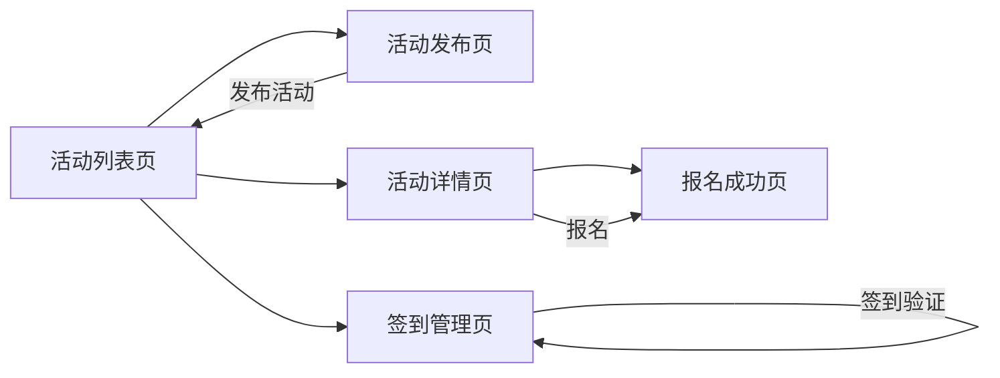

## 1. 产品概述
活动报名系统是一个在线活动管理平台，支持主办方发布活动、参与者在线报名、自动生成签到二维码以及现场签到管理。

- 主要目标用户：活动主办方（发布活动、管理签到）、活动参与者（浏览活动、在线报名）
- 核心价值：简化活动组织流程，提升报名体验，实现高效的签到管理

## 2. 核心功能

### 2.1 用户角色
| 角色 | 进入方式 | 核心权限 |
|------|----------|----------|
| 主办方 | 直接访问 | 发布活动、查看报名名单、签到管理 |
| 参与者 | 直接访问 | 浏览活动、在线报名、获取签到二维码 |

### 2.2 功能模块
1. **活动列表页**：展示所有活动，支持发布活动入口，按时间倒序排列
2. **活动发布页**：主办方填写活动信息表单并提交
3. **活动详情页**：展示活动详细信息，参与者填写报名信息
4. **报名成功页**：展示报名成功信息及签到二维码
5. **签到管理页**：主办方输入活动ID，查看报名名单，验证签到

### 2.3 页面详情
| 页面名称 | 模块名称 | 功能描述 |
|-----------|-------------|---------------------|
| 活动列表页 | 导航栏 | Logo、各页面导航入口、主色调渐变背景 |
| 活动列表页 | 活动卡片列表 | 玻璃板效果卡片，展示活动名/时间/地点/人数状态，按时间倒序，满员标签 |
| 活动列表页 | 发布活动按钮 | 悬浮按钮，跳转到活动发布页 |
| 活动发布页 | 发布表单 | 活动名称、日期时间、地点、最大人数、描述输入框，提交按钮 |
| 活动详情页 | 活动信息区 | 完整展示活动所有信息，包含满员状态提示 |
| 活动详情页 | 报名表单 | 姓名、邮箱输入，报名按钮（满员时禁用） |
| 报名成功页 | 成功提示 | 报名成功文字提示，报名ID展示 |
| 报名成功页 | 二维码展示 | 居中展示签到二维码，呼吸光晕动画效果 |
| 签到管理页 | 活动ID输入 | 输入活动ID加载对应报名名单 |
| 签到管理页 | 报名者列表 | 交替背景色列表，显示姓名/邮箱/签到状态 |
| 签到管理页 | 签到验证区 | 扫码枪/手动输入报名ID，签到按钮及动画 |

## 3. 核心流程
### 主办方发布活动流程
主办方进入发布页 → 填写活动表单 → 提交 → 活动出现在列表页（按时间倒序）

### 参与者报名流程
参与者浏览活动列表 → 点击活动进入详情 → 填写姓名邮箱 → 提交报名 → 展示签到二维码

### 主办方签到流程
主办方进入签到页 → 输入活动ID → 加载报名名单 → 扫码/输入报名ID签到 → 状态更新（绿色高亮动画）

## 4. 用户界面设计

### 4.1 设计风格
- 主色调：深蓝(#1a2a6c)到紫罗兰(#b21f1f)渐变
- 设计语言：毛玻璃质感（Glassmorphism），半透明背景+模糊backdrop-filter
- 按钮风格：圆角胶囊按钮，渐变背景，悬停时有柔和阴影
- 字体：显示字体使用Playfair Display，正文字体使用Poppins
- 布局风格：卡片式布局，顶部导航栏
- 图标风格：使用emoji图标增强视觉趣味性

### 4.2 页面设计概述
| 页面名称 | 模块名称 | UI元素 |
|-----------|-------------|-------------|
| 活动列表页 | 导航栏 | 渐变背景，磨砂玻璃效果，品牌Logo带光晕 |
| 活动列表页 | 活动卡片 | 玻璃板效果，悬停放大1.02倍+柔和阴影，满员红色标签 |
| 活动发布页 | 表单 | 毛玻璃输入框，聚焦时边框发光，提交按钮渐变 |
| 活动详情页 | 信息区 | 大号标题，信息网格布局，渐变分隔线 |
| 报名成功页 | 二维码 | 居中展示，白色背景卡片，呼吸光晕动画（关键帧循环） |
| 签到管理页 | 列表行 | 交替浅灰/白色背景，签到按钮checkmark缩放动画 |

### 4.3 响应式设计
- 设计策略：桌面端优先，移动端适配
- 桌面端：活动列表2-3栏网格，详情页两栏布局
- 移动端：所有页面单列布局，卡片宽度100%，导航栏精简
- 触摸优化：按钮最小高度44px，表单输入框适配软键盘

### 4.4 动画效果
- 卡片悬停：scale(1.02) + box-shadow 柔和投射
- 二维码呼吸光晕：@keyframes pulse 循环动画
- 签到状态更新：绿色背景高亮 + 渐隐过渡
- 签到按钮点击：checkmark图标scale缩放动画
- 页面切换：淡入淡出过渡效果
