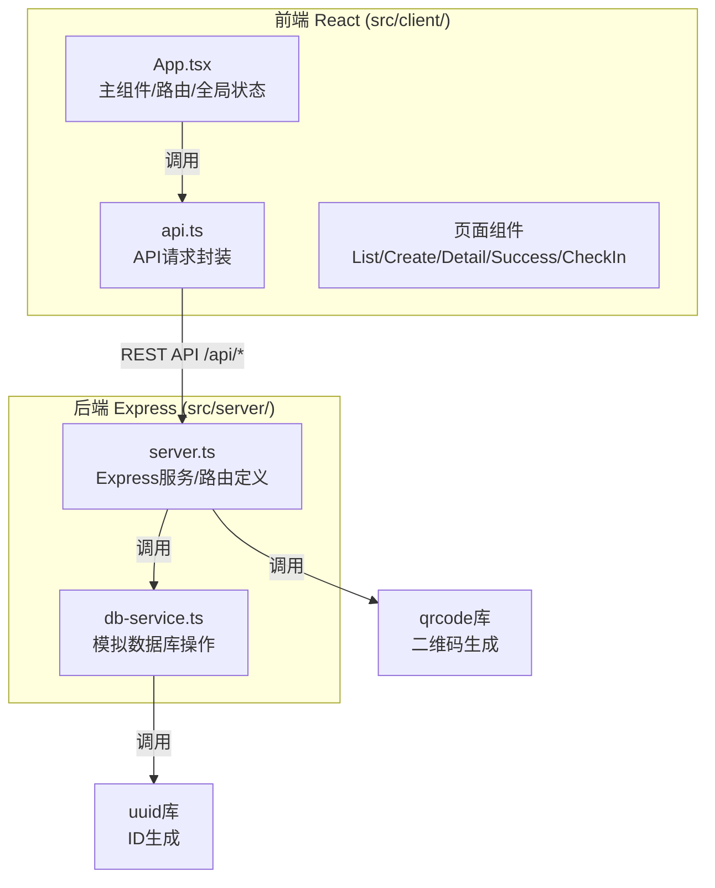
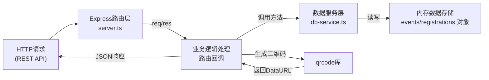
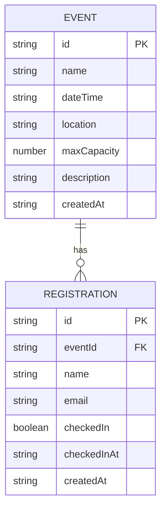

## 1. 架构设计



## 2. 技术说明
- 前端框架：React@18 + TypeScript + Vite
- 前端路由：React Router v6（hash路由，简单SPA体验）
- 前端样式：纯CSS（CSS Modules/全局样式），CSS变量统一主题
- 后端框架：Express@4 + TypeScript
- 数据库：内存模拟（纯对象存储，进程内持久化）
- 二维码生成：qrcode@latest（Node端生成DataURL）
- ID生成：uuid@latest
- 跨域：cors中间件
- 请求体解析：body-parser中间件
- 开发启动：concurrently并行启动前后端

## 3. 路由定义
| 前端路由 | 页面组件 | 用途 |
|----------|----------|------|
| / | EventList | 活动列表主页 |
| /create | CreateEvent | 发布活动页面 |
| /event/:id | EventDetail | 活动详情/报名页 |
| /success/:regId | RegistrationSuccess | 报名成功/二维码页 |
| /checkin | CheckInManager | 签到管理页 |

| 后端API路由 | 方法 | 用途 |
|-------------|------|------|
| /api/events | GET | 获取所有活动列表（按时间倒序） |
| /api/events | POST | 创建新活动 |
| /api/events/:id | GET | 获取单个活动详情 |
| /api/register | POST | 提交报名，返回含二维码的报名信息 |
| /api/registrations/:eventId | GET | 获取指定活动的所有报名记录 |
| /api/verify | POST | 验证并签到（传入报名ID和活动ID） |

## 4. API定义

### 类型定义
```typescript
// 活动
interface Event {
  id: string;
  name: string;
  dateTime: string; // ISO string
  location: string;
  maxCapacity: number;
  description: string;
  createdAt: string;
}

// 报名记录
interface Registration {
  id: string;
  eventId: string;
  name: string;
  email: string;
  checkedIn: boolean;
  checkedInAt?: string;
  createdAt: string;
}

// 活动详情（含报名人数）
interface EventWithStats extends Event {
  registeredCount: number;
  isFull: boolean;
}
```

### 请求/响应结构
- `POST /api/events` 请求体：`{ name, dateTime, location, maxCapacity, description }`
- `POST /api/register` 请求体：`{ eventId, name, email }`，响应：`{ registration, qrCodeDataUrl }`
- `POST /api/verify` 请求体：`{ registrationId, eventId }`，响应：`{ success, registration, message }`
- `GET /api/events` 响应：`EventWithStats[]`

## 5. 服务端架构图



## 6. 数据模型

### 6.1 实体关系



### 6.2 内存数据结构
```typescript
// db-service.ts 内部存储
interface DataStore {
  events: Record<string, Event>;          // eventId -> Event
  registrations: Record<string, Registration>; // registrationId -> Registration
  eventRegistrations: Record<string, string[]>; // eventId -> registrationId[]
}
```

### 数据流向说明
1. 活动发布：CreateEvent页 → api.ts POST /api/events → server.ts路由 → db-service.addEvent() → 内存events对象 → 返回新活动 → 列表页刷新
2. 用户报名：EventDetail页 → api.ts POST /api/register → server.ts路由 → 校验人数未满 → db-service.register() → 生成uuid → qrcode.toDataURL() → 返回报名信息+二维码 → Success页展示
3. 签到验证：CheckIn页 → api.ts POST /api/verify → server.ts路由 → db-service.verify() → 更新checkedIn字段 → 返回最新状态 → 界面高亮动画更新
