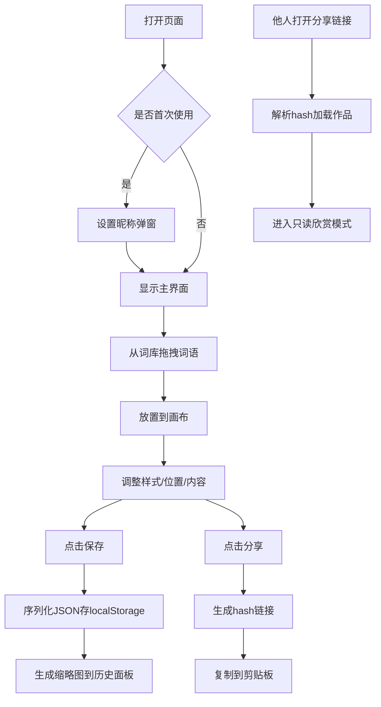

## 1. 产品概述

拼诗是一款面向文字爱好者的在线拼贴诗创作平台，用户可以像玩拼贴游戏一样从内置词库中拖拽词语到画布上自由组合成诗句，支持个性化样式调整、本地存档和作品分享。

- **目标用户**：文字爱好者、诗人、创意工作者
- **核心价值**：降低诗歌创作门槛，通过可视化拼贴方式激发创作灵感
- **产品定位**：轻量、有趣、富有艺术感的在线创作工具

## 2. 核心功能

### 2.1 用户角色

| 角色 | 注册方式 | 核心权限 |
|------|----------|----------|
| 普通用户 | 无需注册，首次使用设置昵称 | 创建、编辑、保存、分享拼贴诗作品 |

### 2.2 功能模块

1. **词库面板**：分类词库展示、可拖拽词语卡片、词语分类切换
2. **画布区域**：文本块拖拽放置、位置调整、样式编辑、右键菜单、缩放旋转
3. **历史面板**：作品存档列表、缩略图预览、一键恢复、删除存档
4. **分享系统**：生成唯一分享链接、只读欣赏模式、原作者信息展示
5. **用户系统**：昵称设置、本地身份存储

### 2.3 页面详情

| 页面名称 | 模块名称 | 功能描述 |
|----------|----------|----------|
| 首页 | 导航栏 | 平台logo、用户昵称、使用指南入口 |
| 首页 | 词库面板 | 5大分类词库（自然/情感/时间/物品/动作），每类20-30个可拖拽词语卡片 |
| 首页 | 画布区域 | 800x600创作画布，支持文本块的拖拽、编辑、缩放、旋转、右键操作 |
| 首页 | 历史面板 | localStorage存档列表，缩略图预览，恢复/删除操作 |
| 首页 | 操作按钮 | 保存按钮、分享按钮 |
| 首页 | 欣赏模式 | 通过分享链接访问时的只读模式，显示作者信息和保存时间 |
| 首页 | 弹窗 | 使用指南、昵称设置弹窗 |

## 3. 核心流程

### 3.1 创作流程

用户打开页面 → 从左侧词库拖拽词语到画布 → 调整文本块位置/样式/内容 → 点击保存到本地存档 → 生成分享链接分享给他人

### 3.2 分享流程

用户创建作品 → 点击分享按钮 → 生成带hash的唯一链接 → 复制到剪贴板 → 他人打开链接 → 自动加载作品 → 进入只读欣赏模式

### 3.3 流程图

## 4. 用户界面设计

### 4.1 设计风格

**色彩系统**：
- 主色：#F5E6CA（米白色）
- 辅色：#C4A882（浅棕色）
- 强调色：#E07A5F（暖橙红色）
- 文本色：#333333（深灰色）
- 边框色：#E0E0E0（浅灰色）

**排版系统**：
- 标题字体：思源宋体（Source Han Serif）
- 正文字体：思源宋体
- Logo字号：24px
- 文本块字号：默认16px，可选12/16/20/24/28px

**组件样式**：
- 词语卡片：圆角矩形、白底浅灰边框、悬停浅蓝背景、拖拽时半透明放大1.1倍
- 画布：800x600浅米色背景、细微网格线、内凹阴影（inset 0 0 20px rgba(0,0,0,0.05)）
- 文本块：选中时半透明蓝色边框、四角缩放柄、平滑过渡动画（200ms ease-out）
- 按钮：圆角设计、悬停阴影变化、点击反馈
- 弹窗：半透明遮罩、居中显示、圆角设计

**动效设计**：
- 词语卡片拖拽：opacity 0.8 + scale 1.1
- 文本块移动：transition: all 200ms ease-out
- 悬停反馈：背景色变化 + 轻微阴影
- 右键菜单：淡入动画

### 4.2 页面设计概览

| 页面名称 | 模块名称 | UI 元素 |
|----------|----------|---------|
| 首页 | 导航栏 | 高60px，左侧"拼诗"logo（暖橙红色，思源宋体24px），右侧用户昵称 + 问号图标 |
| 首页 | 词库面板 | 左侧固定宽度，分类标签页，词语卡片网格布局，拖拽效果 |
| 首页 | 画布区域 | 中央800x600区域，浅米色背景网格线，内凹阴影，文本块可拖拽/编辑/缩放 |
| 首页 | 历史面板 | 右侧固定宽度，存档卡片垂直排列，缩略图+时间+删除按钮 |
| 首页 | 操作栏 | 画布下方，保存/分享按钮，暖橙红色主按钮 |
| 首页 | 右键菜单 | 文本块右键触发，颜色/字号/旋转/删除/复制选项 |
| 首页 | 欣赏模式 | 半透明叠加层显示"欣赏模式"，右上角作者昵称和保存时间，文本块不可编辑 |

### 4.3 响应式

- **设计策略**：桌面端优先，暂不支持移动端适配
- **画布固定尺寸**：800x600，居中显示
- **面板布局**：左右面板固定宽度，中央画布自适应居中

### 4.4 性能要求

- 拖拽和编辑操作响应时间 ≤ 100ms
- 画布上同时支持最多50个文本块时帧率 ≥ 50fps
- 使用CSS transform进行位置更新，避免频繁重排重绘
