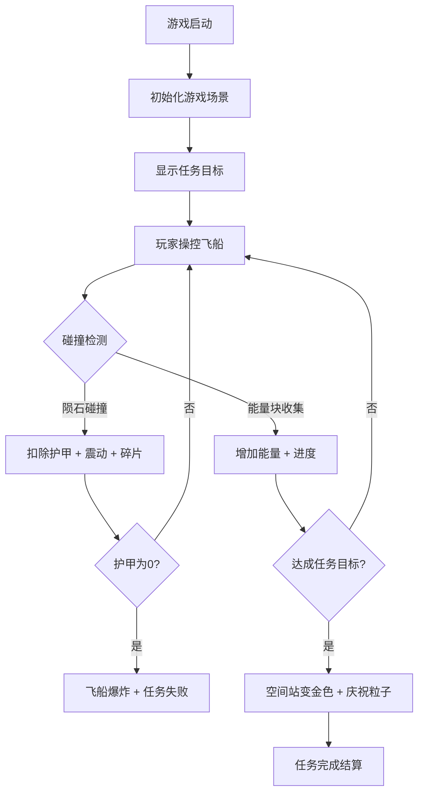

## 1. 产品概述

太空货运飞船模拟游戏是一款基于重力感应与路径规划的 2D 太空冒险游戏，玩家操控货运飞船在陨石带中穿梭、收集能量块并躲避障碍，最终抵达空间站完成货运任务。

- 核心玩法：物理驱动的飞船操控 + 陨石躲避 + 能量收集 + 目标抵达
- 目标用户：休闲游戏爱好者、太空题材爱好者
- 市场价值：提供沉浸式物理模拟体验，结合策略与操作技巧

## 2. 核心功能

### 2.1 功能模块

1. **游戏主画布**：Canvas 渲染的 2D 太空场景，包含飞船、陨石、能量块、星空背景、空间站
2. **物理引擎系统**：引力场模拟、推力控制、惯性运动、碰撞检测与伤害计算
3. **陨石带系统**：随机生成陨石和能量块，动态漂移，生命周期管理
4. **虚拟摇杆**：屏幕左下角的触控/鼠标摇杆，控制飞船推力方向和大小
5. **状态面板**：顶部状态栏显示护甲、能量、任务进度、得分
6. **任务系统**：收集能量块 + 抵达空间站的双目标任务
7. **碰撞反馈系统**：屏幕震动、碎片粒子、护甲闪烁、爆炸效果

### 2.2 功能详情

| 功能模块 | 子功能 | 功能描述 |
|----------|--------|----------|
| 物理引擎 | 引力场 | 指向屏幕中心，强度随距离线性增加 |
| 物理引擎 | 推力控制 | 虚拟摇杆控制推力矢量，最大推力可对抗引力 |
| 物理引擎 | 惯性与阻尼 | 飞船有惯性、角速度和摩擦阻尼 |
| 物理引擎 | 碰撞检测 | 空间哈希网格优化，飞船与陨石/能量块碰撞检测 |
| 陨石带 | 陨石生成 | 50颗随机大小(5-20px)陨石，灰褐到暗红渐变，随机凹凸纹理 |
| 陨石带 | 能量块 | 10个金色发光六边形，脉动大小变化周期1秒 |
| 陨石带 | 动态漂移 | 陨石以随机速度和方向缓慢漂移 |
| 虚拟摇杆 | 摇杆控制 | 半透明圆形区域，拖拽内圈控制推力，松手回弹 |
| 虚拟摇杆 | 力度指示 | 绿到红渐变的力度条，显示推力强度0-100% |
| 状态面板 | 护甲条 | 显示当前护甲值，受击时红色闪烁警告 |
| 状态面板 | 能量条 | 显示能量值，收集能量块增加，满可释放护盾 |
| 状态面板 | 任务进度 | 显示已收集能量块数/目标数 |
| 状态面板 | 得分 | 显示当前游戏得分 |
| 任务系统 | 任务目标 | 收集10个能量块并抵达空间站 |
| 任务系统 | 空间站 | 右上角绿色闪烁光圈，完成后变金色并触发庆祝粒子 |
| 碰撞反馈 | 屏幕震动 | 碰撞时画布随机偏移2-3像素，持续0.2秒 |
| 碰撞反馈 | 碎片爆炸 | 8-12个碎石粒子飞散，2秒后消失 |
| 碰撞反馈 | 护甲闪烁 | 受击后护甲条每秒闪3次，持续1.5秒 |
| 碰撞反馈 | 飞船爆炸 | 护甲为0时全屏白色闪光，显示任务失败 |

## 3. 核心流程

游戏启动 → 初始化场景（飞船、陨石、能量块、空间站）→ 显示任务目标 → 玩家通过虚拟摇杆操控飞船 → 收集能量块增加能量和进度 → 躲避陨石避免护甲损失 → 收集足够能量块 → 驾驶飞船抵达空间站 → 任务完成庆祝 → 游戏结算

## 4. 用户界面设计

### 4.1 设计风格

- **主色调**：深空蓝黑渐变背景（#0a0e27 → #1a1a3e）
- **强调色**：
  - 飞船银色 + 蓝色引擎尾焰
  - 能量块金黄色（#FFD700）
  - 陨石灰褐到暗红渐变
  - 空间站绿色（#00FF00）闪烁光圈
- **UI风格**：毛玻璃效果（半透明背景 + 模糊），白色半透明文字
- **字体**：现代无衬线字体，清晰易读
- **整体氛围**：科幻、沉浸、紧张刺激的太空冒险感

### 4.2 页面设计

| 区域 | 位置 | UI元素 |
|------|------|--------|
| 游戏画布 | 全屏 | 飞船、陨石、能量块、星空、空间站 |
| 状态栏 | 顶部 | 护甲条、能量条、任务进度、得分 |
| 虚拟摇杆 | 左下角 | 摇杆底座、摇杆头、力度指示条 |
| 任务面板 | 左侧 | 任务文字、能量块图标、进度数字 |

### 4.3 响应式设计

- 画布随窗口大小自动缩放
- UI元素按比例重排
- 虚拟摇杆位置固定在左下角，尺寸自适应
- 状态栏保持顶部全宽

### 4.4 视觉细节

- **星空背景**：约200颗大小随机、亮度闪烁的星星（0.5-2秒随机闪动）
- **飞船设计**：流线型银色轮廓，蓝色引擎尾焰粒子流（尾焰长度随推力增加）
- **陨石设计**：随机凹凸纹理，弥漫暗红色调
- **能量块**：发光六边形，脉动大小变化
- **粒子效果**：尾焰粒子、爆炸碎片、庆祝星星
