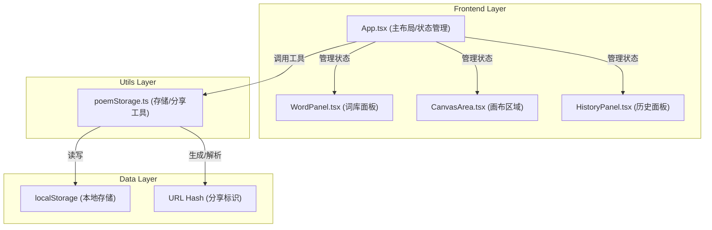

## 1. 架构设计



## 2. 技术描述

- **前端框架**：React@18 + TypeScript@5
- **构建工具**：Vite@5
- **依赖库**：
  - react@18.2.0
  - react-dom@18.2.0
  - uuid@9.0.0（生成唯一ID）
  - @types/react@18.2.0
  - @types/react-dom@18.2.0
  - @types/uuid@9.0.0
  - typescript@5.3.0
- **无后端**：纯前端应用，数据存储于浏览器localStorage

## 3. 项目结构

```
auto50/
├── package.json
├── index.html
├── tsconfig.json
├── vite.config.js
└── src/
    ├── main.tsx           # React根渲染入口
    ├── App.tsx            # 主布局组件，状态管理
    ├── components/
    │   ├── WordPanel.tsx     # 左侧词库面板
    │   ├── CanvasArea.tsx    # 中央画布区域
    │   └── HistoryPanel.tsx  # 右侧历史面板
    └── utils/
        └── poemStorage.ts    # 存储与分享工具函数
```

## 4. 路由定义

| Route | Purpose |
|-------|---------|
| / | 主创作页面 |
| #poem-{hash} | 分享作品的只读欣赏模式 |

## 5. 数据模型

### 5.1 类型定义

```typescript
// 文本块数据结构
interface TextBlock {
  id: string;
  x: number;
  y: number;
  width: number;
  height: number;