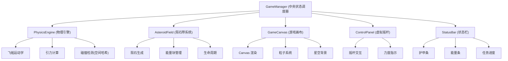

## 1. 架构设计

整体采用模块化架构，分为物理引擎模块、UI渲染模块和中央状态管理器三层，通过 GameManager 进行数据同步。



## 2. 技术描述

- **前端框架**：React@18 + TypeScript + Vite
- **渲染技术**：HTML5 Canvas 2D
- **状态管理**：GameManager 类 + React hooks
- **构建工具**：Vite@5
- **依赖库**：
  - react / react-dom：UI 框架
  - typescript：类型安全
  - uuid：唯一 ID 生成
  - @vitejs/plugin-react：React 支持

## 3. 模块职责

### 3.1 物理引擎模块 (src/engine/)

| 文件 | 职责 |
|------|------|
| PhysicsEngine.ts | 飞船运动学、引力计算、碰撞检测（空间哈希网格优化） |
| AsteroidField.ts | 陨石和能量块生成、位置速度管理、生命周期 |

### 3.2 UI 渲染模块 (src/ui/)

| 文件 | 职责 |
|------|------|
| GameCanvas.tsx | Canvas 主画布，渲染飞船、陨石、能量块、星空、粒子 |
| ControlPanel.tsx | 虚拟摇杆组件，控制推力方向和大小 |
| StatusBar.tsx | 状态栏组件，显示护甲、能量、任务进度、得分 |

### 3.3 中央状态管理器 (src/GameManager.ts)

- 协调引擎与 UI 间的数据同步
- 游戏状态管理（进行中、胜利、失败）
- 帧循环调度
- 事件分发

## 4. 数据模型

### 4.1 核心数据类型

```typescript
// 向量
interface Vector2 {
  x: number;
  y: number;
}

// 飞船状态
interface Ship {
  position: Vector2;
  velocity: Vector2;
  angle: number;
  angularVelocity: number;
  armor: number;
  maxArmor: number;
  energy: number;
  maxEnergy: number;
  shieldActive: boolean;
}

// 陨石
interface Asteroid {
  id: string;
  position: Vector2;
  velocity: Vector2;
  radius: number;
  color: string;
  rotation: number;
  rotationSpeed: number;
  vertices: Vector2[];
}

// 能量块
interface EnergyOrb {
  id: string;
  position: Vector2;
  radius: number;
  pulsePhase: number;
}

// 粒子
interface Particle {
  id: string;
  position: Vector2;
  velocity: Vector2;
  life: number;
  maxLife: number;
  color: string;
  size: number;
}

// 空间站
interface SpaceStation {
  position: Vector2;
  radius: number;
}
```

## 5. 性能优化策略

1. **碰撞检测优化**：使用空间哈希网格（Spatial Hash Grid）减少碰撞检测的计算量
2. **粒子数量控制**：粒子总数不超过 500 个，超出时优先保留最新粒子
3. **帧率控制**：使用 requestAnimationFrame，目标 60fps，最低保证 45fps
4. **Canvas 渲染优化**：分层渲染，静态背景预渲染，动态元素单独绘制
5. **对象池化**：粒子和陨石对象复用，减少 GC 压力

## 6. 项目文件结构

```
src/
├── engine/
│   ├── PhysicsEngine.ts    # 物理引擎
│   └── AsteroidField.ts    # 陨石带系统
├── ui/
│   ├── GameCanvas.tsx      # 游戏画布
│   ├── ControlPanel.tsx    # 虚拟摇杆
│   └── StatusBar.tsx       # 状态栏
├── GameManager.ts           # 中央状态管理器
├── types.ts                 # 类型定义
├── App.tsx                  # 主应用组件
├── main.tsx                 # 入口文件
└── index.css                # 全局样式
```
