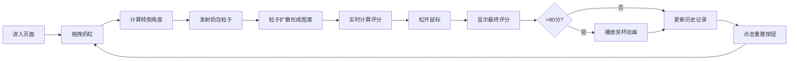

## 1. 产品概述

本产品是一款帮助咖啡师和咖啡爱好者提升拉花技巧的交互式练习应用。用户可以在浏览器中模拟倒入奶泡的过程，通过鼠标拖拽控制奶缸的倾斜角度和倒入位置，实时观察奶泡在咖啡液面上形成的白色图案，并获得即时的技巧反馈和评分。

- **目标用户**：咖啡师、咖啡爱好者、拉花初学者
- **核心价值**：无需真实材料即可练习拉花技巧，实时反馈帮助快速提升
- **市场定位**：面向咖啡从业者和爱好者的技能训练工具

## 2. 核心功能

### 2.1 用户角色

| 角色 | 注册方式 | 核心权限 |
|------|----------|----------|
| 普通用户 | 无需注册 | 练习拉花、查看评分、追踪历史记录 |

### 2.2 功能模块

1. **咖啡杯模拟区域**：400x400像素圆形咖啡杯俯视图，显示深棕色浓缩咖啡基底和奶泡图案
2. **虚拟奶缸控制**：可拖拽的奶缸图标，根据位置计算倾倒角度，发射奶泡粒子
3. **实时评分面板**：四个维度评分（流速均匀度、图案对称性、中心偏移度、奶泡覆盖率）及综合评分
4. **历史记录追踪**：历史最佳评分和最近5次评分折线图
5. **奖杯奖励系统**：评分大于80分时显示金色奖杯动画

### 2.3 页面详情

| 页面名称 | 模块名称 | 功能描述 |
|-----------|-------------|---------------------|
| 主页 | 咖啡杯区域 | 渲染圆形咖啡杯，接收奶泡粒子，显示拉花图案 |
| 主页 | 虚拟奶缸 | 鼠标拖拽控制倾倒角度和位置，发射白色半透明粒子 |
| 主页 | 评分面板 | 实时计算四个维度评分，显示进度条和综合评分，奖杯动画 |
| 主页 | 历史记录 | 显示最佳评分和最近5次评分的折线图 |
| 主页 | 重置按钮 | 清除所有奶泡粒子，开始新练习 |

## 3. 核心流程

用户进入页面后，看到中央的咖啡杯和右下方的虚拟奶缸。按住鼠标拖动奶缸，奶缸根据位置计算倾倒角度并发射奶泡粒子。粒子落在咖啡液面上扩散形成图案，评分面板实时更新各项分数。松开鼠标后图案固定，显示最终评分。用户可点击左下角按钮重置开始新练习，历史记录区域显示进步轨迹。

## 4. 用户界面设计

### 4.1 设计风格

- **主色调**：咖啡色 #6F4E37
- **背景色**：奶白色 #F5F0E1
- **文字/边框色**：深棕色 #3E2723
- **按钮风格**：圆角8px，阴影 box-shadow: 0 2px 6px rgba(62,39,35,0.2)
- **评分面板**：半透明奶白色毛玻璃效果，backdrop-filter: blur(4px)
- **整体风格**：温暖、精致、自然的咖啡店氛围

### 4.2 页面设计概述

| 页面名称 | 模块名称 | UI元素 |
|-----------|-------------|-------------|
| 主页 | 咖啡杯区域 | 400x400圆形，深棕色径向渐变，白色粒子扩散效果 |
| 主页 | 虚拟奶缸 | 杯子右下方，可拖拽，实时显示角度指示 |
| 主页 | 评分面板 | 右侧浮现，四个进度条+小图标，综合评分展示 |
| 主页 | 历史记录 | 页面顶部，最佳评分数字+Canvas折线图 |
| 主页 | 重置按钮 | 左下角，咖啡色背景，圆角按钮 |

### 4.3 响应式设计

- **桌面端**：杯子400x400px，评分面板右侧垂直排列
- **移动端**：杯子缩小至300x300px，评分面板变为横向滚动，适配触控操作
- **触控优化**：增大点击区域，支持触摸拖拽事件

### 4.4 动效设计

- **奖杯动画**：CSS关键帧，从底部向上弹跳并旋转360度，持续1.5秒
- **粒子拖尾**：拖拽过程中5-10像素的轻柔拖尾效果
- **评分更新**：进度条平滑过渡动画
- **按钮交互**：hover状态轻微放大，click状态按压效果
