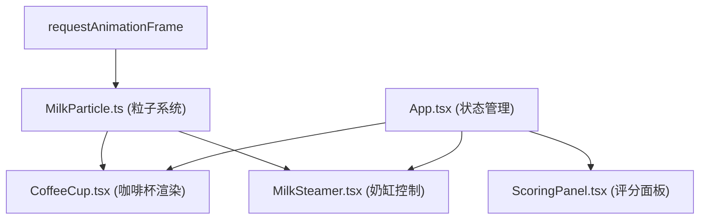

## 1. 架构设计



## 2. 技术描述

- **前端框架**：React 18 + TypeScript
- **构建工具**：Vite 5.x
- **动画库**：framer-motion（用于奖杯等复杂动画）
- **渲染方式**：Canvas API 绘制粒子和折线图
- **状态管理**：React Hooks (useState, useEffect, useRef)
- **初始化方式**：Vite react-ts 模板

## 3. 项目结构

```
src/
├── App.tsx              # 主组件，状态管理和帧循环
├── CoffeeCup.tsx        # 咖啡杯组件，渲染杯子和粒子
├── MilkSteamer.tsx      # 奶缸组件，拖拽控制和粒子生成
├── ScoringPanel.tsx     # 评分面板组件，显示评分和奖杯
├── MilkParticle.ts      # 粒子系统模块，粒子生成和更新逻辑
└── main.tsx             # 入口文件
```

## 4. 核心模块说明

### 4.1 MilkParticle.ts 粒子系统

```typescript
interface Particle {
  x: number;           // x坐标
  y: number;           // y坐标
  radius: number;      // 半径2-4px
  opacity: number;     // 透明度0.6-0.9
  spreadSpeed: number; // 扩散速度
  velocityX: number;   // x方向速度
  velocityY: number;   // y方向速度
  isSettled: boolean;  // 是否已落定
  trail: {x: number; y: number}[]; // 拖尾点
}

// 生成新粒子
function generateParticles(
  startX: number, 
  startY: number, 
  angle: number, 
  speed: number,
  currentParticles: Particle[]
): Particle[]

// 更新粒子状态（一帧）
function updateParticles(particles: Particle[]): Particle[]
```

### 4.2 CoffeeCup.tsx 咖啡杯组件

- **Props**：
  - `particles: Particle[]` - 粒子列表
  - `cupSize: number` - 杯子尺寸（响应式）
  - `onReset: () => void` - 重置回调
- **功能**：Canvas绘制杯底渐变、粒子扩散图案、重置按钮

### 4.3 MilkSteamer.tsx 奶缸组件

- **Props**：
  - `onParticlesUpdate: (particles: Particle[]) => void` - 粒子更新回调
  - `cupCenter: {x: number; y: number}` - 杯子中心坐标
  - `cupRadius: number` - 杯子半径
- **功能**：
  - 渲染可拖拽奶缸图标
  - 监听mousedown/mousemove/mouseup/touch事件
  - 计算倾倒角度（0-90度）
  - 调用generateParticles生成粒子

### 4.4 ScoringPanel.tsx 评分面板

- **Props**：
  - `particles: Particle[]` - 粒子列表
  - `dragTrajectory: {x: number; y: number; angle: number}[]` - 拖拽轨迹
  - `cupCenter: {x: number; y: number}` - 杯子中心
  - `cupRadius: number` - 杯子半径
- **计算逻辑**：
  - 流速均匀度：根据拖拽过程中角度变化的稳定性计算
  - 图案对称性：计算粒子分布关于中心轴的对称度
  - 中心偏移度：计算粒子重心与杯子中心的距离
  - 奶泡覆盖率：计算白色区域占杯子总面积的比例
  - 综合评分：加权平均（25%、25%、30%、20%）

### 4.5 App.tsx 主组件

- 状态管理：粒子列表、拖拽轨迹、评分数据、历史记录
- 帧循环：useEffect + requestAnimationFrame 调用updateParticles
- 响应式：监听窗口大小变化，调整杯子尺寸
- 历史记录：localStorage存储最佳评分和最近5次评分

## 5. 性能优化

- 粒子数量限制：最多300个，超过时移除最早的粒子
- 帧率控制：requestAnimationFrame保证30FPS以上
- Canvas优化：使用离屏Canvas或分层渲染
- 事件节流：mousemove事件使用requestAnimationFrame节流
- 内存管理：及时清理不再需要的粒子和轨迹数据

## 6. 数据持久化

```typescript
interface ScoreHistory {
  bestScore: number;
  recentScores: number[]; // 最近5次
}

// 存储在localStorage中，key: 'latteArtScores'
```
