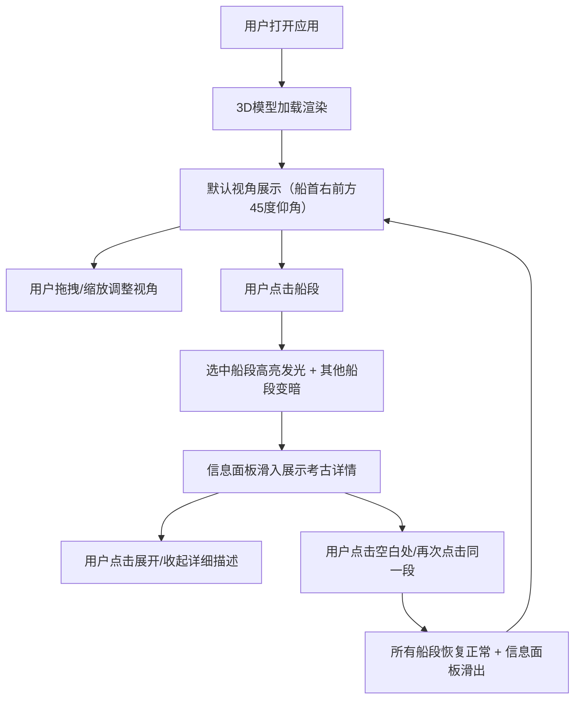

## 1. 产品概述

古代沉船3D考古复原交互展示应用，让公众通过浏览器交互式地探索一艘沉没古代商船的3D复原模型，了解船体各部位的考古信息。

- 主要目的：为水下考古学家提供一个线上展览平台，将古代沉船的考古发现以沉浸式3D交互方式呈现给公众
- 解决的问题：传统静态图片和文字展览无法让公众直观感受古代船体结构和考古细节
- 目标用户：对考古、历史、海洋文化感兴趣的公众
- 产品价值：通过交互式3D技术让考古文化遗产触手可及，提升公众对水下考古的认知和兴趣

## 2. 核心功能

### 2.1 用户角色

| 角色 | 注册方式 | 核心权限 |
|------|----------|----------|
| 普通用户 | 无需注册 | 浏览3D模型、旋转缩放视角、点击查看各船段考古信息 |

### 2.2 功能模块

1. **3D场景主页面**：沉船3D模型展示、交互控制、信息面板

### 2.3 页面详情

| 页面名称 | 模块名称 | 功能描述 |
|----------|----------|----------|
| 主页面 | 3D模型展示 | 场景中心渲染古代商船简化3D模型，船体由6个独立分段拼接而成（船首、船尾、船舷、甲板、桅杆、龙骨），每段使用不同深色木纹材质，表面有程序生成的半透明船板纹理条纹 |
| 主页面 | 水下光束效果 | 船体周围环绕一圈半透明浅蓝色光束，缓慢旋转，营造水下沉浸感 |
| 主页面 | 视角控制 | 鼠标拖拽旋转视角（围绕模型），滚轮缩放，默认视角在船首右前方45度仰角 |
| 主页面 | 船段交互 | 点击任意船段时，该段边缘发射淡黄色脉动光晕（周期2秒），其他船段透明度降低至0.3；点击空白处或再次点击同一段恢复初始状态 |
| 主页面 | 信息面板 | 右侧半透明毛玻璃信息面板，显示选中船段的考古详情，包含名称、年代、材质、用途、可折叠详细描述；面板滑入滑出带动画（0.5秒缓入缓出） |
| 主页面 | 响应式布局 | 窗口宽度小于800px时，信息面板改为底部弹出式卡片 |

## 3. 核心流程

用户打开应用 → 页面加载，3D沉船模型渲染完成 → 用户通过鼠标拖拽旋转模型、滚轮缩放查看整体结构 → 用户点击感兴趣的船段 → 该船段高亮发光，其他船段变暗，信息面板从右侧滑入展示考古详情 → 用户可展开详细描述阅读更多内容 → 用户点击空白处或再次点击同一段 → 所有船段恢复正常，信息面板滑出。

## 4. 用户界面设计

### 4.1 设计风格

- **主色调**：深海蓝（#0a1628）到黑色（#000000）的径向渐变背景
- **辅助色**：浅蓝色光束（#4fc3f7，半透明）、淡黄色光晕（#fff176，脉动动画）、米黄色文字（#f5f0e1）
- **材质色**：深褐色（#3e2723）、赭石色（#6d4c41）、墨绿色（#1b5e20）等木纹色调
- **字体**：标题使用衬线体（Georgia, "Times New Roman", serif），正文也使用衬线体，行距1.8
- **面板风格**：半透明毛玻璃效果，背景模糊12px，深色半透底色（rgba(10, 22, 40, 0.85)）
- **动画**：信息面板0.5秒缓入缓出，船段高亮2秒周期脉动动画

### 4.2 页面设计概述

| 页面名称 | 模块名称 | UI元素 |
|----------|----------|--------|
| 主页面 | 3D场景区域 | 占75%宽度，中央展示沉船3D模型，深海渐变背景，环绕旋转的浅蓝色光束 |
| 主页面 | 信息面板 | 占25%宽度，右侧贴边，毛玻璃效果，包含：船段名称标题、年代标签、材质标签、用途说明、可折叠详细描述区域 |
| 主页面 | 交互反馈 | 船段选中时淡黄色脉动光晕，未选中船段半透明变暗 |

### 4.3 响应式设计

- **桌面端（≥800px）**：3D场景占75%宽度，信息面板占25%宽度位于右侧
- **移动端（<800px）**：3D场景占满全屏，信息面板改为底部弹出式卡片，从底部滑入滑出

### 4.4 3D场景设计

- **环境**：深海环境，深蓝色到黑色径向渐变背景，模拟水下光线衰减效果
- **光照**：环境光（低强度）+ 方向光模拟水下光照 + 船体周围环绕旋转的浅蓝色光束
- **相机**：透视相机，默认位置在船首右前方45度仰角，距离模型约15个单位
- **构图**：模型位于场景正中心，周围留出充足空间供旋转查看
- **交互**：OrbitControls轨道控制（禁用Pan平移，仅允许旋转和缩放），Raycaster射线检测点击
- **性能**：模型总三角面数控制在5000以内，所有动画使用requestAnimationFrame驱动，帧率稳定30FPS以上
- **后期**：无复杂后期处理，使用Three.js内置材质效果实现光晕和透明度

## 5. 性能与技术约束

- 模型总三角面数 ≤ 5000
- 场景帧率稳定 ≥ 30FPS
- 所有动画使用requestAnimationFrame驱动
- 移动端流畅运行，无明显卡顿
