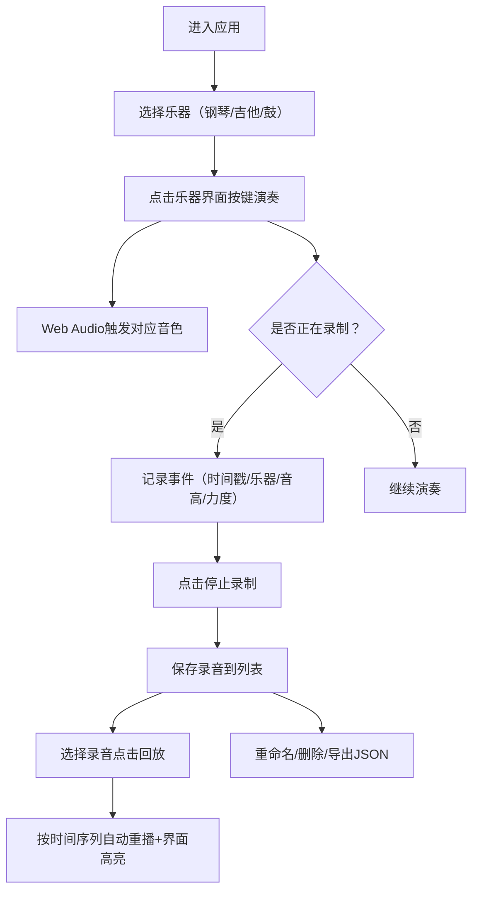

## 1. 产品概述

虚拟乐器合奏室是一款基于Web的实时音乐演奏应用，用户可通过点击交互界面演奏钢琴、吉他和架子鼓三种乐器，并支持录音与回放功能。

- 核心价值：无需物理乐器即可体验多乐器实时演奏乐趣，适合音乐爱好者、初学者进行节奏和音高练习
- 目标用户：音乐爱好者、音乐教师、学生、创意工作者
- 技术亮点：Web Audio API实现低延迟音色合成，高精度事件录制与回放系统

## 2. 核心功能

### 2.1 功能模块

1. **乐器切换模块**：顶部三个圆形图标按钮切换钢琴/吉他/鼓三种乐器，带主题色高亮和淡入淡出过渡动画
2. **钢琴演奏模块**：两排黑白琴键（C4-B5共12个半音），支持最多3键同时按下的和弦模式，琴键光晕动画
3. **吉他演奏模块**：六根琴弦×5品格网格，点击触发弦振动波纹动画，标准调音(E2,A2,D3,G3,B3,E4)
4. **架子鼓演奏模块**：四个鼓面圆形阵列（底鼓/军鼓/嗵鼓/镲），冲击波扩散动画，军鼓带沙铃音质
5. **录音控制模块**：开始录制/停止/播放控制按钮，高精度事件时序记录
6. **录音管理模块**：录音列表（重命名/删除/导出JSON），回放时自动高亮对应乐器界面
7. **音量控制模块**：每个乐器独立音量滑块（0-100%），轨道颜色随音量渐变

### 2.2 页面详情

| 页面名称 | 模块名称 | 功能描述 |
|---------|---------|---------|
| 主页面 | 顶部导航栏 | 乐器切换按钮（钢琴/吉他/鼓圆形图标），选中主题色高亮，未选灰色 |
| 主页面 | 乐器演奏区 | 4:3宽高比居中布局，深色主题，柔和发光边框，根据切换乐器动态渲染 |
| 主页面 | 音量控制区 | 每个乐器独立细长型音量滑块，轨道颜色随音量从灰渐变到主题色 |
| 主页面 | 录音控制区 | 底部矩形按钮组：开始录制/停止/播放录音 |
| 主页面 | 录音列表面板 | 右侧可滚动面板，每条录音支持重命名、删除、导出JSON |

## 3. 核心流程

### 3.1 主用户流程
用户进入页面 → 默认选中钢琴乐器 → 点击琴键/琴弦/鼓面演奏 → 点击开始录制按钮 → 继续演奏录制音符 → 点击停止保存录音 → 从录音列表选择回放 → 系统自动按时间序列重播并高亮界面

### 3.2 流程图

## 4. 用户界面设计

### 4.1 设计风格
- **主色调**：深色主题（背景#1a1a2e，控件背景#16213e，文字#e0e0e0）
- **乐器主题色**：钢琴深蓝(#1e3a5f)、吉他墨绿(#1e4d3a)、鼓酒红(#5c1e3a)
- **按钮风格**：圆形（乐器切换）/矩形（控制按钮），圆角设计，hover时0.2s线性缩放+颜色加深，点击0.1s按压下沉
- **字体**：标题用Orbitron（未来感显示字体），正文用Space Grotesk（科技感无衬线）
- **图标**：Lucide React图标库
- **动效**：CSS动画（光晕扩散、弦振动、冲击波、淡入淡出）

### 4.2 页面设计概览

| 模块名称 | UI元素 | 样式说明 |
|---------|-------|---------|
| 顶部切换栏 | 三个圆形图标按钮 | 选中填充乐器主题色，未选灰色(#555)，固定定位，40px圆形 |
| 钢琴演奏区 | 两排琴键 | 白键白色/黑键黑色，低音到高音尺寸递减，按下白色光晕扩散0.1s |
| 吉他演奏区 | 六弦×5品格网格 | 暖木色渐变背景(#3d2e1f→#5c4a32)，金色弦线(#d4af37)，波纹振动动画 |
| 架子鼓演奏区 | 四鼓面圆形阵列 | 底鼓(下)军鼓(上)嗵鼓(左)镲(右)，圆形冲击波扩散，亮度随力度变化 |
| 音量滑块 | 细长型水平滑块 | 轨道0-50%灰→主题色渐变，圆柄带阴影 |
| 录音控制 | 矩形按钮组 | 开始录制(红)/停止(灰)/播放(绿)，底部固定 |
| 录音列表 | 右侧滚动面板 | 每条录音卡片：名称+时长+操作按钮 |

### 4.3 响应式设计
- **桌面端（≥768px）**：顶部水平切换栏，演奏区居中4:3比例，录音列表右侧面板
- **移动端（<768px）**：垂直堆叠布局，乐器切换栏顶部水平排列，演奏区宽度100%自适应，录音列表底部展开
- **触摸优化**：增大乐器按键最小触控区域（≥44px），禁用双击缩放

### 4.4 性能设计
- 声音延迟：音符触发到Web Audio输出≤50ms（使用AudioContext.currentTime精确调度）
- 回放精度：事件触发间隔误差≤±10ms（使用performance.now()高精度计时+requestAnimationFrame调度）
