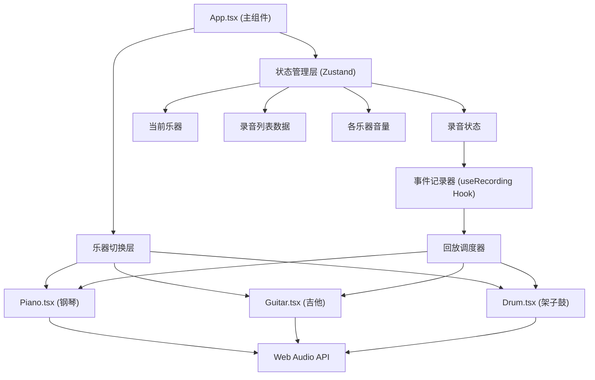

## 1. 架构设计



## 2. 技术描述

- **前端框架**：React 18 + TypeScript 5
- **构建工具**：Vite 5 + @vitejs/plugin-react
- **状态管理**：Zustand（轻量级状态管理，管理全局乐器切换、录音状态、音量等）
- **音频引擎**：原生Web Audio API（OscillatorNode + GainNode合成音色，AudioBuffer处理噪声）
- **唯一ID**：uuid（录音记录唯一标识）
- **图标库**：lucide-react
- **样式方案**：原生CSS + CSS Modules（避免Tailwind，保证样式细节控制）

## 3. 模块文件结构

```
src/
├── App.tsx              # 主组件：全局布局、乐器切换、录音控制
├── Piano.tsx            # 钢琴组件：琴键渲染、音频触发、光晕动画
├── Guitar.tsx           # 吉他组件：弦品格渲染、振动动画
├── Drum.tsx             # 架子鼓组件：鼓面渲染、冲击波动画
├── types/
│   └── index.ts         # 全局类型定义
├── hooks/
│   ├── useAudio.ts      # Web Audio封装Hook
│   └── useRecording.ts  # 录音与回放Hook
├── utils/
│   └── audioUtils.ts    # 音频工具函数（频率映射、音色合成）
└── styles/
    ├── App.module.css
    ├── Piano.module.css
    ├── Guitar.module.css
    └── Drum.module.css
```

## 4. 核心数据模型

### 4.1 TypeScript 类型定义

```typescript
export type InstrumentType = 'piano' | 'guitar' | 'drum';

export interface NoteEvent {
  id: string;
  timestamp: number;
  instrument: InstrumentType;
  pitch: string | number;
  velocity: number;
  duration?: number;
}

export interface Recording {
  id: string;
  name: string;
  createdAt: number;
  duration: number;
  events: NoteEvent[];
}

export interface AppState {
  currentInstrument: InstrumentType;
  isRecording: boolean;
  isPlaying: boolean;
  pianoVolume: number;
  guitarVolume: number;
  drumVolume: number;
  recordings: Recording[];
  currentRecordingId: string | null;
  recordingStartTime: number;
}
```

### 4.2 音频工具函数

- `noteToFrequency(note: string): number` - 音名转频率（A4=440Hz基准，等比数列计算半音）
- `createPianoTone(ctx, freq, gain): {start, stop}` - 钢琴音色（正弦波+快速ADSR包络）
- `createGuitarTone(ctx, freq, gain): {start, stop}` - 吉他音色（三角波+拨弦包络+轻微延迟）
- `createDrumTone(ctx, type, gain): void` - 鼓音色（底鼓sine扫频、军鼓白噪声+burst、嗵鼓sine、镲高通噪声）

## 5. 关键技术实现

### 5.1 Web Audio 音色合成策略

| 乐器 | 合成方法 | 包络参数 |
|-----|---------|---------|
| 钢琴 | OscillatorNode(sine) + GainNode ADSR | Attack:5ms, Decay:200ms, Sustain:0.3, Release:300ms |
| 吉他 | OscillatorNode(triangle) + 低通滤波 | 拨弦瞬态Attack:2ms, 指数衰减Release:800ms |
| 底鼓 | Sine波频率扫描(150Hz→60Hz) | Attack:1ms, Decay:150ms |
| 军鼓 | 白噪声(4kHz高通) + 中频tone burst | Attack:1ms, Decay:120ms |
| 嗵鼓 | Sine波扫频(250Hz→100Hz) | Attack:2ms, Decay:200ms |
| 镲 | 白噪声(8kHz高通) + 带通滤波 | Attack:1ms, Decay:300ms |

### 5.2 录音回放时序调度
- 录制时使用 `performance.now()` 记录高精度时间戳
- 回放时使用 `requestAnimationFrame` + 时间差比较，确保±10ms精度
- 回放事件触发时通过props回调各乐器组件更新视觉高亮状态

### 5.3 Zustand Store Actions
- `setInstrument(instrument)` - 切换乐器
- `startRecording()` - 开始录制（记录起始时间）
- `stopRecording()` - 停止录制并保存
- `playRecording(id)` - 回放指定录音
- `stopPlayback()` - 停止回放
- `recordEvent(event)` - 录制单个音符事件
- `renameRecording(id, name)` - 重命名
- `deleteRecording(id)` - 删除录音
- `exportRecording(id)` - 导出JSON下载
- `setVolume(instrument, value)` - 设置音量
