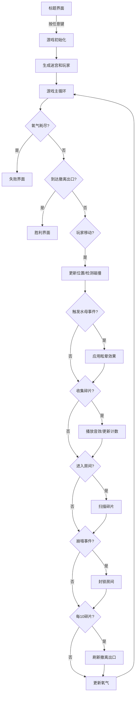

## 1. 产品概述

深渊回响是一款2D俯视图迷宫探索游戏，玩家扮演潜水员在废弃水下实验室中探索并回收珍贵科技碎片。游戏核心挑战在于有限氧气、随机崩塌场景下规划最优回收路径并快速撤离。

- 主要目标：在氧气耗尽前尽可能多地收集科技碎片并找到撤离出口
- 目标用户：休闲游戏爱好者、策略规划玩家

## 2. 核心功能

### 2.1 功能模块

1. **标题界面**：游戏启动画面、标题展示、开始提示
2. **迷宫探索系统**：随机生成房间布局、走廊连接、玩家移动、碰撞检测
3. **氧气管理系统**：氧气消耗、氧气条显示、黑暗房间加速消耗
4. **碎片收集系统**：碎片生成、自动扫描、收集音效、计数动画
5. **崩塌事件系统**：随机房间封锁、裂纹动画、路径阻断
6. **撤离出口系统**：碎片收集触发、出口刷新、胜利判定
7. **水母干扰系统**：随机事件、眩晕效果、氧气加倍消耗
8. **结束界面**：通关/失败结算、统计展示

### 2.2 功能详情

| 页面名称 | 模块名称 | 功能描述 |
|-----------|-------------|---------------------|
| 标题界面 | 标题展示 | 水下实验室模糊背景、艺术字标题、闪烁开始提示 |
| 游戏界面 | 迷宫渲染 | 深蓝到暗绿径向渐变背景、半透明白色网格墙壁、水波扭曲动画 |
| 游戏界面 | 玩家渲染 | 椭圆形潜水头盔、30度扇形探照灯、覆盖前方5格 |
| 游戏界面 | 氧气条 | 左上角弧形进度条、从#00ff00渐变到#ff0000 |
| 游戏界面 | 碎片计数 | 右上角金色圆形徽章、缩放弹出动画 |
| 游戏界面 | 键盘提示 | 底部WASD按钮、按下高亮显示 |
| 游戏界面 | 崩塌效果 | 红色半透明方块封锁、闪烁裂纹动画 |
| 游戏界面 | 水母群 | 半透明粉紫色水母、触手动效、眩晕效果 |
| 结束界面 | 结算展示 | 通关时长、碎片数量、氧气剩余 |

## 3. 核心流程

## 4. 用户界面设计

### 4.1 设计风格

- 主色调：深蓝(#0d1b2a)到暗蓝(#1b263b)深色渐变
- 强调色：蓝色发光(#00aaff)、金色(#ffaa00)、绿色(#00ff00)、红色(#ff0000)
- 字体：白色标题48px带阴影、状态文字24px、提示文字12px
- 布局：画布960x640像素居中、蓝色发光边框
- 动画风格：水波扭曲、闪光、气泡上升、文字缩放弹出

### 4.2 页面设计概览

| 页面名称 | 模块名称 | UI元素 |
|-----------|-------------|-------------|
| 标题界面 | 背景 | CSS模糊滤镜、水下场景 |
| 标题界面 | 标题 | 白色48px艺术字、字母间距0.1em、黑色阴影偏移3px |
| 标题界面 | 提示 | 闪烁文字、透明度0.3-1交替、周期1.5秒 |
| 游戏界面 | 背景 | 径向渐变深蓝到暗绿、模拟水下光线衰减 |
| 游戏界面 | 墙壁 | 半透明白色网格线、2Hz水波扭曲动画、振幅3像素 |
| 游戏界面 | 玩家 | 椭圆形头盔、30度扇形探照灯、5格覆盖距离 |
| 游戏界面 | 碎片 | 白色闪光圆点、直径4像素、1秒闪光周期 |
| 游戏界面 | 氧气条 | 弧形进度条、-90度到90度、8像素宽度、绿到红渐变 |
| 游戏界面 | 碎片徽章 | 金色圆形36px、径向渐变、白色24px数字、SVG图标 |
| 游戏界面 | 键盘提示 | 底部圆角矩形、半透明白色背景、按下高亮蓝色 |
| 游戏界面 | 崩塌封锁 | 红色半透明方块、0.5秒闪烁裂纹、红到亮红循环 |
| 游戏界面 | 水母 | 半透明粉紫色、8px半圆体、触手动效 |
| 结束界面 | 结算 | 通关时长、碎片数量、氧气剩余百分比 |

### 4.3 响应式

桌面端优先设计，游戏画布固定960x640像素居中显示。

## 5. 性能需求

- 游戏主循环帧率不低于45FPS
- 960x640画布上绘制100个网格渲染时间不超过8ms
- 水母群粒子数控制在100以内
- 使用requestAnimationFrame驱动所有动画
