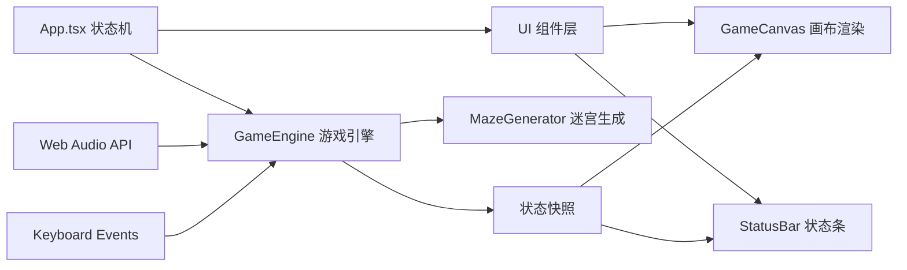

## 1. 架构设计



## 2. 技术描述

- 前端：React@18 + TypeScript + Vite
- 构建工具：Vite@5
- 渲染：Canvas 2D API
- 状态管理：React useState/useReducer + 自定义引擎类
- 音频：Web Audio API
- 无后端，纯前端游戏

## 3. 文件结构

| 文件路径 | 用途 |
|---------|------|
| package.json | 项目依赖配置 |
| vite.config.js | Vite构建配置 |
| tsconfig.json | TypeScript配置 |
| index.html | 入口HTML |
| src/main.tsx | React挂载入口 |
| src/App.tsx | 主组件，状态机管理 |
| src/engine/GameEngine.ts | 游戏核心引擎 |
| src/engine/MazeGenerator.ts | 迷宫生成模块 |
| src/ui/GameCanvas.tsx | Canvas渲染组件 |
| src/ui/StatusBar.tsx | 状态条UI组件 |

## 4. 核心数据模型

### 4.1 游戏状态枚举

```typescript
enum GameState {
  TITLE = 'title',
  PLAYING = 'playing',
  WIN = 'win',
  LOSE = 'lose'
}
```

### 4.2 方向枚举

```typescript
enum Direction {
  UP = 'up',
  DOWN = 'down',
  LEFT = 'left',
  RIGHT = 'right'
}
```

### 4.3 坐标与网格

```typescript
interface Position {
  x: number;
  y: number;
}

interface Cell {
  x: number;
  y: number;
  type: 'wall' | 'floor' | 'door';
  roomId?: number;
}
```

### 4.4 房间

```typescript
interface Room {
  id: number;
  x: number;
  y: number;
  width: number;
  height: number;
  doors: Position[];
  explored: boolean;
  collapsed: boolean;
  collapseEndTime: number;
  fragments: Position[];
  isDark: boolean;
}
```

### 4.5 玩家

```typescript
interface Player {
  position: Position;
  direction: Direction;
  isStunned: boolean;
  stunEndTime: number;
  shakeEndTime: number;
  oxygenMultiplierEndTime: number;
}
```

### 4.6 碎片

```typescript
interface Fragment {
  position: Position;
  roomId: number;
  collected: boolean;
}
```

### 4.7 水母

```typescript
interface Jellyfish {
  id: number;
  x: number;
  y: number;
  vx: number;
  vy: number;
  angle: number;
  endTime: number;
}
```

### 4.8 撤离出口

```typescript
interface Exit {
  position: Position;
  spawnTime: number;
}
```

### 4.9 引擎状态快照

```typescript
interface GameSnapshot {
  gameState: GameState;
  player: Player;
  rooms: Room[];
  cells: Cell[][];
  fragments: Fragment[];
  jellyfish: Jellyfish[];
  exit: Exit | null;
  oxygen: number;
  fragmentCount: number;
  startTime: number;
  currentTime: number;
  pressedKeys: Set<string>;
  collapseFlashPhase: number;
  fragmentPopTime: number;
  stunMessageTime: number;
  gridWidth: number;
  gridHeight: number;
}
```

## 5. 引擎核心逻辑

### 5.1 迷宫生成
- 使用递归回溯算法
- 房间大小：6x6 到 12x12 网格
- 走廊宽度：4 个网格
- 每个房间：1-3 个出入口
- 初始玩家位置：左下角入口

### 5.2 玩家移动
- WASD键盘控制
- 移动速度：每0.3秒一格
- 长按连续移动
- 墙壁碰撞：停止 + 0.1秒抖动动画(3像素)
- 眩晕期间不可移动

### 5.3 氧气系统
- 初始100%
- 正常每5秒下降1%
- 黑暗房间每2秒额外下降0.5%
- 水母事件后5秒内消耗加倍
- 0%时游戏结束

### 5.4 碎片收集
- 进入房间中心自动扫描
- 1格范围内自动收集
- Web Audio 440Hz正弦波0.15秒音效
- 数字缩放动画(1.2倍, 0.3秒)
- 每10个刷新撤离出口

### 5.5 崩塌事件
- 每15-20秒随机触发
- 目标：未探索房间
- 持续10秒
- 期间无法进入/离开
- 红色闪烁裂纹动画

### 5.6 水母事件
- 每次移动5%概率触发
- 3-5只水母出现3秒
- 触碰玩家眩晕2秒
- 红白闪烁(5Hz)
- 氧气消耗加倍5秒

## 6. 渲染规格

### 6.1 画布
- 尺寸：960x640像素
- 居中对齐
- 边框：2px蓝色发光(#00aaff, 10px强度)

### 6.2 网格单元
- 动态计算：画布大小 / 网格尺寸
- 背景：深蓝(#0d1b2a)到暗绿径向渐变

### 6.3 动画帧率
- 最低45FPS
- requestAnimationFrame驱动
