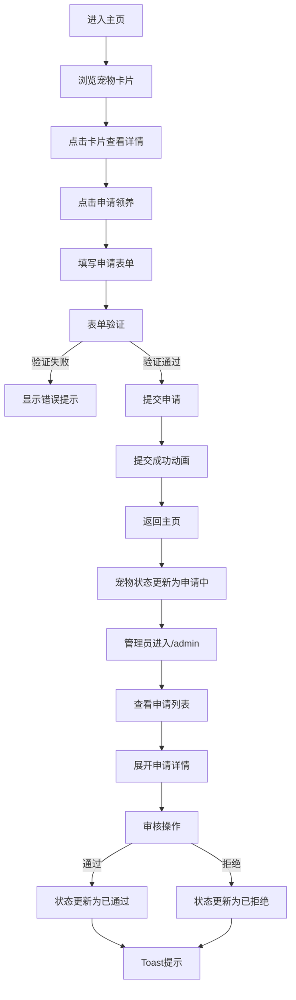

## 1. 产品概述

宠物救助站领养管理应用，旨在帮助宠物救助站管理待领养宠物档案，为潜在领养人提供浏览宠物、提交领养申请和追踪审核进度的功能，同时为管理员提供申请处理和宠物档案管理能力。

- 主要目的：连接待领养宠物与潜在领养人，提高领养效率和透明度
- 目标用户：潜在领养人、救助站管理员
- 市场价值：提升救助站运营效率，促进宠物领养公益事业

## 2. 核心功能

### 2.1 用户角色

| 角色 | 注册方式 | 核心权限 |
|------|----------|----------|
| 领养人 | 无需注册，直接使用 | 浏览宠物、提交领养申请、查看申请进度 |
| 管理员 | 路径访问（/admin）模拟登录 | 管理宠物档案、审核领养申请、查看统计数据 |

### 2.2 功能模块

1. **主页（宠物列表）**：宠物卡片网格展示、详情模态框、申请领养入口
2. **领养申请表单页**：表单填写、字段验证、提交成功反馈
3. **管理员面板**：申请统计、申请列表筛选、申请详情、审核操作、宠物档案管理

### 2.3 页面详情

| 页面名称 | 模块名称 | 功能描述 |
|----------|----------|----------|
| 主页 | 宠物卡片网格 | 3列布局展示宠物卡片，移动端自动切换为单列 |
| 主页 | 宠物详情模态框 | 点击卡片弹出，半透明毛玻璃背景，右向左划出动画 |
| 申请表单页 | 领养表单 | 姓名、手机号（自动格式化）、居住类型、养宠经验，表单验证 |
| 申请表单页 | 提交成功动画 | 勾号图标放大弹出，绿色渐变背景 |
| 管理员面板 | 统计卡片 | 总申请数、待审核数、本月新增领养数，数字滚动动画 |
| 管理员面板 | 申请列表 | 按状态筛选（待审核/已通过/已拒绝/全部），展开查看详情 |
| 管理员面板 | 审核操作 | 通过/拒绝按钮，Toast提示反馈 |
| 管理员面板 | 宠物档案管理 | 添加新宠物表单 |

## 3. 核心流程

### 领养人领养流程
用户浏览主页宠物卡片 → 点击卡片查看详情 → 点击"申请领养"进入表单页 → 填写表单并提交 → 提交成功后自动返回主页 → 宠物状态更新为"申请中"

### 管理员审核流程
管理员通过/admin路径进入面板 → 查看统计数据 → 筛选申请列表 → 展开申请详情 → 点击通过/拒绝 → 填写备注 → 状态更新并显示Toast提示

### Mermaid 流程图

## 4. 用户界面设计

### 4.1 设计风格
- **主色调**：#F5E6D3（米白色背景）
- **辅色调**：#4A90D9（蓝色按钮和链接）、#E8A87C（橙色强调）
- **按钮风格**：圆角8px，hover状态过渡动画0.3s
- **字体**：系统默认无衬线体（-apple-system, BlinkMacSystemFont）
- **布局风格**：卡片式布局，柔和阴影，圆角16px
- **动画风格**：所有交互带平滑过渡（transition 0.3s ease）

### 4.2 页面设计概述

| 页面名称 | 模块名称 | UI元素 |
|----------|----------|--------|
| 主页 | 宠物卡片网格 | 3列网格，卡片hover上浮3px+阴影放大，圆角16px，柔和阴影0 4px 12px rgba(0,0,0,0.1) |
| 主页 | 详情模态框 | 半透明毛玻璃背景，右向左划出动画，宠物详情信息，申请领养按钮 |
| 申请表单页 | 表单组件 | 输入框宽度自适应，手机号自动格式化XXX-XXXX-XXXX，错误提示，提交按钮 |
| 申请表单页 | 成功动画 | 勾号图标从中心放大弹出，背景绿色渐变 |
| 管理员面板 | 统计卡片 | 数字滚动上升动画，三列布局 |
| 管理员面板 | 申请列表 | 状态标签颜色：待审核-橙色、已通过-绿色、已拒绝-红色，展开详情动画 |
| 管理员面板 | Toast提示 | 从顶部滑入，3秒后自动消失 |

### 4.3 响应式设计
- **设计方式**：桌面优先，移动端自适应
- **断点**：宽度<768px时切换为单列卡片布局
- **触摸优化**：按钮最小尺寸44px，表单输入框高度自适应，触摸区域充足

### 4.4 性能优化
- **首屏渲染**：≤1.2秒，使用React.lazy和Suspense按需加载申请表单页面
- **列表性能**：100条宠物数据保持60fps，使用React.memo优化PetCard组件
