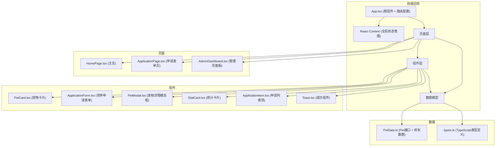

## 1. 架构设计



## 2. 技术描述

- **前端框架**：React@18 + TypeScript
- **构建工具**：Vite@5 + @vitejs/plugin-react
- **路由管理**：react-router-dom@6
- **状态管理**：React Context API（用户指定，不使用zustand）
- **工具库**：uuid（生成唯一ID）
- **样式方案**：原生CSS（用户未指定Tailwind，按需求使用CSS变量和自定义样式）
- **性能优化**：React.lazy + Suspense 按需加载、React.memo 组件记忆化

## 3. 路由定义

| 路由路径 | 页面组件 | 用途 |
|----------|----------|------|
| / | HomePage | 主页，展示宠物卡片列表 |
| /application/:petId | ApplicationPage | 领养申请表单页 |
| /admin | AdminDashboard | 管理员面板 |

> 注：用户要求申请表单页使用React.lazy按需加载，以优化首屏性能。

## 4. 数据模型

### 4.1 TypeScript 类型定义

```typescript
// 宠物状态枚举
export enum PetStatus {
  AVAILABLE = 'available',      // 可领养
  PENDING = 'pending',          // 申请中
  ADOPTED = 'adopted'           // 已领养
}

// 申请状态枚举
export enum ApplicationStatus {
  PENDING = 'pending',          // 待审核
  APPROVED = 'approved',        // 已通过
  REJECTED = 'rejected'         // 已拒绝
}

// 居住类型
export type HousingType = 'own' | 'rent' | 'other';

// 宠物接口
export interface Pet {
  id: string;
  name: string;
  breed: string;
  age: number;
  personality: string[];
  imageUrl: string;
  status: PetStatus;
  description: string;
  adoptionCount: number;        // 领养次数
}

// 领养申请接口
export interface Application {
  id: string;
  petId: string;
  petName: string;
  applicantName: string;
  phone: string;
  housingType: HousingType;
  experience: string;
  status: ApplicationStatus;
  submitTime: number;           // 时间戳
  remark?: string;              // 审核备注
}

// 全局状态类型
export interface AppState {
  pets: Pet[];
  applications: Application[];
}
```

### 4.2 数据流向说明

1. **PetData.ts** → 定义Pet接口和初始宠物列表，被所有组件引用
2. **App.tsx** → 配置路由，接收路由参数分发到不同页面组件
3. **HomePage.tsx** → 从Context读取宠物数据 → 传递给PetCard组件
4. **PetCard.tsx** → 接收宠物数据 → 渲染卡片 → 点击触发模态框或跳转
5. **ApplicationForm.tsx** → 表单输入 → 校验 → 调用提交回调 → 更新Context中的申请列表
6. **AdminDashboard.tsx** → 从Context读取申请数据 → 展示 → 修改状态 → 更新Context

## 5. 文件结构与调用关系

```
src/
├── App.tsx                    # 根组件，路由配置，Context Provider
├── main.tsx                   # 入口文件
├── index.css                  # 全局样式
├── context/
│   └── AppContext.tsx         # React Context 全局状态管理
├── data/
│   └── PetData.ts             # Pet接口、枚举、样本数据
├── types/
│   └── index.ts               # TypeScript类型定义
├── components/
│   ├── PetCard.tsx            # 宠物卡片（React.memo优化）
│   ├── ApplicationForm.tsx    # 领养申请表单
│   ├── PetModal.tsx           # 宠物详情模态框
│   ├── StatCard.tsx           # 统计卡片（数字滚动动画）
│   ├── ApplicationItem.tsx    # 申请列表项
│   ├── AddPetForm.tsx         # 添加宠物表单
│   └── Toast.tsx              # Toast提示组件
└── pages/
    ├── HomePage.tsx           # 主页
    ├── ApplicationPage.tsx    # 申请表单页（React.lazy按需加载）
    └── AdminDashboard.tsx     # 管理员面板
```

### 调用关系说明

- **App.tsx** → 引入并包裹 AppContext.Provider，配置路由
- **AppContext.tsx** → 引用 types/index.ts 和 data/PetData.ts 初始化状态
- **HomePage.tsx** → 引用 AppContext、PetCard、PetModal
- **ApplicationPage.tsx** → 引用 ApplicationForm、AppContext
- **AdminDashboard.tsx** → 引用 AppContext、StatCard、ApplicationItem、AddPetForm、Toast
- **所有组件** → 共享 AppContext 中的状态和更新方法

## 6. 性能优化方案

1. **按需加载**：ApplicationPage 使用 React.lazy 和 Suspense 动态导入
   ```tsx
   const ApplicationPage = React.lazy(() => import('./pages/ApplicationPage'));
   ```

2. **组件记忆化**：PetCard 使用 React.memo 避免不必要的重渲染
   ```tsx
   export default React.memo(PetCard);
   ```

3. **路由懒加载**：仅在访问对应路由时才加载页面组件

4. **CSS动画优化**：使用 transform 和 opacity 属性实现动画，触发GPU加速
