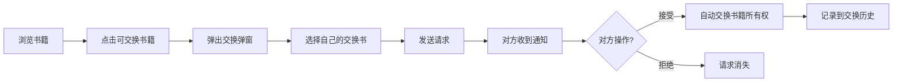

## 1. 产品概述
在线书籍交换社区是一个让用户自由交换闲置书籍、管理个人书库的平台。解决了闲置书籍利用率低、书友交流渠道少的问题，目标用户为热爱阅读和分享的读者群体。

通过构建信任的书籍交换社区，实现知识共享，降低阅读成本，促进书友交流，创造可持续的阅读生态圈。

## 2. 核心功能

### 2.1 用户角色
| 角色 | 登录方式 | 核心权限 |
|------|----------|----------|
| 普通用户 | 默认登录（模拟） | 管理个人书库、发起/接受交换请求、浏览社区动态、查看交换历史 |

### 2.2 功能模块
1. **个人书架**：网格展示藏书、添加/编辑/删除书籍、设置可交换状态、搜索过滤
2. **交换管理**：发起交换请求、接受/拒绝请求、未处理请求角标提示
3. **交换历史**：查看已完成和待处理的交换记录
4. **社区动态**：瀑布流展示最近添加书籍、想交换按钮跳转、分页加载

### 2.3 页面详情
| 页面名称 | 模块名称 | 功能描述 |
|---------|---------|----------|
| 个人书架页 | 书籍管理 | 网格布局展示所有藏书，支持搜索（防抖300ms）、分类筛选，动画过渡效果 |
| 交换管理页 | 交换管理 | 列表展示传入的交换请求（按时间倒序），接受/拒绝按钮，自动交换书籍所有权 |
| 交换历史页 | 交换历史 | 展示所有交换记录，显示状态、双方信息、交换书籍 |
| 社区动态页 | 社区动态 | 瀑布流展示所有用户最近添加的书籍，加载更多，骨架屏动画 |

## 3. 核心流程

### 3.1 交换书籍流程
用户浏览社区动态/他人书架 → 点击可交换书籍 → 弹出交换请求弹窗 → 选择自己可交换的书籍 → 发送请求 → 对方收到通知 → 对方接受/拒绝 → 接受则双方书库自动交换书籍所有权 → 记录交换历史

### 3.2 个人书库管理流程
用户进入个人书架 → 查看所有藏书 → 搜索/筛选 → 添加新书 / 编辑书籍信息 / 切换可交换状态 / 删除书籍 → 书架实时刷新

## 4. 用户界面设计

### 4.1 设计风格
- **主色调**：深蓝色 #1a5276（按钮、导航栏）
- **背景色**：浅灰色 #f0f2f5
- **卡片色**：白色 #ffffff 带阴影 box-shadow: 0 2px 8px rgba(0,0,0,0.1)
- **主题**：灰白浅色主题，简洁现代
- **按钮样式**：圆角矩形，悬停0.2秒透明度过渡
- **字体**：系统无衬线字体，清晰可读
- **布局风格**：卡片式布局，顶部固定导航
- **分类颜色**：科幻#3498db、文学#27ae60、历史#8b4513、科技#9b59b6、艺术#e74c3c、其他#7f8c8d

### 4.2 页面设计概述
| 页面名称 | 模块名称 | UI元素 |
|---------|---------|--------|
| 个人书架页 | 书籍管理 | 顶部搜索过滤栏（搜索框+分类下拉）、书籍卡片网格、编辑图标、状态标签、平滑动画 |
| 交换管理页 | 交换管理 | 请求列表、用户头像（随机色圆形）、请求信息、接受/拒绝按钮、未读数角标 |
| 交换历史页 | 交换历史 | 时间线布局、状态标签、双方信息卡片 |
| 社区动态页 | 社区动态 | 瀑布流布局、用户信息、想交换按钮、加载更多、骨架屏 |

### 4.3 响应式
- **桌面端**（≥1200px）：4列网格
- **平板端**（768px-1199px）：2列网格
- **移动端**（<768px）：1列网格
- 顶部导航固定，毛玻璃半透明效果（backdrop-filter: blur(10px)）
- 页面切换水平滑动动画（0.3秒）

### 4.4 交互与动画
- 卡片悬停：上移2px + 加深阴影
- 搜索过滤：卡片缩小淡出动画
- 按钮悬停：0.2秒透明度过渡
- 加载状态：旋转白色圆环、骨架屏灰色闪烁
- 消息提示：顶部绿色/红色提示条，自动消失
