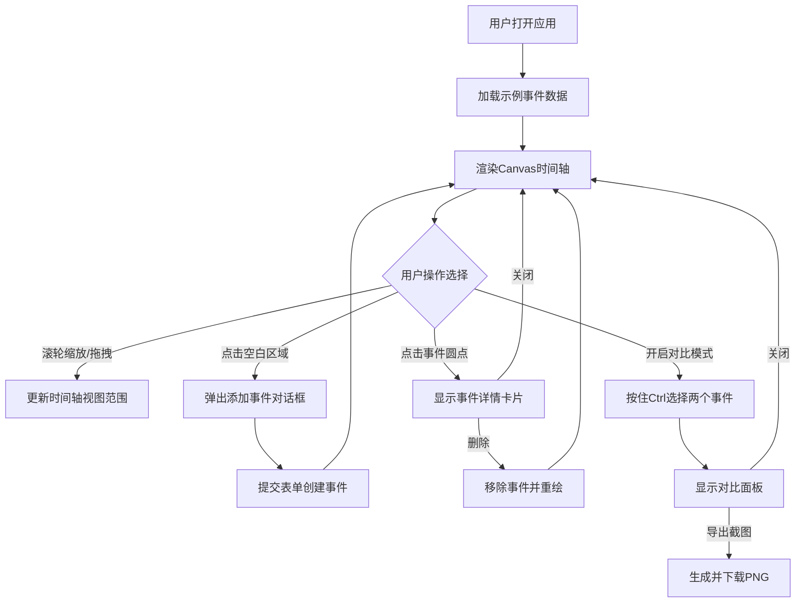

## 1. 产品概述

在线历史时间轴事件对比与标注应用，用户可以创建自定义时间轴、添加历史事件、通过缩放和拖拽对比不同时期的事件关系。

- 核心功能：可视化时间轴展示、事件管理（增删改）、类别筛选与搜索、事件对比模式
- 目标用户：历史爱好者、教育工作者、学生，以及需要进行时间维度数据分析的用户

## 2. 核心功能

### 2.1 功能模块

1. **时间轴主视图**：Canvas绘制可缩放可拖拽的水平时间轴，覆盖公元前3000年至公元2000年
2. **事件管理面板**：添加、删除、修改历史事件，数据持久化到localStorage
3. **筛选与搜索**：按类别标签筛选事件，支持标题和描述全文搜索
4. **事件对比模式**：选择两个事件进行并排对比，支持导出对比截图

### 2.2 功能详情

| 功能模块 | 子功能 | 功能描述 |
|---------|--------|---------|
| 时间轴 | 缩放 | 鼠标滚轮缩放时间范围，最小100年，最大5000年 |
| 时间轴 | 平移 | 拖拽空白区域左右平移时间轴 |
| 时间轴 | 事件渲染 | 带颜色圆点显示事件，同类事件相同颜色，圆点带发光光环 |
| 时间轴 | 添加事件 | 点击空白区域弹出添加对话框，输入年份、标题、描述、类别 |
| 事件详情 | 详情卡片 | 点击事件圆点显示毛玻璃背景详情卡片，居中对齐在圆点上方 |
| 事件详情 | 删除事件 | 详情卡片内提供删除按钮 |
| 筛选 | 类别筛选 | 右侧圆角按钮多选筛选，选中时背景色填满 |
| 筛选 | 全文搜索 | 右上角搜索框实时按标题和描述过滤 |
| 对比模式 | 事件选择 | Ctrl键连续点击两个事件圆点 |
| 对比模式 | 对比面板 | 页面下方并排显示两个事件信息，中间垂直线分隔 |
| 对比模式 | 导出截图 | 导出对比面板为PNG图片并下载 |

## 3. 核心流程

用户打开应用 → 查看默认示例事件时间轴 → 通过滚轮缩放/拖拽平移浏览时间轴 → 点击空白区域添加事件 → 点击事件圆点查看详情 → 开启对比模式选择两个事件 → 查看对比并排面板 → 导出对比截图

## 4. 用户界面设计

### 4.1 设计风格

- **主色调**：深蓝底色 #1a1a2e，时间轴背景深灰 #2d2