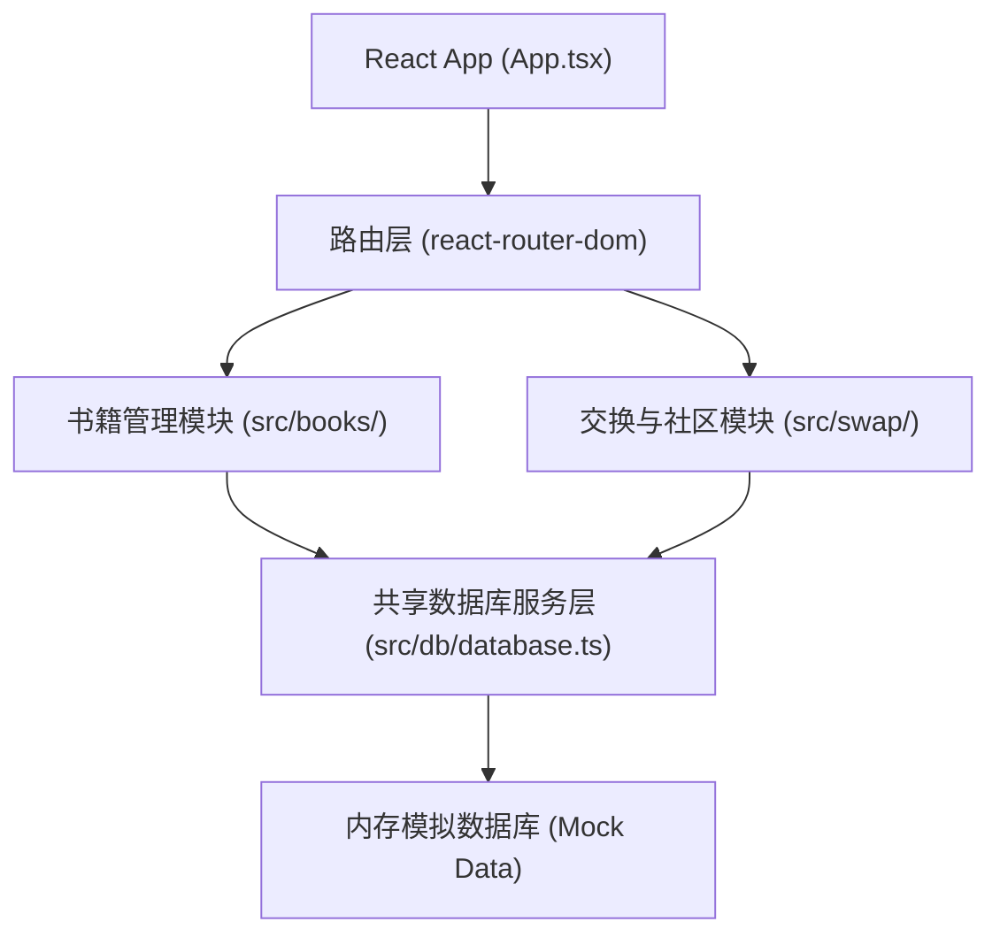
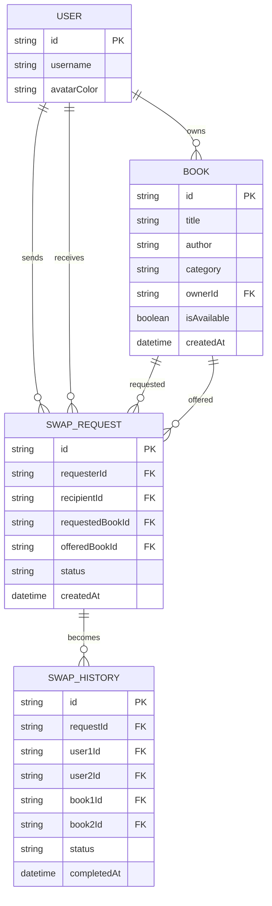

## 1. 架构设计



## 2. 技术描述
- **前端**：React@18 + TypeScript + Vite
- **路由**：react-router-dom@6
- **状态管理**：React hooks (useState, useEffect, useCallback, useMemo)
- **唯一ID**：uuid
- **数据库**：内存模拟数据库（localStorage持久化）
- **CSS**：原生CSS + CSS Modules（遵循BEM命名规范）

## 3. 目录结构
```
src/
├── App.tsx              # 路由配置和根组件
├── main.tsx             # 应用入口
├── index.css            # 全局样式
├── db/
│   └── database.ts      # 模拟数据库层，CRUD接口
├── books/
│   ├── BookShelf.tsx    # 个人书架组件
│   ├── BookCard.tsx     # 书籍卡片组件
│   ├── AddBookModal.tsx # 添加/编辑书籍弹窗
│   └── SearchBar.tsx    # 搜索过滤栏
├── swap/
│   ├── SwapRequest.tsx  # 交换请求弹窗
│   ├── SwapManagement.tsx # 交换管理页面
│   ├── SwapHistory.tsx  # 交换历史列表
│   └── SwapItem.tsx     # 交换请求项组件
├── community/
│   ├── CommunityFeed.tsx # 社区动态瀑布流
│   └── FeedCard.tsx     # 动态卡片组件
├── components/
│   ├── Navbar.tsx       # 导航栏组件
│   ├── Toast.tsx        # 消息提示组件
│   └── Modal.tsx        # 通用弹窗组件
├── hooks/
│   ├── useDebounce.ts   # 防抖hook
│   └── useToast.ts      # 消息提示hook
├── types/
│   └── index.ts         # 类型定义
└── utils/
    └── colors.ts        # 分类颜色映射工具
```

## 4. 路由定义
| 路由 | 页面 | 组件 |
|------|------|------|
| / | 个人书架 | BookShelf |
| /swap | 交换管理 | SwapManagement |
| /history | 交换历史 | SwapHistory |
| /community | 社区动态 | CommunityFeed |
| /user/:userId | 用户书架 | BookShelf (带userId参数) |

## 5. 数据模型

### 5.1 数据模型定义



### 5.2 类型定义

```typescript
interface User {
  id: string;
  username: string;
  avatarColor: string;
}

interface Book {
  id: string;
  title: string;
  author: string;
  category: string;
  ownerId: string;
  isAvailable: boolean;
  createdAt: Date;
}

interface SwapRequest {
  id: string;
  requesterId: string;
  recipientId: string;
  requestedBookId: string;
  offeredBookId: string;
  status: 'pending' | 'accepted' | 'rejected';
  createdAt: Date;
}

interface SwapHistory {
  id: string;
  requestId: string;
  user1Id: string;
  user2Id: string;
  book1Id: string;
  book2Id: string;
  status: 'completed' | 'cancelled';
  completedAt: Date;
}
```

## 6. 核心接口（database.ts）

```typescript
// 书籍相关
getBooks(filter?: Partial<Book>): Book[]
getBookById(id: string): Book | undefined
addBook(book: Omit<Book, 'id' | 'createdAt'>): Book
updateBook(id: string, updates: Partial<Book>): Book | undefined
deleteBook(id: string): boolean
getBooksByUserId(userId: string): Book[]
getAvailableBooksByUserId(userId: string): Book[]

// 用户相关
getCurrentUser(): User
getUserById(id: string): User | undefined
getAllUsers(): User[]

// 交换请求相关
getSwapRequests(filter?: Partial<SwapRequest>): SwapRequest[]
createSwapRequest(request: Omit<SwapRequest, 'id' | 'createdAt' | 'status'>): SwapRequest
updateSwapRequestStatus(id: string, status: 'accepted' | 'rejected'): SwapRequest | undefined
getPendingRequestsCount(userId: string): number

// 交换历史相关
getSwapHistory(): SwapHistory[]
addSwapHistory(history: Omit<SwapHistory, 'id' | 'completedAt'>): SwapHistory

// 执行交换
executeSwap(requestId: string): boolean
```

## 7. 性能优化策略
- **搜索防抖**：300ms延迟，避免频繁重渲染
- **列表虚拟化**：瀑布流使用Intersection Observer实现懒加载
- **状态提升**：共享状态提升至合适层级，避免props drilling
- **Memo优化**：使用React.memo、useMemo、useCallback减少不必要重渲染
- **CSS动画**：使用transform和opacity实现GPU加速动画
- **骨架屏**：加载时显示骨架屏，提升感知性能
