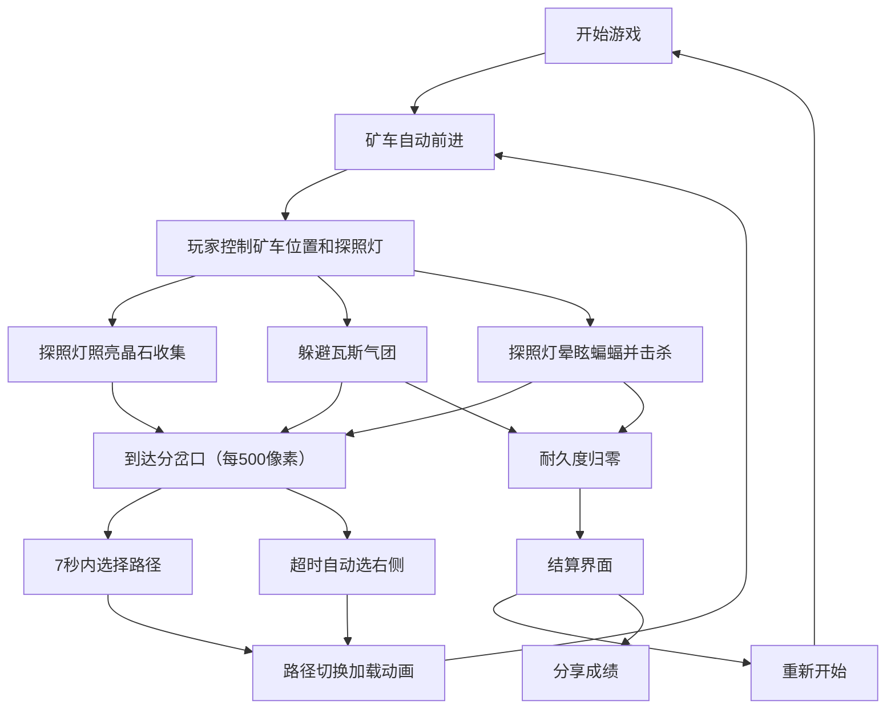

## 1. 产品概述
《矿洞探险：晶石猎人》是一款2D横版卷轴动作游戏，玩家驾驶探照灯矿车在蜿蜒的废弃矿洞中收集发光晶石，同时抵抗蝙蝠群袭击并躲避爆炸性瓦斯气团。游戏核心挑战在于在狭窄多变的地下通道中同时兼顾驾驶操作、光线管理和攻击防御。

- **核心玩法**：矿车自动前进，玩家通过鼠标控制矿车上下移动和探照灯角度，收集晶石、击退蝙蝠、选择路径
- **目标用户**：休闲游戏玩家，喜欢紧张刺激的动作类游戏用户
- **市场价值**：融合驾驶、射击、资源收集和路径选择的多元化玩法，提供独特的地下探险体验

## 2. 核心功能

### 2.1 用户角色
无多角色系统，单玩家模式。

### 2.2 功能模块
1. **游戏主界面**：Canvas 2D渲染的2D横版卷轴游戏场景
2. **矿车控制系统**：鼠标控制垂直移动，滚轮调节探照灯角度
3. **光线与晶石系统**：探照灯光斑照亮晶石，收集晶石粒子
4. **敌人系统**：瓦斯气团（触碰爆炸）、蝙蝠群（正弦轨迹飞行、可晕眩、可击杀）
5. **路径选择系统**：每隔500像素出现分岔口，7秒内选择路径
6. **UI界面系统**：耐久度条、晶石计数器、蝙蝠击杀数、路径预览、结算界面
7. **音效系统**：Web Audio API生成蝙蝠尖啸、晶石收集声、爆炸声

### 2.3 页面详情
| 页面名称 | 模块名称 | 功能描述 |
|---------|---------|---------|
| 游戏主场景 | 矿车控制 | 鼠标在垂直中间60%区域滑动控制矿车上下移动 |
| 游戏主场景 | 探照灯系统 | 滚轮控制灯头仰角（-30°~60°），光斑照亮区域，缓动过渡效果 |
| 游戏主场景 | 晶石收集 | 光斑覆盖晶石触发闪烁，六边形粒子沿抛物线飞向计数器 |
| 游戏主场景 | 瓦斯气团 | 发红光警戒节点，触碰损失30%耐久度，屏幕抖动（振幅8px，0.3秒） |
| 游戏主场景 | 蝙蝠群 | 5-8只正弦轨迹飞行，触碰损失10%耐久度，附着后每秒损失2%，需快速移动甩掉 |
| 游戏主场景 | 攻击系统 | 探照灯照射蝙蝠使其晕眩1.5秒，左键发射声波子弹击杀晕眩蝙蝠 |
| 游戏主场景 | 路径选择 | 每500像素分岔口，7秒选择，顶部路径预览，超时自动选右侧 |
| 结算界面 | 成绩统计 | 晶石数滚动动画、蝙蝠击杀数反向滚动、等级评价（S/A/B/C）、随机励志语 |
| 结算界面 | 重新开始 | 点击按钮重置游戏 |
| 结算界面 | 分享成绩 | 模拟分享提示弹窗 |

## 3. 核心流程

玩家进入游戏后，矿车沿矿洞自动前进，玩家通过鼠标控制矿车垂直位置和探照灯角度。探照灯光斑照亮晶石后可收集，同时需要躲避瓦斯气团并击退蝙蝠群。每隔500像素出现分岔口，玩家需在7秒内选择路径。当矿车耐久度归零时游戏结束，显示结算界面，玩家可选择重新开始或分享成绩。

## 4. 用户界面设计

### 4.1 设计风格
- **整体风格**：复古科幻风格，暗色调
- **主背景**：深灰到炭黑渐变
- **UI元素**：发光荧光蓝描边
- **字体**：等宽手写体
- **角色风格**：像素风带平滑动画过渡

### 4.2 色彩方案
- **主色调**：深棕色→黑色渐变（矿洞背景）
- **强调色**：荧光蓝（UI描边、晶石光效）、亮黄色（探照灯光斑）、红色（瓦斯警戒、蝙蝠）、蓝紫→金色（晶石粒子渐变）
- **文字颜色**：蓝金色（晶石数）、红色（蝙蝠击杀数）、荧光蓝（UI文字）

### 4.3 动画效果
- **探照灯角度**：tween缓动，持续0.2秒
- **晶石收集**：六边形粒子沿抛物线飞行，随机弧度和旋转
- **屏幕抖动**：瓦斯爆炸时振幅8像素，持续0.3秒
- **路径切换**：半透明黑色覆盖层从中央向两侧展开，持续0.8秒
- **结算数字**：晶石数从0递增滚动，蝙蝠击杀数反向滚动
- **蝙蝠晕眩**：停止移动并旋转下坠，持续1.5秒
- **声波子弹**：半透明圆形波纹，扩散速度300像素/秒

### 4.4 页面设计概述
| 页面名称 | 模块名称 | UI元素 |
|---------|---------|---------|
| 游戏主场景 | 矿洞背景 | 深棕到黑渐变，粗糙不规则洞壁线条，随机蓝光晶石小簇 |
| 游戏主场景 | 矿车 | 像素风格，前部探照灯，顶部计数器 |
| 游戏主场景 | 探照灯光斑 | 亮黄色圆形，直径150像素，边缘羽化 |
| 游戏主场景 | 晶石 | 微弱蓝光，光斑覆盖时闪烁 |
| 游戏主场景 | 瓦斯气团 | 红光警戒节点 |
| 游戏主场景 | 蝙蝠群 | 正弦轨迹飞行，晕眩时旋转下坠 |
| 游戏主场景 | UI叠加层 | 耐久度条、晶石计数器、蝙蝠击杀数、路径预览 |
| 分岔口界面 | 路径预览 | 顶部两条曲线分支，蓝色虚线当前路径，灰色虚线可选路径 |
| 结算界面 | 成绩面板 | 滚动数字、等级评价、重新开始按钮、分享按钮 |

### 4.5 响应式设计
- **桌面优先**：min-width: 800px
- **支持比例**：16:9和4:3屏幕宽高比
- **自适应**：Canvas画布根据窗口尺寸调整，保持游戏区域比例

## 5. 性能要求
- **帧率**：不低于30FPS
- **光斑渲染**：每帧光斑计算在1ms内，避免GPU过热
- **粒子系统**：晶石收集粒子、爆炸碎片上限100个，超出部分剔除
- **物理循环**：每秒60帧调用update方法
