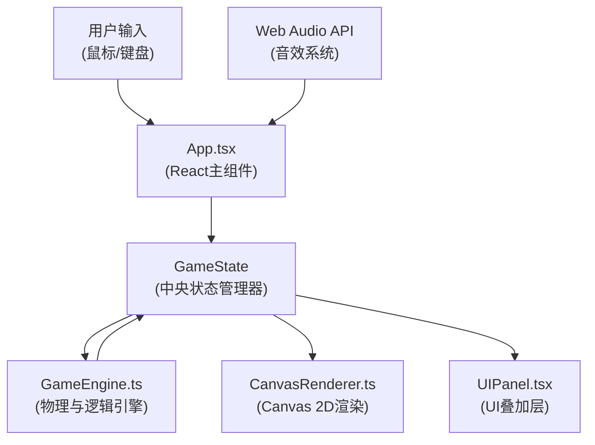

## 1. 架构设计



系统采用分层架构，分为：
- **输入层**：处理鼠标移动、滚轮、点击和键盘事件
- **状态层**：GameState作为中央状态管理器，在引擎和渲染层之间传递数据
- **引擎层**：GameEngine处理物理逻辑、AI、碰撞检测、路径生成
- **渲染层**：CanvasRenderer负责2D渲染，UIPanel负责React UI组件
- **音效层**：Web Audio API生成游戏音效

## 2. 技术描述

- **前端框架**：React@18 + TypeScript@5
- **构建工具**：Vite@5 + @vitejs/plugin-react@4
- **渲染引擎**：Canvas 2D API
- **音效系统**：Web Audio API
- **辅助库**：uuid（用于生成唯一ID）
- **初始化方式**：npm create vite@latest

## 3. 目录结构

```
auto58/
├── package.json
├── vite.config.js
├── tsconfig.json
├── index.html
└── src/
    ├── engine/
    │   ├── GameState.ts        # 游戏状态接口定义
    │   ├── GameEngine.ts       # 核心物理循环与逻辑
    │   └── PathGenerator.ts    # 路径生成器
    └── ui/
        ├── App.tsx             # React主组件
        ├── CanvasRenderer.ts   # Canvas渲染引擎
        └── UIPanel.tsx         # UI叠加组件
```

## 4. 核心模块定义

### 4.1 数据接口定义（GameState.ts）

```typescript
// 位置接口
interface Position {
  x: number;
  y: number;
}

// 矿车状态
interface MineCart {
  position: Position;
  durability: number;      // 0-100
  targetY: number;
  lightAngle: number;       // 当前角度（弧度）
  targetLightAngle: number; // 目标角度（弧度）
  attachedBats: number;     // 附着的蝙蝠数量
}

// 晶石
interface Crystal {
  id: string;
  position: Position;
  isLit: boolean;
  isCollected: boolean;
  glowIntensity: number;
}

// 蝙蝠
interface Bat {
  id: string;
  position: Position;
  velocity: Position;
  isStunned: boolean;
  stunTimer: number;
  isAttached: boolean;
  sinePhase: number;
  rotation: number;
}

// 瓦斯气团
interface GasCloud {
  id: string;
  position: Position;
  radius: number;
  warningIntensity: number;
}

// 粒子
interface Particle {
  id: string;
  position: Position;
  velocity: Position;
  type: 'crystal' | 'explosion' | 'bullet';
  life: number;
  maxLife: number;
  rotation: number;
  color: string;
}

// 声波子弹
interface SonicBullet {
  id: string;
  position: Position;
  radius: number;
  maxRadius: number;
  speed: number;
}

// 路径配置
interface PathConfig {
  id: string;
  crystalDensity: number;
  batIntensity: number;
  width: number;
  topBoundary: (x: number) => number;
  bottomBoundary: (x: number) => number;
}

// 分岔口状态
interface ForkState {
  active: boolean;
  position: number;
  timer: number;
  leftPath: PathConfig;
  rightPath: PathConfig;
  selectedPath: 'left' | 'right' | null;
}

// 屏幕抖动
interface ScreenShake {
  active: boolean;
  amplitude: number;
  duration: number;
  timer: number;
  offset: Position;
}

// 路径切换动画
interface PathTransition {
  active: boolean;
  duration: number;
  timer: number;
  progress: number;
}

// 游戏状态
interface GameState {
  isRunning: boolean;
  isGameOver: boolean;
  score: number;
  crystalsCollected: number;
  batsKilled: number;
  survivalTime: number;
  distanceTraveled: number;
  scrollSpeed: number;
  
  mineCart: MineCart;
  crystals: Crystal[];
  bats: Bat[];
  gasClouds: GasCloud[];
  particles: Particle[];
  sonicBullets: SonicBullet[];
  
  currentPath: PathConfig;
  forkState: ForkState;
  screenShake: ScreenShake;
  pathTransition: PathTransition;
  
  lightSpot: {
    x: number;
    y: number;
    radius: number;
  };
}
```

### 4.2 引擎模块（GameEngine.ts）

核心方法：
- `constructor(state: GameState)` - 初始化引擎
- `update(deltaTime: number)` - 每秒60帧调用，更新所有游戏逻辑
- `updateMineCart(deltaTime: number)` - 更新矿车位置和探照灯角度
- `updateCrystals(deltaTime: number)` - 更新晶石状态和收集逻辑
- `updateBats(deltaTime: number)` - 更新蝙蝠AI和状态
- `updateGasClouds(deltaTime: number)` - 更新瓦斯气团
- `updateParticles(deltaTime: number)` - 更新粒子系统
- `updateSonicBullets(deltaTime: number)` - 更新声波子弹
- `checkCollisions()` - 碰撞检测
- `checkFork()` - 检查分岔口
- `triggerScreenShake(amplitude: number, duration: number)` - 触发屏幕抖动
- `startPathTransition()` - 开始路径切换动画
- `spawnCrystal()` - 生成晶石
- `spawnBatSwarm()` - 生成蝙蝠群
- `spawnGasCloud()` - 生成瓦斯气团
- `fireSonicBullet()` - 发射声波子弹

### 4.3 路径生成器（PathGenerator.ts）

核心方法：
- `generatePath(): PathConfig` - 生成随机路径配置
- `generateFork(): { left: PathConfig, right: PathConfig }` - 生成分岔路径
- `generateBoundaryFunction(baseOffset: number, variation: number): (x: number) => number` - 生成洞边界函数

### 4.4 渲染模块（CanvasRenderer.ts）

核心方法：
- `constructor(canvas: HTMLCanvasElement)` - 初始化渲染器
- `render(state: GameState)` - 渲染一帧
- `clear()` - 清除画布
- `drawBackground(state: GameState)` - 绘制矿洞背景
- `drawMineCart(state: GameState)` - 绘制矿车
- `drawLightSpot(state: GameState)` - 绘制探照灯光斑（性能关键）
- `drawCrystals(state: GameState)` - 绘制晶石
- `drawBats(state: GameState)` - 绘制蝙蝠
- `drawGasClouds(state: GameState)` - 绘制瓦斯气团
- `drawParticles(state: GameState)` - 绘制粒子
- `drawSonicBullets(state: GameState)` - 绘制声波子弹
- `drawPathTransition(state: GameState)` - 绘制路径切换动画
- `applyScreenShake(state: GameState)` - 应用屏幕抖动

### 4.5 UI组件（UIPanel.tsx）

React组件，包含：
- 耐久度条（荧光蓝描边，渐变色填充）
- 晶石计数器（蓝金色数字）
- 蝙蝠击杀数（红色数字）
- 路径预览（顶部二选一曲线）
- 分岔口计时器（7秒倒计时）
- 结算界面（滚动数字、等级评价、按钮）

### 4.6 主组件（App.tsx）

职责：
- 初始化GameState和GameEngine
- 管理Canvas引用
- 设置requestAnimationFrame循环
- 处理鼠标和键盘事件
- 集成Web Audio API音效
- 渲染UIPanel组件

## 5. 性能优化策略

### 5.1 光斑渲染优化
- 使用离屏Canvas预渲染光斑纹理
- 利用径向渐变实现羽化效果，避免每帧逐像素计算
- 光斑计算时间控制在1ms内

### 5.2 粒子系统优化
- 粒子池技术，复用粒子对象避免频繁GC
- 粒子数量上限100个，超出时剔除最早的粒子
- 按类型分层渲染

### 5.3 渲染优化
- 使用`requestAnimationFrame`实现60FPS渲染
- 离屏Canvas预渲染静态元素（洞壁纹理）
- 脏矩形渲染，只更新变化区域

### 5.4 逻辑优化
- 空间分区碰撞检测
- 对象池复用（蝙蝠、晶石、粒子）
- 延迟加载和按需生成

## 6. 音效系统（Web Audio API）

使用OscillatorNode和GainNode生成：
- **晶石收集声**：高频正弦波，快速衰减
- **蝙蝠尖啸**：频率调制的锯齿波
- **爆炸声**：白噪声经过低通滤波，快速衰减
- **子弹发射声**：低频正弦波扫频

## 7. 响应式适配

```typescript
// 屏幕尺寸配置
const SCREEN_CONFIG = {
  minWidth: 800,
  aspectRatios: {
    '16:9': { width: 1280, height: 720 },
    '4:3': { width: 1024, height: 768 }
  }
};

// 游戏区域配置
const GAME_CONFIG = {
  verticalControlZone: 0.6,  // 中间60%区域
  lightAngleMin: -30,        // 度
  lightAngleMax: 60,         // 度
  lightSpotRadius: 150,      // 像素
  forkInterval: 500,         // 像素
  forkTimeout: 7,            // 秒
  scrollSpeed: 150,          // 像素/秒
  sonicBulletSpeed: 300,     // 像素/秒
  batStunDuration: 1.5,      // 秒
  screenShakeAmplitude: 8,   // 像素
  screenShakeDuration: 0.3,  // 秒
  pathTransitionDuration: 0.8 // 秒
};
```

## 8. 依赖配置

### package.json
```json
{
  "name": "mine-crystal-hunter",
  "private": true,
  "version": "1.0.0",
  "type": "module",
  "scripts": {
    "dev": "vite",
    "build": "tsc && vite build",
    "preview": "vite preview"
  },
  "dependencies": {
    "react": "^18.2.0",
    "react-dom": "^18.2.0",
    "uuid": "^9.0.0"
  },
  "devDependencies": {
    "@types/react": "^18.2.0",
    "@types/react-dom": "^18.2.0",
    "@types/uuid": "^9.0.0",
    "@vitejs/plugin-react": "^4.0.0",
    "typescript": "^5.0.0",
    "vite": "^5.0.0"
  }
}
```

### tsconfig.json
```json
{
  "compilerOptions": {
    "target": "ES2020",
    "useDefineForClassFields": true,
    "lib": ["ES2020", "DOM", "DOM.Iterable"],
    "module": "ESNext",
    "skipLibCheck": true,
    "moduleResolution": "bundler",
    "allowImportingTsExtensions": true,
    "resolveJsonModule": true,
    "isolatedModules": true,
    "noEmit": true,
    "jsx": "react-jsx",
    "strict": true,
    "noUnusedLocals": true,
    "noUnusedParameters": true,
    "noFallthroughCasesInSwitch": true
  },
  "include": ["src"],
  "references": [{ "path": "./tsconfig.node.json" }]
}
```

### vite.config.js
```javascript
import { defineConfig } from 'vite';
import react from '@vitejs/plugin-react';

export default defineConfig({
  plugins: [react()],
  server: {
    port: 3000,
    open: true
  }
});
```

## 9. 运行方式

```bash
# 安装依赖
npm install

# 启动开发服务器
npm run dev

# 构建生产版本
npm run build
```
