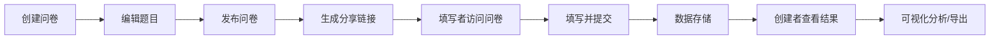

## 1. 产品概述
在线问卷调查与数据分析平台，提供问卷创建、发布、填写及结果可视化分析功能。
- 主要面向需要快速收集用户反馈并进行数据分析的企业和个人用户
- 核心价值：简化问卷创建流程，提供直观的数据可视化分析，帮助用户快速洞察数据价值

## 2. 核心功能

### 2.1 用户角色
| 角色 | 注册方式 | 核心权限 |
|------|---------|---------|
| 问卷创建者 | 无需注册（本地使用） | 创建、编辑、发布问卷，查看和导出统计结果 |
| 问卷填写者 | 无需登录 | 通过分享链接访问并填写问卷 |

### 2.2 功能模块
1. **问卷编辑模块**：添加单选、多选、文本、评分题型，拖拽排序，删除/复制题目
2. **问卷发布模块**：生成唯一分享链接，控制问卷状态
3. **问卷填写模块**：步骤条引导，必填验证，平滑动画
4. **结果分析模块**：图表可视化展示，时间范围筛选，CSV导出

### 2.3 页面详情
| 页面名称 | 模块名称 | 功能描述 |
|---------|---------|---------|
| 首页/问卷列表 | 问卷卡片列表 | 展示所有问卷，支持创建新问卷、编辑、查看结果 |
| 问卷编辑页 | 题目编辑器 | 左侧题目列表拖拽排序，右侧实时预览，支持增删改题目 |
| 问卷填写页 | 答题界面 | 步骤条引导，每题淡入动画，必填验证，提交按钮 |
| 结果分析页 | 数据可视化 | 柱状图/饼图/折线图展示，时间筛选，CSV导出 |

## 3. 核心流程
问卷创建者在编辑器中添加和配置题目，完成后发布问卷生成分享链接。填写者通过链接访问问卷，按步骤填写并提交。创建者可以查看统计结果，通过图表分析数据，并支持按时间范围筛选和导出CSV。

## 4. 用户界面设计
### 4.1 设计风格
- 主色调：蓝紫色渐变（#4A90D9 和 #7B68EE）
- 背景色：浅灰（#F5F7FA）
- 卡片式布局，圆角设计，柔和阴影
- 按钮悬停效果：轻微上浮阴影（transition 0.2s）
- 字体：现代无衬线字体，清晰的层级结构

### 4.2 页面设计概述
| 页面名称 | 模块名称 | UI元素 |
|---------|---------|--------|
| 问卷编辑页 | 编辑器布局 | 左右分栏，左侧题目列表，右侧实时预览，顶部操作栏 |
| 问卷填写页 | 答题界面 | 居中卡片，步骤条进度指示，单题淡入动画 |
| 结果分析页 | 图表展示 | 网格布局的图表卡片，筛选器工具栏，导出按钮 |

### 4.3 响应性
- 桌面端优先设计
- 移动端自适应：编辑器分栏改为上下布局，卡片调整宽度
- 触摸优化：按钮最小尺寸 44x44px

### 4.4 动效设计
- 页面加载：元素渐入动画（staggered reveal）
- 题目切换：淡入淡出 + 轻微位移
- 按钮悬停：上浮 + 阴影增强（0.2s transition）
- 拖拽排序：跟随光标 + 放置动画
