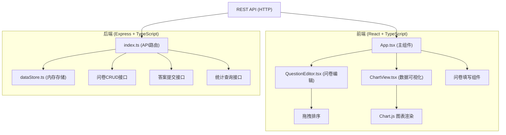
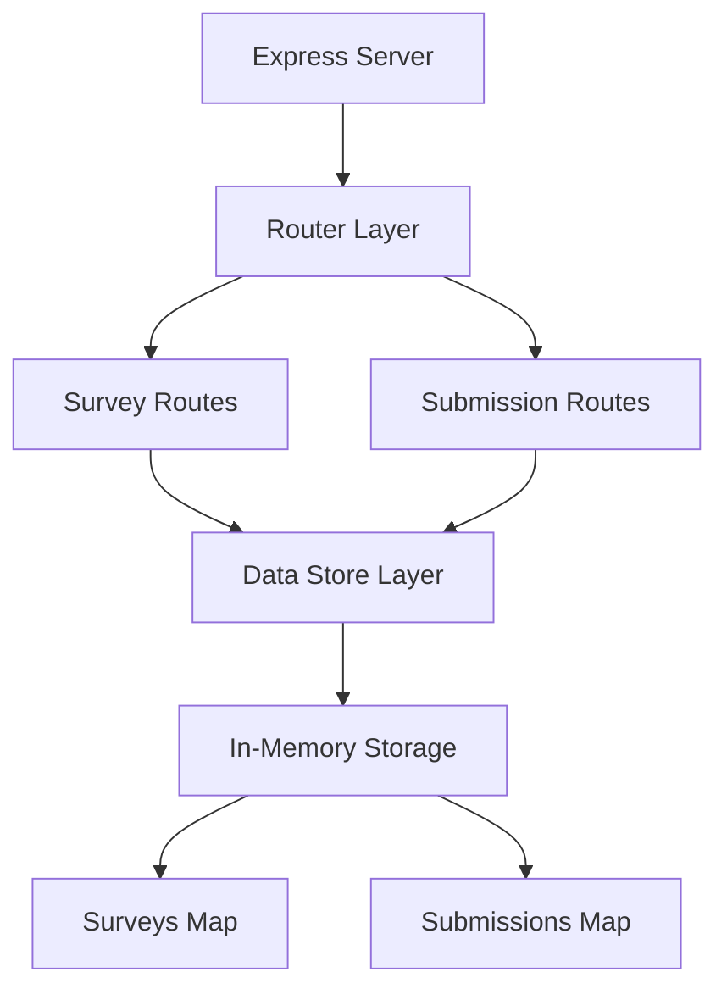
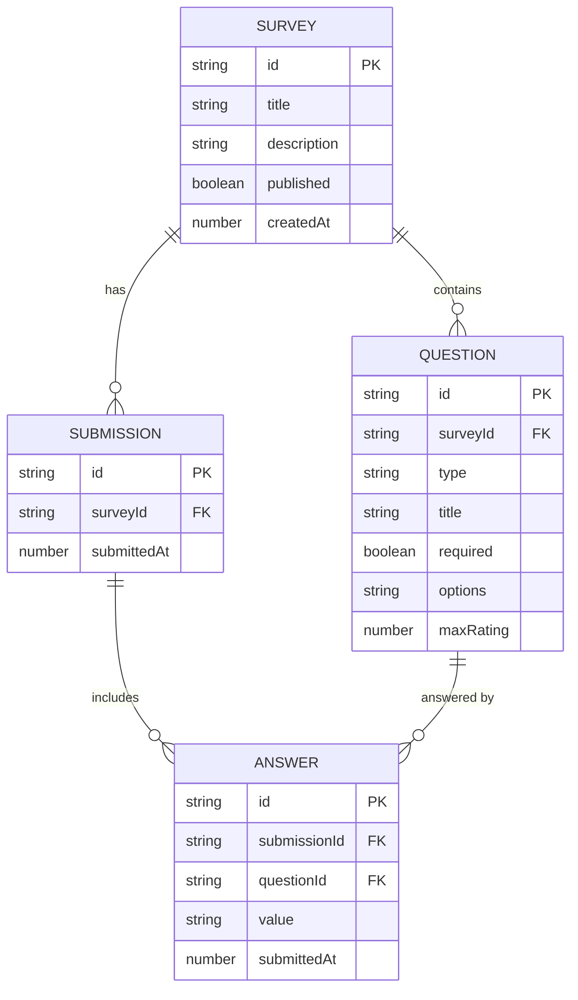

## 1. 架构设计



## 2. 技术描述
- 前端：React@18 + TypeScript + Vite
- 后端：Express@4 + TypeScript
- 图表：chart.js + react-chartjs-2
- 唯一ID：uuid
- CSV导出：csv-export
- 状态管理：React useState/useReducer (轻量场景)
- 样式：原生CSS + CSS Variables

## 3. 路由定义
| 路由 | 用途 |
|-----|------|
| / | 首页，问卷列表 |
| /editor/:id? | 问卷编辑器 |
| /survey/:id | 问卷填写页 |
| /results/:id | 结果分析页 |

## 4. API 定义

### 类型定义
```typescript
type QuestionType = 'single' | 'multiple' | 'text' | 'rating';

interface Question {
  id: string;
  type: QuestionType;
  title: string;
  required: boolean;
  options?: string[];
  maxRating?: number;
}

interface Survey {
  id: string;
  title: string;
  description: string;
  questions: Question[];
  createdAt: number;
  published: boolean;
}

interface Answer {
  id: string;
  surveyId: string;
  questionId: string;
  value: string | string[] | number;
  submittedAt: number;
}

interface Submission {
  id: string;
  surveyId: string;
  answers: Answer[];
  submittedAt: number;
}
```

### API 端点
| 方法 | 路径 | 描述 |
|-----|------|------|
| GET | /api/surveys | 获取所有问卷列表 |
| GET | /api/surveys/:id | 获取单个问卷详情 |
| POST | /api/surveys | 创建新问卷 |
| PUT | /api/surveys/:id | 更新问卷 |
| DELETE | /api/surveys/:id | 删除问卷 |
| POST | /api/surveys/:id/publish | 发布问卷 |
| POST | /api/submissions | 提交问卷答案 |
| GET | /api/surveys/:id/results | 获取问卷统计结果 |
| GET | /api/surveys/:id/export | 导出CSV |

## 5. 服务器架构图



## 6. 数据模型

### 6.1 数据模型定义



### 6.2 内存数据结构
```typescript
// dataStore.ts 内部结构
const surveys: Map<string, Survey> = new Map();
const submissions: Map<string, Submission[]> = new Map();
```

## 7. 性能要求
- API响应时间 < 300ms（本地1000份答卷数据）
- 使用内存数据结构保证查询效率
- 统计计算在服务端完成，减少前端数据传输
