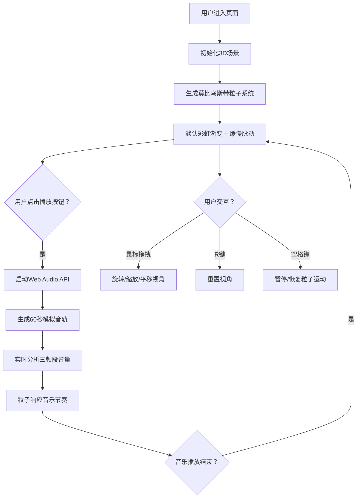

## 1. 产品概述
莫比乌斯带粒子流交互可视化应用，通过Three.js在三维空间中呈现8000个粒子沿莫比乌斯带表面运动的动态效果，支持音乐节奏响应和交互式视角控制。
- 主要用途：提供沉浸式的3D音乐可视化体验，展示数学美学与音乐节奏的结合
- 目标用户：对数学可视化、音乐可视化和交互艺术感兴趣的用户

## 2. 核心功能

### 2.1 Feature Module
1. **3D场景渲染**：莫比乌斯带粒子系统、相机控制、动画循环
2. **音频响应系统**：Web Audio API音频解析、三频段（低/中/高）音量检测
3. **交互控制系统**：OrbitControls鼠标拖拽、键盘快捷键、播放按钮
4. **参数面板**：实时显示三频段音量进度条和粒子总数

### 2.2 Page Details
| Page Name | Module Name | Feature description |
|-----------|-------------|---------------------|
| 主页面 | 3D场景 | 全屏黑色背景，莫比乌斯带粒子系统，支持鼠标拖拽旋转、缩放、平移 |
| 主页面 | 参数面板 | 左上角半透明磨砂玻璃面板，显示低/中/高频音量进度条和粒子总数 |
| 主页面 | 播放控制 | 点击播放按钮生成模拟音轨，粒子随音乐节奏变化 |

## 3. 核心流程
用户进入页面后看到默认状态的莫比乌斯带粒子系统（彩虹渐变、缓慢脉动）。点击播放按钮后，生成60秒模拟音轨，粒子开始响应音乐节奏变化（低频控制旋转速度、中频控制颜色饱和度、高频控制粒子大小）。用户可通过鼠标拖拽旋转视角、滚轮缩放，按R键重置视角，按空格键暂停/恢复粒子运动。

## 4. User Interface Design

### 4.1 Design Style
- **设计风格**：极简科技风，以纯黑色为背景，突出粒子系统的视觉效果
- **主色调**：黑色背景 (#000000)，粒子彩虹渐变（HSL 0-300°）
- **强调色**：低频红 (#ff4444)、中频绿 (#44ff44)、高频蓝 (#4444ff)
- **字体**：白色无衬线字体，字号12px
- **面板样式**：半透明磨砂玻璃效果（rgba(0,0,0,0.5)，backdrop-filter: blur(8px)），圆角8px，无边框，内边距10px

### 4.2 Page Design Overview
| Page Name | Module Name | UI Elements |
|-----------|-------------|-------------|
| 主页面 | 3D场景 | 全屏黑色背景，8000个粒子构成的莫比乌斯带，粒子大小2-6px随机脉动 |
| 主页面 | 参数面板 | 左上角固定，进度条高度6px、宽度80px，颜色对应低/中/高频 |
| 主页面 | 播放按钮 | 居中悬浮，半透明圆形按钮，点击后消失 |

### 4.3 3D Scene Guidance
- **环境**：纯黑色背景，无额外光源（粒子自发光）
- **相机设置**：PerspectiveCamera，位置(0, 0, 5)，看向原点，fov=75
- **交互**：OrbitControls支持旋转、缩放、平移，启用阻尼效果
- **粒子系统**：使用Points + BufferGeometry + PointsMaterial，确保60FPS性能
- **动画**：粒子沿莫比乌斯带表面流动，整体旋转速度可动态调整

### 4.4 Responsiveness
- 响应式设计，自适应窗口大小
- 移动端支持触摸拖拽旋转和双指缩放
