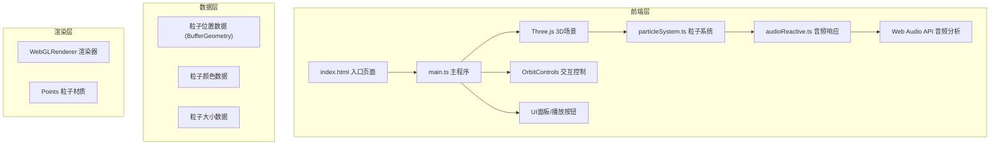

## 1. Architecture Design



## 2. Technology Description
- **前端框架**：纯TypeScript + Vite，无额外UI框架
- **3D渲染引擎**：Three.js (latest)
- **音频处理**：Web Audio API (原生)
- **构建工具**：Vite 5.x + vite-plugin-glsl
- **类型支持**：@types/three
- **语言目标**：ES2020，严格模式TypeScript

## 3. Project Structure

```
auto60/
├── package.json
├── vite.config.js
├── tsconfig.json
├── index.html
└── src/
    ├── main.ts              # 主入口：场景初始化、动画循环
    ├── particleSystem.ts    # 粒子系统：莫比乌斯带生成、颜色渐变、粒子动画
    └── audioReactive.ts     # 音频响应：Web Audio API、频率分析、模拟音轨
```

## 4. Core Module Design

### 4.1 main.ts - 主程序入口
- **职责**：初始化Three.js场景、相机、渲染器、轨道控制器
- **关键功能**：
  - 场景初始化：PerspectiveCamera + WebGLRenderer + OrbitControls
  - 动画循环：requestAnimationFrame，60FPS
  - 事件监听：键盘快捷键（R重置视角、空格暂停）、窗口大小变化
  - 播放按钮：点击后启动音频系统
  - UI面板：实时更新三频段音量进度条

### 4.2 particleSystem.ts - 莫比乌斯带粒子系统
- **职责**：生成8000个粒子，计算莫比乌斯带位置，管理粒子动画
- **莫比乌斯带参数方程**：
  - x = (1 + v/2 * cos(u/2)) * cos(u)
  - y = (1 + v/2 * cos(u/2)) * sin(u)
  - z = v/2 * sin(u/2)
  - u ∈ [0, 2π]（沿带走向），v ∈ [-0.15, 0.15]（带宽方向）
- **关键功能**：
  - 粒子位置计算：均匀分布8000个粒子
  - 颜色系统：默认彩虹渐变（HSL色相从0°到300°）
  - 粒子动画：沿带面流动，大小脉动（0.5-2Hz随机）
  - 音频响应接口：接收低频/中频/高频数据，调整旋转速度、饱和度、大小

### 4.3 audioReactive.ts - 音频响应系统
- **职责**：使用Web Audio API生成模拟音轨并分析频率
- **关键功能**：
  - 模拟音轨生成：60秒内随机变化的低频正弦波 + 中频方波 + 高频三角波
  - 频率分析：AnalyserNode，fftSize=256
  - 三频段检测：
    - 低频：20-250Hz → 控制旋转速度（0.5-2.0转/秒）
    - 中频：250-2000Hz → 控制颜色饱和度（30%-100%）
    - 高频：2000-8000Hz → 控制粒子大小（3-8像素）
  - 响应延迟：≤100ms

## 5. Performance Optimization
- **粒子系统**：使用BufferGeometry + Points，单Draw Call
- **数据更新**：仅更新必要的属性（position/color/size），避免重建几何
- **音频分析**：fftSize=256平衡精度与性能，每帧分析一次
- **渲染优化**：启用抗锯齿，自适应像素比

## 6. Interaction Design
| 交互方式 | 功能 |
|---------|------|
| 鼠标左键拖拽 | 旋转视角 |
| 鼠标滚轮 | 缩放 |
| 鼠标右键拖拽 | 平移 |
| R键 | 重置视角到(0,0,5) |
| 空格键 | 暂停/恢复粒子运动 |
| 点击播放按钮 | 启动/停止模拟音轨 |

## 7. TypeScript Type Definitions

```typescript
// 音频频段数据
interface FrequencyData {
  low: number;      // 0-100
  mid: number;      // 0-100
  high: number;     // 0-100
}

// 粒子系统配置
interface ParticleConfig {
  count: number;    // 粒子数量，默认8000
  bandLength: number;  // 带长，默认2π
  bandWidth: number;   // 带宽，默认0.3
  baseSize: number;    // 基础大小，2-6像素
  minSize: number;     // 最小大小
  maxSize: number;     // 最大大小
}

// 莫比乌斯带粒子数据
interface ParticleData {
  positions: Float32Array;
  colors: Float32Array;
  sizes: Float32Array;
  uParams: Float32Array;  // 每个粒子的u参数
  vParams: Float32Array;  // 每个粒子的v参数
  pulsePhases: Float32Array;  // 脉动相位
  pulseFrequencies: Float32Array;  // 脉动频率
}
```
