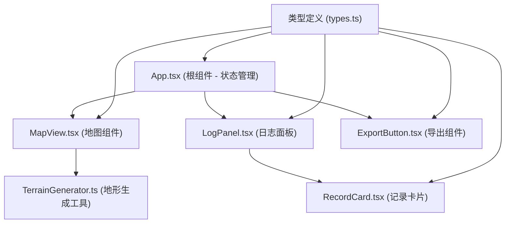

## 1. 架构设计



## 2. 技术描述
- 前端：React@18 + TypeScript@5 + Vite@5
- 构建工具：Vite，输出目录dist
- 状态管理：React useState/useReducer（无需额外状态管理库）
- 地图渲染：Canvas 2D API
- 依赖：react, react-dom, typescript, vite, @vitejs/plugin-react, uuid
- 后端：无（纯前端应用）
- 数据库：无（浏览器内存存储）

## 3. 数据类型定义

```typescript
interface Waypoint {
  id: string;
  x: number;
  y: number;
  elevation: number;
  records: Record[];
  createdAt: number;
}

interface Record {
  id: string;
  timestamp: number;
  description: string;
  imageUrl: string;
}

interface RouteData {
  waypoints: Waypoint[];
  routeCoordinates: { x: number; y: number; elevation: number }[];
  exportedAt: number;
}
```

## 4. 文件结构

```
src/
├── App.tsx                  # 根组件，状态管理
├── main.tsx                 # 入口文件
├── index.css                # 全局样式
├── types.ts                 # 类型定义
├── map/
│   ├── MapView.tsx          # 地图主组件
│   └── TerrainGenerator.ts  # 地形生成工具
├── log/
│   ├── LogPanel.tsx         # 日志面板
│   └── RecordCard.tsx       # 记录卡片组件
└── export/
    └── ExportButton.tsx     # 导出按钮组件
```

## 5. 模块职责

### 5.1 MapView.tsx
- 渲染Canvas地图
- 处理鼠标/触摸事件（点击添加、拖拽调整）
- 绘制等高线、河流、森林（调用TerrainGenerator）
- 绘制途经点和路线
- 管理点击涟漪动画
- 回调：onWaypointAdd, onWaypointMove, onWaypointSelect

### 5.2 TerrainGenerator.ts
- 生成模拟地形高度数据（Perlin噪声模拟）
- 绘制等高线（棕色，间距50米）
- 绘制河流（蓝色，蜿蜒路径）
- 绘制森林区域（绿色斑块）

### 5.3 LogPanel.tsx
- 渲染右侧日志列表面板
- 按时间排序展示记录
- 处理卡片展开/收起动画
- 回调：onRecordClick（高亮地图途经点）

### 5.4 RecordCard.tsx
- 单条记录卡片展示
- 时间戳、描述缩略、缩略图
- 悬浮上浮动画效果
- 展开/收起过渡动画（transition 0.3s ease）

### 5.5 ExportButton.tsx
- 导出按钮交互
- 生成完整JSON数据
- 语法高亮代码块渲染
  - 关键字：蓝色
  - 字符串：绿色
  - 数字：橙色

### 5.6 App.tsx
- 持有waypoints状态数组
- 分发状态和更新函数到子组件
- 管理响应式布局（媒体查询）
- 管理记录弹窗状态

## 6. 性能优化策略

### 6.1 Canvas绘制优化
- 使用requestAnimationFrame实现60fps绘制循环
- 离屏Canvas预渲染底图（等高线、河流、森林）
- 只在途经点变化时重绘动态层（途经点、路线）
- 使用路径缓存减少重复计算

### 6.2 拖拽优化
- 使用useRef存储拖拽状态避免重渲染
- 鼠标事件使用passive: true优化滚动性能
- 拖拽时只更新位置，使用requestAnimationFrame批量渲染

### 6.3 重渲染优化
- 使用React.memo包裹子组件
- 使用useCallback缓存回调函数
- 状态更新使用不可变数据模式

## 7. 响应式实现

### 7.1 媒体查询断点
- ≥768px：桌面端布局（地图70% + 日志30%）
- <768px：移动端布局（地图全宽 + 底部抽屉）

### 7.2 抽屉实现
- CSS transform实现平滑滑入/滑出
- 汉堡菜单按钮控制显示
- 点击遮罩层关闭抽屉

## 8. 动画实现

### 8.1 涟漪动画
- Canvas arc绘制渐变圆
- requestAnimationFrame逐帧更新半径和透明度
- 0.5秒内从半径0到40px，透明度从1到0

### 8.2 卡片动画
- CSS transition: all 0.3s ease
- 悬浮：transform: translateY(-2px); box-shadow增加
- 展开/收起：max-height + opacity过渡

## 9. 启动脚本
- npm install 安装依赖
- npm run dev 启动开发服务器
