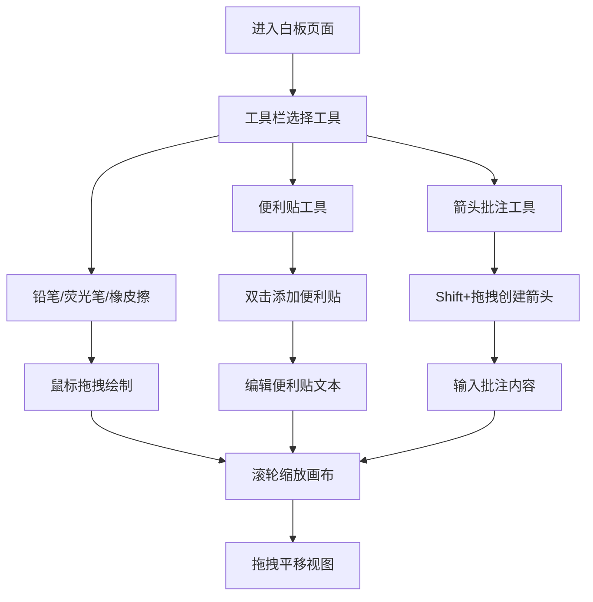

## 1. 产品概述

在线涂鸦白板与协作批注工具，为设计师团队提供浏览器端的实时协作白板体验。支持无限画布、自由绘制、便利贴标注和箭头批注，配合个性化笔迹和流畅动画，打造高效且富有创意的协作环境。

- 面向设计师团队的创意协作与设计评审工具
- 核心价值：降低沟通成本，提升团队创意协作效率

## 2. 核心功能

### 2.1 功能模块

1. **无限画布**：全屏可滚动网格画布，支持缩放平移
2. **画笔工具**：铅笔、荧光笔、橡皮擦三种绘制模式
3. **便利贴**：双击添加、可编辑文本、可拖拽移动、可删除
4. **箭头批注**：Shift+拖拽创建带批注文本的箭头
5. **工具栏**：顶部工具切换、颜色选择、当前状态指示

### 2.2 页面详情

| 页面名称 | 模块名称 | 功能描述 |
|---------|---------|---------|
| 白板主页面 | 工具栏 | 画笔模式切换（铅笔/荧光笔/橡皮擦）、颜色选择、状态提示 |
| 白板主页面 | 无限画布 | 细密网格背景、滚轮缩放（0.5x-3x）、拖拽平移 |
| 白板主页面 | 画笔绘制 | 铅笔实线带手绘抖动、荧光笔半透明叠加加深、橡皮擦圆形擦除 |
| 白板主页面 | 便利贴 | 双击创建、150x150px淡黄底色、手撕边缘、多行文本编辑、拖拽移动、旋转缩小删除动画 |
| 白板主页面 | 箭头批注 | Shift+拖拽创建、起点圆点终点三角、四种颜色可选、中部弹出批注文本框跟随旋转 |

## 3. 核心流程

用户进入页面后看到全屏网格白板，通过顶部工具栏切换绘制工具。可以自由绘制图形，双击添加便利贴记录想法，按住Shift拖拽创建批注箭头标记修改意见。所有元素支持选中、拖拽、删除，白板可缩放和平移浏览。

## 4. 用户界面设计

### 4.1 设计风格

- **主色调**：灰蓝色（#607D8B）搭配白色，整体柔和精致
- **背景**：细密灰色网格线（间距20px，线宽0.5px，颜色#ddd）
- **按钮风格**：圆角矩形，轻微悬浮阴影，点击缩放反馈
- **字体**：现代无衬线字体，清晰易读
- **动效**：所有元素200ms ease-out过渡，选中虚线流动动画，便利贴删除旋转缩小动画

### 4.2 页面设计概览

| 页面名称 | 模块名称 | UI元素 |
|---------|---------|--------|
| 白板主页面 | 工具栏 | 顶部居中、图标按钮、高亮选中态、悬浮提示标签、阴影+缩放反馈 |
| 白板主页面 | 网格背景 | 全屏铺满、细密灰色网格、缩放时间距动态调整 |
| 白板主页面 | 便利贴 | 淡黄底色（#FFF9C4）、手撕边缘（clip-path）、右上角删除按钮、选中外围虚线框 |
| 白板主页面 | 箭头批注 | 圆点起点、三角箭头终点、半透明白底圆角批注框、跟随箭头角度旋转 |

### 4.3 响应式

- 桌面端优先，全屏画布布局
- 移动端适配 viewport，支持触摸操作

### 4.4 性能要求

- 便利贴拖拽和箭头移动保持 60fps 流畅度
- 白板缩放动画不卡顿
- 使用 CSS transform 优化渲染性能
