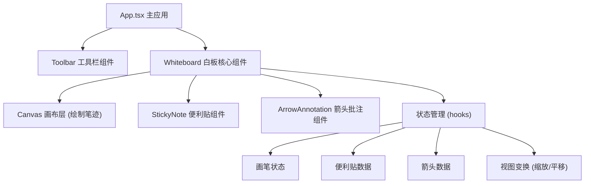

## 1. 架构设计



## 2. 技术说明

- **前端框架**：React@18 + TypeScript
- **构建工具**：Vite@5 + @vitejs/plugin-react
- **样式方案**：CSS Modules / 内联样式 + CSS 变量
- **唯一标识**：uuid 库生成元素 ID
- **渲染方案**：Canvas 2D 绘制笔迹，DOM 元素渲染便利贴与箭头

## 3. 文件结构

| 文件路径 | 用途 |
|---------|------|
| `package.json` | 项目依赖与脚本配置 |
| `vite.config.js` | Vite 构建配置 |
| `tsconfig.json` | TypeScript 严格模式配置 |
| `index.html` | 入口页面，全屏布局 |
| `src/App.tsx` | 主应用组件，组合工具栏和白板 |
| `src/components/Whiteboard.tsx` | 白板核心组件，状态中心 |
| `src/components/StickyNote.tsx` | 便利贴组件 |
| `src/components/ArrowAnnotation.tsx` | 箭头批注组件 |

## 4. 数据模型

### 4.1 画笔笔迹 (Stroke)
```typescript
interface Point {
  x: number;
  y: number;
}

interface Stroke {
  id: string;
  type: 'pencil' | 'highlighter' | 'eraser';
  points: Point[];
  color: string;
  lineWidth: number;
  opacity: number;
}
```

### 4.2 便利贴 (StickyNote)
```typescript
interface StickyNoteData {
  id: string;
  x: number;
  y: number;
  text: string;
  color: string;
  width: number;
  height: number;
}
```

### 4.3 箭头批注 (ArrowAnnotation)
```typescript
interface ArrowAnnotationData {
  id: string;
  startX: number;
  startY: number;
  endX: number;
  endY: number;
  color: string;
  text: string;
}
```

### 4.4 视图状态 (ViewState)
```typescript
interface ViewState {
  scale: number;
  offsetX: number;
  offsetY: number;
}
```

## 5. 核心交互逻辑

### 5.1 画布坐标转换
- 屏幕坐标 → 画布坐标：`canvasX = (clientX - offsetX) / scale`
- 画布坐标 → 屏幕坐标：`screenX = canvasX * scale + offsetX`

### 5.2 缩放处理
- 滚轮事件触发，以鼠标位置为缩放中心
- 缩放范围 0.5x - 3x
- 网格线间距随缩放动态调整视觉密度

### 5.3 拖拽平移
- 空白区域按住鼠标拖拽平移视图
- 使用 transform: translate 实现 GPU 加速

### 5.4 性能优化
- Canvas 分层绘制（背景层 + 笔迹层）
- 便利贴与箭头使用 CSS transform 定位
- 拖拽时更新 transform 而非 top/left
- requestAnimationFrame 优化动画流畅度
