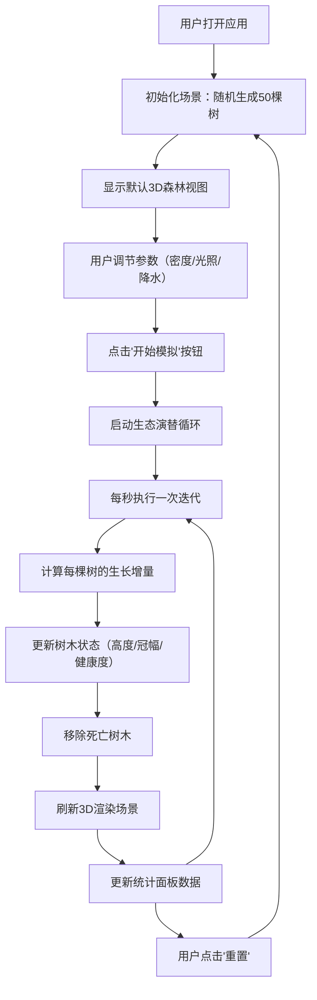

## 1. 产品概述

森林生态演替动态模拟应用，用户通过交互式3D场景观察不同树种在光照、降水等环境因素影响下的生长、竞争与更替过程。

- **核心价值**：将抽象的生态学概念转化为直观可视化的动态模拟，帮助学习者理解森林演替规律
- **目标用户**：生态学学习者、环境科学教育工作者、对自然生态感兴趣的大众用户
- **产品定位**：教育型交互式模拟应用，兼具科学性与观赏性

## 2. 核心功能

### 2.1 功能模块

1. **3D森林视口**：实时渲染森林场景，支持鼠标拖拽旋转、滚轮缩放
2. **生态演替引擎**：基于树种特性和环境因子驱动树木生长、竞争、衰亡
3. **环境控制面板**：调节树木密度、光照强度、降水系数
4. **树种信息统计面板**：实时展示各树种数量、平均高度、优势树种

### 2.2 功能详情

| 模块名称 | 功能描述 |
|---------|---------|
| 3D森林视口 | Three.js渲染的100x100米森林场景，包含地面、树木模型、光照系统，支持OrbitControls交互 |
| 生态演替引擎 | 每秒一次迭代，基于光照因子、降水因子、竞争抑制因子计算生长量，树木健康状态影响树冠颜色 |
| 环境控制面板 | 三个滑块（树木密度10-100、光照强度0.3-1.5、降水系数0.2-2.0），开始/重置按钮 |
| 树种信息面板 | 实时统计树木总数、各树种数量占比、平均高度，高亮优势树种 |

## 3. 核心流程

## 4. 用户界面设计

### 4.1 设计风格

- **主色调**：深森林绿（#1a472a）作为品牌色，搭配深灰半透明面板
- **强调色**：鲜亮绿（#4ade80）用于滑块手柄、按钮悬停态
- **背景**：深灰渐变，模拟夜空下的森林氛围
- **字体**：无衬线现代字体，清晰易读
- **整体氛围**：深色主题，科技感与自然感融合

### 4.2 页面设计概览

| 页面名称 | 模块名称 | UI元素 |
|---------|---------|--------|
| 主界面 | 左侧控制面板 | 半透明深灰背景（backdrop-filter: blur），圆角，内阴影 |
| 主界面 | 滑块控件 | 深色轨道，圆形高亮绿色手柄，悬停微放大，点击内凹效果 |
| 主界面 | 操作按钮 | 深绿背景，悬停上浮阴影，点击内凹，圆角8px |
| 主界面 | 统计面板 | 白色文字，行间距1.5，树种名称带颜色标识 |
| 主界面 | 3D视口 | 全屏显示，45度俯视视角，OrbitControls交互 |

### 4.3 交互动效

- **树木生长**：高度和冠幅变化带有0.3秒平滑过渡动画
- **树冠颜色**：随健康状态渐变过渡（鲜绿→黄绿→红褐→灰）
- **控件微交互**：按钮悬停轻微上浮+阴影增强，点击内凹反馈
- **场景光照**：调节光照强度时，平行光方向和强度同步渐变

### 4.4 3D场景设计

- **地面**：绿色渐变PlaneGeometry，带辅助网格线
- **树木**：树干（圆柱体，棕色材质）+ 树冠（球体，渐变绿色材质）
- **光照**：平行光（模拟太阳）+ 环境光，支持动态调整
- **雾效**：场景边缘柔和雾化，增强空间感
- **视角**：默认45度俯视，支持OrbitControls旋转缩放

### 4.5 响应式设计

桌面端为主，左侧固定320px控制面板，右侧为自适应3D视口。支持窗口大小变化时场景自动适配。
