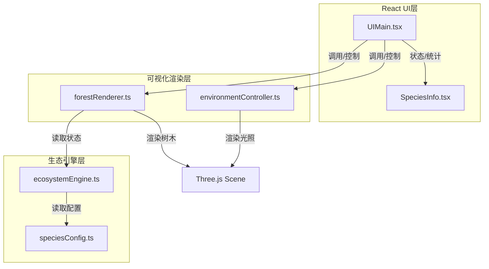

## 1. 架构设计



## 2. 技术描述

- **前端框架**：React@18 + TypeScript@5
- **构建工具**：Vite@5 + @vitejs/plugin-react
- **3D渲染**：Three.js + @types/three
- **状态管理**：React useState/useRef（无需额外状态库，生态引擎内部维护状态）
- **UI样式**：原生CSS（深色主题，半透明毛玻璃效果）
- **工具库**：uuid（生成树木唯一标识）

### 2.1 依赖清单

| 包名 | 版本 | 用途 |
|-----|------|------|
| react | ^18.2.0 | UI框架 |
| react-dom | ^18.2.0 | DOM渲染 |
| three | ^0.160.0 | 3D渲染引擎 |
| @types/three | ^0.160.0 | Three.js类型定义 |
| typescript | ^5.3.0 | 类型系统 |
| vite | ^5.0.0 | 构建工具 |
| @vitejs/plugin-react | ^4.2.0 | React支持 |
| uuid | ^9.0.0 | 唯一ID生成 |

## 3. 目录结构

```
src/
├── ecosystem/
│   ├── ecosystemEngine.ts    # 生态引擎核心
│   └── speciesConfig.ts      # 树种配置
├── visualization/
│   ├── forestRenderer.ts     # 森林3D渲染器
│   └── environmentController.ts  # 环境光照控制
├── ui/
│   ├── UIMain.tsx            # 主界面组件
│   └── SpeciesInfo.tsx       # 树种信息面板
├── App.tsx                   # 应用入口
├── main.tsx                  # React挂载点
└── index.css                 # 全局样式
```

## 4. 数据模型

### 4.1 树种配置 (SpeciesConfig)

| 字段 | 类型 | 说明 |
|-----|------|------|
| id | string | 树种唯一标识 |
| name | string | 树种名称 |
| baseGrowthRate | number | 基础生长速率（米/迭代） |
| maxHeight | number | 最大高度（米） |
| canopyRadius | number | 冠幅半径（米） |
| shadeTolerance | number | 耐阴能力（0-1） |
| waterDemand | number | 水分需求系数 |
| trunkColor | string | 树干颜色（十六进制） |
| canopyColor | string | 树冠基础颜色（十六进制） |

### 4.2 树木状态 (TreeState)

| 字段 | 类型 | 说明 |
|-----|------|------|
| id | string | 树木唯一ID |
| speciesId | string | 所属树种ID |
| position | {x: number, z: number} | 地面位置坐标 |
| height | number | 当前高度（米） |
| targetHeight | number | 目标高度（用于平滑动画） |
| canopyRadius | number | 当前冠幅半径 |
| targetCanopyRadius | number | 目标冠幅半径 |
| health | number | 健康度（0-1） |
| initialHeight | number | 初始高度 |
| negativeGrowthStreak | number | 连续负生长次数 |
| isDying | boolean | 是否处于衰亡状态 |

### 4.3 环境参数 (EnvironmentParams)

| 字段 | 类型 | 说明 |
|-----|------|------|
| lightIntensity | number | 光照强度（0.3-1.5） |
| precipitation | number | 降水系数（0.2-2.0） |
| treeDensity | number | 树木密度（10-100棵） |

### 4.4 生态引擎接口

```typescript
interface EcosystemEngine {
  // 初始化森林
  initialize(density: number): void;
  
  // 执行一次演替迭代
  iterate(): void;
  
  // 获取当前所有树木快照
  getTreesSnapshot(): TreeState[];
  
  // 设置环境参数
  setEnvironment(params: Partial<EnvironmentParams>): void;
  
  // 获取统计信息
  getStatistics(): ForestStatistics;
}

interface ForestStatistics {
  totalCount: number;
  speciesCount: Record<string, number>;
  averageHeight: number;
  dominantSpecies: string | null;
}
```

## 5. 性能优化策略

1. **BufferGeometry合并**：同树种的树干和树冠几何体使用合并策略，减少draw call
2. **增量更新**：仅在树木状态变化时更新对应Mesh的属性，避免每帧全量重建
3. **对象池**：树木Mesh复用，死亡树木隐藏而非销毁，需要时重新激活
4. **渲染循环优化**：使用requestAnimationFrame，生态迭代固定每秒1次，渲染与逻辑解耦
5. **材质复用**：同类型树木共享材质实例，通过uniforms差异化颜色
6. **LOD策略**：远处树木使用简化模型（可选优化）
