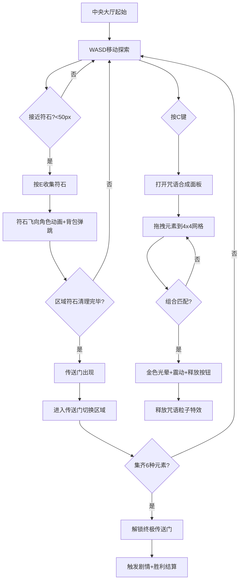

## 1. 产品概述

魔法学院元素符石组合咒语游戏是一款2D俯视角回合制RPG游戏应用，旨在解决传统回合制RPG中施法逻辑单一、元素组合缺乏创意的问题。玩家在魔法学院的六大区域中探索、收集元素符石，通过创新的拖拽组合系统合成独特咒语，体验元素融合的魔法魅力。

- 目标用户：喜欢魔法题材、解谜组合玩法的休闲RPG玩家
- 核心价值：通过元素自由组合系统赋予施法创造性与策略深度

## 2. 核心功能

### 2.1 功能模块

1. **游戏主界面**：2D俯视角学院地图，6个区域（火之庭院、水之回廊、风之塔、土之密室、光之穹顶、中央大厅），WASD移动，角色斗篷漂移动画
2. **符石收集系统**：各区域随机生成3-5个漂浮元素符石，接近后E键收集，飞向角色动画+背包图标弹跳反馈
3. **咒语合成面板**：C键打开毛玻璃面板，左侧元素图标拖拽到4x4网格，组合匹配后金色光晕+震动+释放按钮
4. **粒子特效系统**：全屏Canvas粒子特效，粒子数量随组合复杂度变化，颜色混合，扩散后边缘白光闪烁
5. **传送门与区域切换**：清理符石后出现旋转漩涡传送门，进入后淡入淡出切换区域，中央大厅终极传送门+胜利结算

### 2.2 页面详情

| 页面名称 | 模块名称 | 功能描述 |
|---------|---------|---------|
| 游戏主界面 | 学院地图 | 6区域渐变背景地图，角色WASD移动（3px/帧），斗篷6帧漂移动画 |
| 游戏主界面 | 符石系统 | 各区域3-5个半透明六边形符石，2秒圆形轨迹旋转，接近<50px按E收集，0.5秒缓出飞向角色动画 |
| 游戏主界面 | 传送门 | 清理区域后旋转漩涡传送门（60度/秒），淡入淡出切换（1秒），终极传送门触发剧情+结算 |
| 咒语合成面板 | 合成网格 | 毛玻璃面板（模糊10px），左侧元素图标40x40圆角，右侧4x4白色虚线网格，拖拽排序 |
| 咒语合成面板 | 组合反馈 | 匹配序列后金色光晕+3次震动（5px），显示咒语名称和释放按钮 |
| 粒子特效 | 释放动画 | 2元素100粒子/3元素150/4元素200，从角色扩散200-400px持续2秒，颜色混合，2-8px衰减，边缘白光0.3秒 |
| 角色信息栏 | 状态显示 | 左上角头像+分段胶囊进度条+当前区域名，已填充段带磨砂光泽 |
| 咒语快捷栏 | 快速施法 | 顶部中央半透明栏，最多4个咒语60x60px，悬停放大1.1倍+显示名称 |
| 元素背包 | 扇形菜单 | 右下角图标点击展开扇形，圆心弹出间隔0.1秒二次缓动 |
| 胜利结算 | 结算面板 | 收集时间、施法次数、组合发现率 |

## 3. 核心流程

玩家从中央大厅出发，使用WASD移动探索学院六大区域。在各区域接近漂浮的元素符石后按E键收集，符石飞向角色并消失，同时背包图标亮起弹跳。收集足够元素后按C键打开咒语合成面板，将左侧元素图标拖拽到4x4网格中组合。当组合匹配预定义咒语时，网格亮起金色光晕并震动，出现咒语名称和释放按钮。点击释放后播放全屏粒子特效。每个区域清理所有符石后出现传送门，进入可切换至下一区域。集齐6种元素后解锁中央大厅终极传送门，触发剧情并显示胜利结算。

## 4. 界面设计

### 4.1 设计风格

- **主色调**：米色 #F5E6C8、深棕 #4A3728、暗金 #B8860B
- **按钮风格**：粗糙羊皮纸纹理背景（CSS噪声纹理透明度0.15），悬停纸页翻动动画（上移2px+0.5px阴影）
- **字体**：衬线字体（serif），标题使用粗体，正文使用常规
- **布局风格**：全屏Canvas地图 + 覆盖层UI面板
- **动画风格**：弹窗缩放0.8→1倍0.3秒弹性缓出，面板毛玻璃模糊10px，背景模糊增加

### 4.2 页面设计概览

| 页面名称 | 模块名称 | UI元素 |
|---------|---------|--------|
| 游戏主界面 | 学院地图 | 全屏Canvas，各区域渐变背景，角色带斗篷6帧动画，符石六边形旋转流光 |
| 游戏主界面 | 角色信息栏 | 左上角，头像+分段胶囊进度条（磨砂光泽）+区域名称 |
| 游戏主界面 | 咒语快捷栏 | 顶部中央半透明，4个60x60咒语位，悬停放大1.1倍 |
| 游戏主界面 | 元素背包 | 右下角图标，点击扇形展开（0.1秒间隔二次缓动弹出） |
| 咒语合成面板 | 毛玻璃面板 | 半透明毛玻璃，左侧元素图标40x40圆角，右侧4x4白色虚线网格 |
| 咒语合成面板 | 组合反馈 | 网格外圈金色光晕+3次震动5px，中央咒语名称+释放按钮 |
| 粒子特效 | 释放动画 | 全屏Canvas粒子扩散，颜色混合，边缘白光闪烁 |
| 传送门 | 漩涡效果 | 旋转深色漩涡+随机星点，60度/秒 |
| 区域切换 | 过渡动画 | 白屏淡入淡出1秒 |
| 胜利结算 | 结算面板 | 收集时间+施法次数+组合发现率 |

### 4.3 响应式适配

- 1280x720以上分辨率：地图全屏显示
- 小于1280x720：地图自动缩放并添加黑色边框
- 关键UI元素（角色、符石、传送门）最小尺寸不低于20像素

### 4.4 六大区域配色

| 区域名称 | 渐变背景色 | 元素颜色 |
|---------|-----------|---------|
| 火之庭院 | 红橙渐变 | 红色 #FF4444 |
| 水之回廊 | 蓝紫渐变 | 蓝色 #4488FF |
| 风之塔 | 青绿渐变 | 绿色 #44FF88 |
| 土之密室 | 棕黄渐变 | 黄色 #FFAA44 |
| 光之穹顶 | 白金色渐变 | 白色 #FFFFCC |
| 中央大厅 | 米色暗金渐变 | 金色 #FFD700 |
