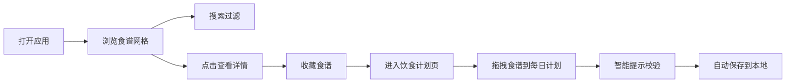

## 1. 产品概述

在线食谱分享与智能配餐助手是一款纯前端Web应用，帮助用户浏览丰富的食谱、按食材搜索、收藏喜爱的食谱，并通过拖拽方式规划一周饮食计划。应用以温暖的配色和流畅的交互体验，为用户提供便捷的饮食规划解决方案。

- 主要用途：食谱浏览与搜索、个性化收藏、一周饮食计划拖拽规划
- 目标用户：注重饮食健康、喜欢烹饪和规划饮食的人群
- 产品价值：简化饮食规划流程，提供智能配餐建议，提升烹饪体验

## 2. 核心功能

### 2.1 用户角色

| 角色 | 注册方式 | 核心权限 |
|------|----------|----------|
| 普通用户 | 无需注册，本地存储 | 浏览食谱、搜索过滤、收藏食谱、规划饮食计划 |

### 2.2 功能模块

1. **食谱浏览页**：搜索栏、食谱卡片网格、收藏功能、详情模态框
2. **饮食计划页**：七日计划列、拖拽规划、智能提示、收藏面板

### 2.3 页面详情

| 页面名称 | 模块名称 | 功能描述 |
|----------|----------|----------|
| 食谱浏览页 | 顶部导航 | 应用Logo、搜索栏、收藏计数、我的计划入口 |
| 食谱浏览页 | 食谱网格 | 每行3张卡片，展示食谱封面、名称、难度、时长、收藏按钮 |
| 食谱浏览页 | 搜索过滤 | 实时搜索食谱名称、食材、菜系，响应时间≤100ms |
| 食谱浏览页 | 详情模态框 | 大图展示、食材列表、步骤说明、营养标签、加入计划按钮 |
| 饮食计划页 | 七日计划列 | 周一至周日7列，每列显示日期和食谱数量徽章 |
| 饮食计划页 | 拖拽交互 | 从收藏面板拖拽食谱到每日计划，60fps流畅拖拽 |
| 饮食计划页 | 智能提示 | 烹饪时长超限橙色警告、菜品不足提示气泡 |
| 饮食计划页 | 收藏面板 | 左侧浮动面板展示已收藏食谱，可拖拽使用 |

## 3. 核心流程

用户打开应用 → 浏览食谱卡片 → 使用搜索栏过滤食谱 → 点击卡片查看详情 → 点击心形收藏食谱 → 进入饮食计划页 → 从收藏面板拖拽食谱到每日计划 → 系统智能提示烹饪时长和菜品数量 → 数据自动保存到本地存储

## 4. 用户界面设计

### 4.1 设计风格

- **主色调**：#F5A623（暖橙色）
- **辅助色**：#F7DC6F（暖黄色）
- **背景色**：#FFF8E7（米白色暖调）
- **卡片样式**：白色圆角矩形，border-radius: 12px，细微阴影 box-shadow: 0 2px 8px rgba(0,0,0,0.06)
- **字体**：系统默认Inter或无衬线字体
- **按钮风格**：圆角按钮，悬停背景色变化，0.2s过渡
- **难度徽章**：初级（绿色）、中级（黄色）、高级（红色），圆角徽章
- **图标风格**：线性图标，心形收藏按钮

### 4.2 页面设计概览

| 页面名称 | 模块名称 | UI元素 |
|----------|----------|--------|
| 食谱浏览页 | 导航栏 | 暖色调背景、搜索框（聚焦发光效果）、收藏计数徽章、计划入口 |
| 食谱浏览页 | 食谱卡片 | 圆形封面图、名称（16px加粗深灰）、难度标签、烹饪时长、心形收藏 |
| 食谱浏览页 | 详情模态框 | 大图（300x300）、食材圆点列表、分步骤说明、营养进度条、加入计划按钮 |
| 饮食计划页 | 星期卡片 | 圆角顶部卡片、星期名称、日期、数量徽章（圆形数字） |
| 饮食计划页 | 拖拽区域 | 虚线放置区、拖拽半透明效果、放置弹性动画 |
| 饮食计划页 | 提示气泡 | 橙色警告边框、提示文字气泡、0.3s过渡动画 |

### 4.3 响应式设计

- **桌面端**（≥768px）：食谱网格每行3张，计划7列横向排列
- **移动端**（<768px）：食谱网格每行2张，计划列垂直排列可横向滚动
- **触摸优化**：按钮和可点击区域≥44px，拖拽支持触摸操作

### 4.4 动效设计

- 卡片悬停：抬升6px，阴影加深，transition: 0.2s ease
- 搜索聚焦：边框变主色，box-shadow发光效果
- 拖拽过程：卡片半透明跟随鼠标
- 放置效果：轻微弹性动画
- 提示出现/消失：0.3s过渡动画
- 按钮悬停：背景色变化，cursor: pointer
