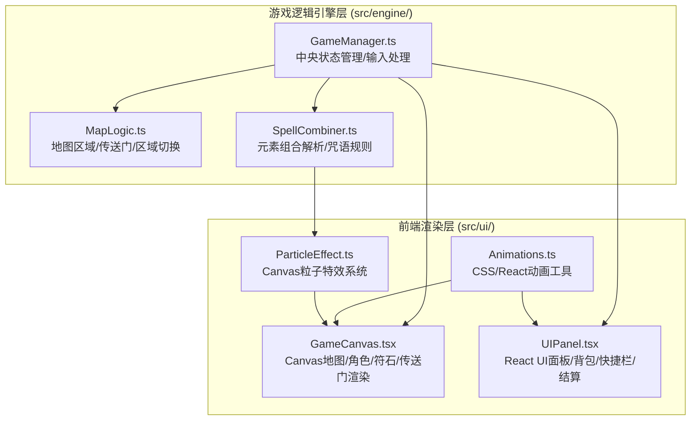

## 1. 架构设计



## 2. 技术说明

- **前端框架**：React@18 + TypeScript + Vite
- **初始化工具**：vite-init (react-ts模板)
- **渲染引擎**：HTML5 Canvas 2D（地图/角色/符石/粒子）+ React DOM（UI面板/按钮/背包）
- **状态管理**：GameManager单例类（引擎与UI唯一通信桥梁）
- **后端**：无（纯前端游戏）
- **数据库**：无（游戏状态在内存中管理）

## 3. 路由定义

| 路由 | 用途 |
|------|------|
| / | 游戏主页面（单页应用，所有游戏内容在一个页面中） |

## 4. 模块职责

### 4.1 GameManager.ts — 中央游戏状态管理

```
职责：
- 初始化地图和6个区域状态
- 维护角色状态（位置、朝向、移动速度）
- 维护符石列表（各区域符石位置、类型、收集状态）
- 维护咒语组合规则表
- 作为引擎和UI之间的唯一通信桥梁
- 接收UI层键盘/鼠标输入并返回更新后的状态数据
- 管理游戏流程（开始、区域切换、胜利判定）

关键接口：
- init(): GameState
- handleInput(input: InputEvent): GameState
- getState(): GameState
- collectRune(runeId: string): GameState
- combineSpell(elements: Element[]): SpellResult
- triggerPortal(): GameState
```

### 4.2 MapLogic.ts — 地图区域管理

```
职责：
- 定义6个区域的边界数据、背景色、符石生成位置
- 传送门触发逻辑（玩家进入传送门区域检测）
- 区域切换时的状态重置（新区域符石生成）
- 向GameManager提供区域信息和切换方法

关键接口：
- getAreaInfo(areaId: string): AreaInfo
- checkPortalTrigger(playerPos: Position, areaId: string): boolean
- switchArea(fromArea: string, toArea: string): AreaState
- generateRunes(areaId: string): Rune[]
```

### 4.3 SpellCombiner.ts — 元素组合解析

```
职责：
- 维护预定义的咒语组合规则表
- 接收元素列表，查询匹配的咒语
- 返回匹配的咒语ID和对应粒子特效参数
- 向GameManager报告合成结果

预定义组合规则：
- 火+风+光 → 烈焰风暴
- 水+土+光 → 生命之泉
- 火+水 → 蒸汽爆发
- 风+土 → 沙暴漩涡
- 火+风 → 烈风灼烧
- 水+光 → 圣光洗礼
- 土+光 → 圣盾庇护
- 火+水+风+土 → 元素湮灭

关键接口：
- combine(elements: Element[]): SpellResult
- getSpellRules(): SpellRule[]
```

### 4.4 GameCanvas.tsx — Canvas渲染组件

```
职责：
- React组件，管理Canvas元素
- 绘制地图区域渐变背景
- 绘制角色（斗篷法师6帧动画）和移动漂移
- 绘制符石（六边形旋转+流光效果）
- 绘制传送门（漩涡+星点）
- 通过GameManager获取游戏状态并渲染
- 将键盘(WASD/E/C)和鼠标输入传递给GameManager
- 调用ParticleEffect渲染粒子
```

### 4.5 UIPanel.tsx — React UI面板组件

```
职责：
- 管理所有UI面板（咒语合成面板、元素背包面板、胜利结算面板）
- 读取GameManager状态并显示
- 处理拖拽排序（元素图标拖入4x4网格）
- 处理按钮点击（释放咒语、传送门确认）
- 调用Animations工具函数实现过渡效果
```

### 4.6 ParticleEffect.ts — 粒子特效模块

```
职责：
- 接收SpellCombiner返回的粒子参数
- 在Canvas上生成、更新和渲染粒子
- 提供startEffect方法和销毁清理功能
- 粒子数量上限400个，超过自动截断
- 独立计时循环不影响主帧率

关键接口：
- startEffect(params: ParticleParams): void
- update(deltaTime: number): void
- render(ctx: CanvasRenderingContext2D): void
- destroy(): void
```

### 4.7 Animations.ts — 动画工具模块

```
职责：
- 提供缩放（0.8→1倍弹性缓出0.3秒）
- 提供弹跳（1.2倍后恢复）
- 提供淡入淡出（1秒过渡）
- 提供缓出函数、二次缓动函数
- 统一管理所有CSS和React过渡效果

关键接口：
- scaleAnimation(from: number, to: number, duration: number, easing: string): AnimationConfig
- bounceAnimation(scale: number): AnimationConfig
- fadeInOut(duration: number): AnimationConfig
- easeOut(t: number): number
- quadraticEase(t: number): number
```

## 5. 数据模型

### 5.1 核心类型定义

```typescript
interface Position { x: number; y: number }

interface PlayerState {
  position: Position
  direction: Direction
  isMoving: boolean
  cloakFrame: number
  collectedElements: ElementType[]
  discoveredSpells: string[]
  spellCount: number
}

enum ElementType { FIRE, WATER, WIND, EARTH, LIGHT, ARCANE }

interface Rune {
  id: string
  element: ElementType
  position: Position
  collected: boolean
  rotation: number
  collectAnimProgress: number
}

interface AreaInfo {
  id: string
  name: string
  gradientColors: [string, string]
  runePositions: Position[]
  portalPosition: Position | null
  hasPortal: boolean
  runeCount: number
}

interface SpellRule {
  elements: ElementType[]
  spellId: string
  spellName: string
  particleCount: number
  particleColors: string[]
 扩散MinRadius: number
  扩散MaxRadius: number
}

interface GameState {
  player: PlayerState
  currentArea: string
  areas: Map<string, AreaState>
  runes: Rune[]
  activePortal: boolean
  gamePhase: 'playing' | 'victory'
  startTime: number
  discoveredSpells: string[]
  spellCount: number
}

interface ParticleParams {
  count: number
  colors: string[]
  origin: Position
  minRadius: number
  maxRadius: number
  duration: number
  minSize: number
  maxSize: number
}
```

## 6. 文件组织

```
project-root/
├── package.json
├── vite.config.js
├── tsconfig.json
├── index.html
└── src/
    ├── engine/
    │   ├── GameManager.ts
    │   ├── MapLogic.ts
    │   └── SpellCombiner.ts
    └── ui/
        ├── GameCanvas.tsx
        ├── UIPanel.tsx
        ├── ParticleEffect.ts
        └── Animations.ts
```

## 7. 性能要求

- 60FPS基准，50个符石同时浮动旋转时帧率不低于50FPS
- 粒子特效数量上限400个，超过自动截断
- Canvas渲染使用requestAnimationFrame
- 粒子特效独立计时循环不影响主帧率
- 响应式适配：1280x720以上全屏，以下缩放+黑边，关键UI最小20px
