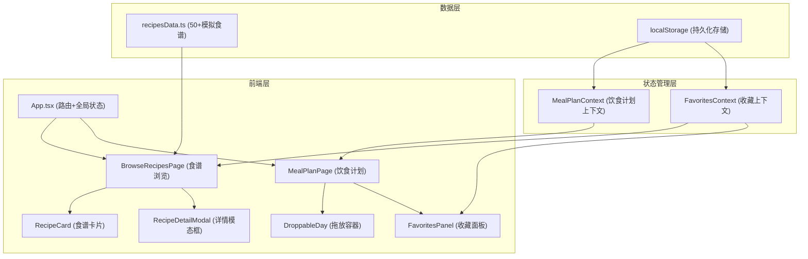

## 1. 架构设计



## 2. 技术描述

- **前端框架**：React 18 + TypeScript
- **构建工具**：Vite 5
- **样式方案**：Tailwind CSS 3 + PostCSS + Autoprefixer
- **路由管理**：react-router-dom v6
- **拖拽库**：react-beautiful-dnd
- **状态管理**：React Context API
- **唯一ID**：uuid
- **数据持久化**：localStorage
- **初始化工具**：vite-init

## 3. 路由定义

| 路由路径 | 页面组件 | 功能说明 |
|----------|----------|----------|
| `/` | BrowseRecipesPage | 食谱浏览首页，搜索与过滤 |
| `/meal-plan` | MealPlanPage | 一周饮食计划，拖拽规划 |

## 4. 数据模型

### 4.1 食谱数据模型

```typescript
interface Recipe {
  id: string;
  name: string;
  image: string;
  difficulty: '初级' | '中级' | '高级';
  cookTime: number; // 分钟
  cuisine: string;
  ingredients: string[];
  steps: string[];
  nutrition: {
    protein: number; // 每日推荐百分比
    carbs: number;
    fat: number;
  };
}
```

### 4.2 饮食计划模型

```typescript
interface DayPlan {
  day: string; // 周一 ~ 周日
  date: string;
  recipes: PlannedRecipe[];
}

interface PlannedRecipe {
  id: string;
  recipeId: string;
  name: string;
  image: string;
  cookTime: number;
}

type MealPlan = DayPlan[];
```

### 4.3 收藏数据模型

```typescript
type FavoriteRecipeIds = string[];
```

## 5. 文件结构

```
auto65/
├── package.json
├── vite.config.js
├── tsconfig.json
├── tailwind.config.js
├── postcss.config.js
├── index.html
├── src/
│   ├── main.tsx
│   ├── App.tsx
│   ├── index.css
│   ├── pages/
│   │   ├── BrowseRecipesPage.tsx
│   │   └── MealPlanPage.tsx
│   ├── components/
│   │   ├── RecipeCard.tsx
│   │   ├── DroppableDay.tsx
│   │   ├── RecipeDetailModal.tsx
│   │   ├── FavoritesPanel.tsx
│   │   ├── Navbar.tsx
│   │   └── SearchBar.tsx
│   ├── context/
│   │   ├── MealPlanContext.tsx
│   │   └── FavoritesContext.tsx
│   └── data/
│       └── recipesData.ts
```

## 6. 性能优化策略

1. **搜索性能**：使用 useMemo 缓存过滤结果，确保响应时间 ≤ 100ms
2. **拖拽性能**：使用 react-beautiful-dnd 优化的拖拽实现，保持 60fps
3. **组件优化**：使用 React.memo 避免不必要的重渲染
4. **图片优化**：使用合适尺寸的图片，避免大图片内存占用
5. **状态隔离**：Context 分层管理，减少跨组件重渲染
6. **本地存储**：使用节流（debounce）优化 localStorage 写入频率

## 7. 智能提示规则

1. **烹饪时长警告**：某天总烹饪时长 > 120分钟时，边框变橙色并显示"烹饪时间过长"
2. **菜品数量提示**：某天食谱数量 < 2道时，显示"建议至少两道菜"提示气泡
3. **提示过渡**：条件满足/消除时 0.3s 平滑过渡动画
