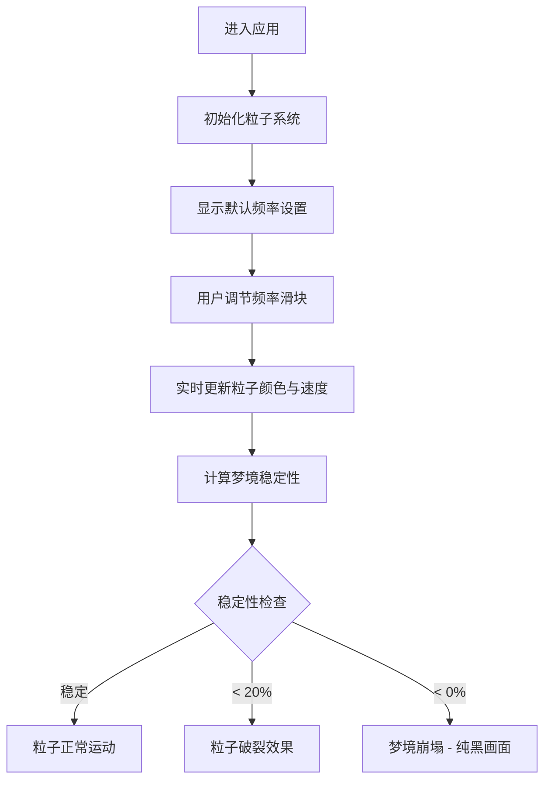

## 1. 产品概述

一款基于墨菲斯睡眠戒指原理的梦境控制游戏模拟应用，玩家通过调整Alpha、Theta、Delta三种脑波频率和颜色组合来影响虚拟梦境的稳定性和视觉效果。

- 核心价值：通过沉浸式粒子视觉效果模拟梦境调节过程，提供交互性强的视觉体验
- 目标用户：对梦境探索爱好者、独立游戏玩家、视觉艺术爱好者

## 2. 核心功能

### 2.1 功能模块

1. **梦境粒子系统**：Canvas绘制的动态粒子效果，呈现梦境视觉效果
2. **频率控制面板**：三个滑块控制三种脑波频率（Alpha/Theta/Delta）
3. **颜色混合系统**：根据三种波段强度加权混合生成粒子颜色
4. **梦境稳定性系统**：实时计算并显示梦境稳定性状态
5. **粒子生命管理**：粒子生成、运动、生命周期管理系统

### 2.2 页面详情

| 页面名称 | 模块名称 | 功能描述 |
|---------|---------|---------|
| 主页面 | 频率控制面板 | Alpha波滑块、Theta波滑块、Delta波滑块、颜色选择器、开始/停止按钮 |
| 主页面 | 梦境Canvas画布 | 粒子系统渲染、梦境视觉效果、背景微光闪烁 |
| 主页面 | 稳定性指示条 | 稳定性百分比显示、渐变颜色指示条 |
| 主页面 | 梦境崩塌效果 | 粒子破裂效果、纯黑渐变、崩塌文字显示 |

## 3. 核心流程

玩家进入应用 → 调节频率滑块 → 实时观察粒子变化 → 观察稳定性变化 → 尝试维持稳定梦境

## 4. 用户界面设计

### 4.1 设计风格

- **主色调**：深蓝色到黑色的径向渐变背景，模拟夜空氛围
- **配色方案**：
  - Alpha波：紫色 (#9b59b6)
  - Theta波：蓝色 (#3498db)
  - Delta波：绿色 (#2ecc71)
  - 文本：浅灰色 (#d0d0d0)
- **字体**：等宽字体 (monospace)
- **视觉效果**：毛玻璃面板、柔和光晕、粒子发光效果

### 4.2 页面设计概述

| 页面名称 | 模块名称 | UI元素 |
|---------|---------|--------|
| 主页面 | 左侧控制面板 | 半透明毛玻璃效果、圆角16px、内边距20px、宽度280px |
| 主页面 | 右侧Canvas画布 | 占剩余宽度、边缘柔和光晕 |
| 主页面 | 底部稳定性条 | 高度24px、宽度80%、居中、绿到红渐变 |
| 主页面 | 滑块组件 | 轨道高度6px、圆角3px、滑块直径24px、白色外发光 |

### 4.3 响应式设计

- **桌面端**：左侧控制面板 + 右侧Canvas画布的左右布局
- **移动端**（<768px）：面板折叠为顶部浅灰色条状，点击展开
- **触摸支持**：滑块支持触摸操作
- **全屏渲染**：无滚动条，全屏显示

### 4.4 交互与动画

- 滑块调节时即时视觉反馈
- 粒子颜色渐变、运动速度变化
- 背景微光闪烁（频率跟随Alpha波）
- 鼠标悬停显示数值和推荐范围工具提示
- 滑块轨道从冷色到暖色渐变
- 粒子透明度脉动效果
