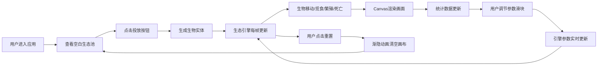

## 1. 产品概述

数字生态模拟器是一个交互式微型数字生态系统游戏，用户通过投放不同属性的生物（生产者、消费者、分解者）到生态池中，观察它们根据预设规则自动觅食、繁殖和死亡，体验整个系统的动态平衡过程。

- 核心价值：为用户提供直观的生态系统动态可视化体验，寓教于乐
- 目标用户：对生态学、复杂系统、模拟游戏感兴趣的用户
- 市场定位：轻量级教育娱乐型Web应用

## 2. 核心功能

### 2.1 用户角色

| 角色 | 注册方式 | 核心权限 |
|------|----------|----------|
| 普通用户 | 无需注册 | 投放生物、调节参数、观察统计、重置生态 |

### 2.2 功能模块

1. **主生态池画布**：800x600像素Canvas渲染区域，展示生物活动、粒子特效、尸体残骸
2. **控制面板**：投放生物按钮、参数调节滑块、重置按钮
3. **统计面板**：种群数量折线图、能量总量显示、事件日志滚动区
4. **生态引擎**：生物AI逻辑、碰撞检测、能量流动、繁殖死亡规则

### 2.3 页面详情

| 页面名称 | 模块名称 | 功能描述 |
|---------|----------|----------|
| 主页面 | 生态池画布 | Canvas 2D渲染生物运动、发光效果、粒子拖影、波纹底纹 |
| 主页面 | 控制面板 | 投放三种生物按钮、四个参数滑块（生态池大小、能量衰减、繁殖阈值、移动速度）、重置按钮 |
| 主页面 | 统计面板 | D3折线图展示60秒种群变化、实时能量总量、倒序事件日志 |

## 3. 核心流程

用户打开应用 → 查看空白生态池 → 点击投放按钮添加生物 → 观察生物自动行为（觅食/繁殖/死亡）→ 通过滑块调节生态参数 → 查看实时统计数据和事件日志 → 点击重置按钮清空生态池 → 重新投放生物

## 4. 用户界面设计

### 4.1 设计风格

- **主色调**：暗色科幻主题，背景#1a1a2e，面板#16213e
- **生物颜色**：生产者#00ff88（霓虹绿）、消费者#ff6b6b（霓虹红）、分解者#a0a0a0（灰色）
- **按钮风格**：圆角矩形，悬浮时亮度提升10%并轻微上浮，0.2秒过渡动画
- **字体**：使用Orbitron（标题/数据）和JetBrains Mono（正文/日志）组合，营造科技仪表盘风格
- **布局风格**：三栏布局，生态池居中，左右固定280px面板，响应式单列布局（<1024px）
- **视觉特效**：生物发光光晕（Canvas径向渐变）、粒子拖影（透明度渐变）、分裂扩散粒子、渐隐过渡动画

### 4.2 页面设计概述

| 页面名称 | 模块名称 | UI元素 |
|---------|----------|--------|
| 主页面 | 生态池画布 | 800x600浅蓝绿色背景、波纹底纹、发光小球生物、粒子拖影、尸体半透明效果 |
| 主页面 | 控制面板 | 三个投放按钮（带生物颜色标识）、四个滑块组（带数值显示）、重置按钮（警告色） |
| 主页面 | 统计面板 | D3折线图（带渐变填充）、能量数值卡片、滚动日志区域（时间倒序） |

### 4.3 响应性

- **桌面端**（≥1024px）：三栏布局，生态池最大宽度1200px居中，左右面板各280px固定宽度
- **移动端**（<1024px）：单列布局，控制面板在上，生态池居中自适应高度，统计面板在下
- **触控优化**：按钮最小尺寸48x48px，滑块增加触控区域

## 5. 非功能需求

- **性能约束**：500个生物以内保持60fps；400-500个时粒子特效减半；图表每秒更新不阻塞主线程
- **渲染方式**：Canvas 2D而非DOM元素，减轻重绘压力
- **交互反馈**：所有交互元素0.2秒过渡动画，焦点和悬停状态即时视觉反馈
